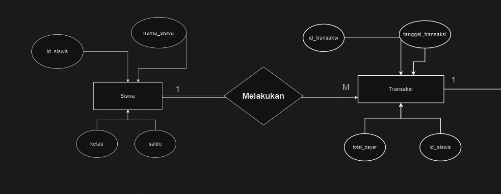
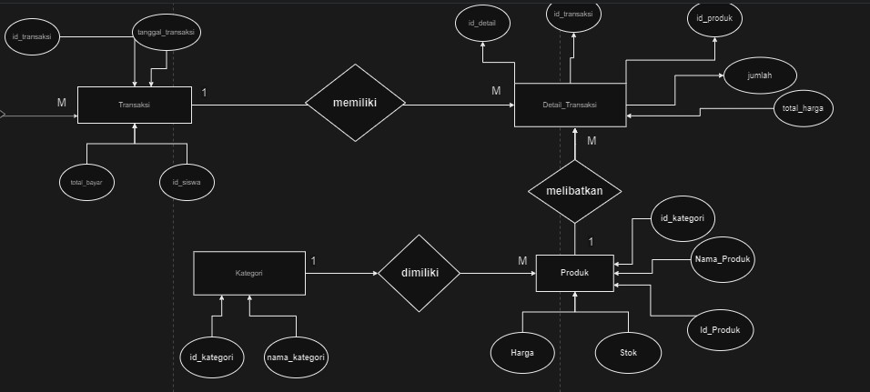
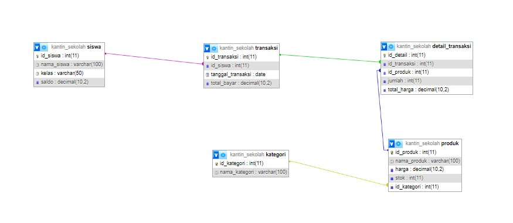
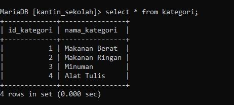
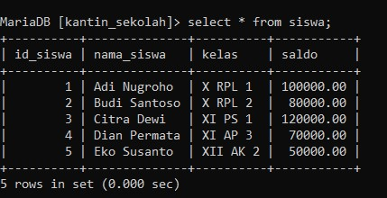
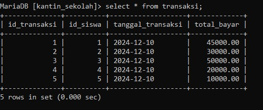
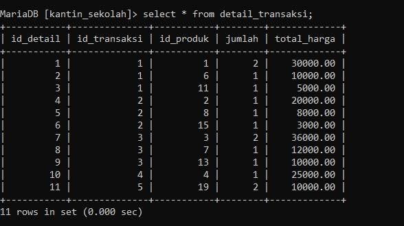
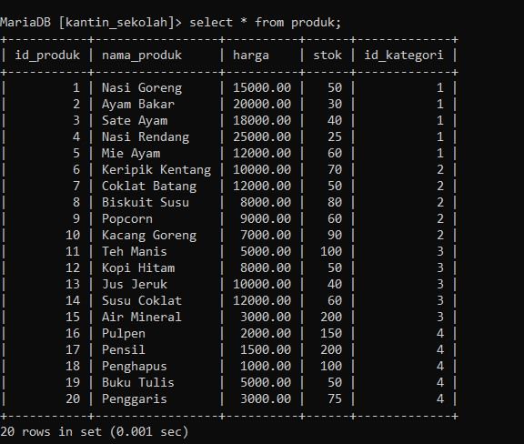
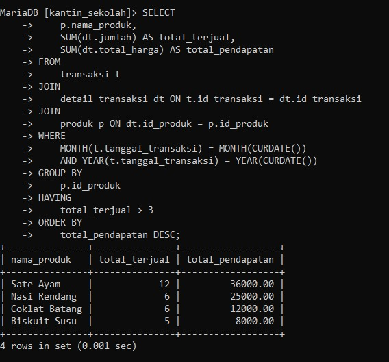
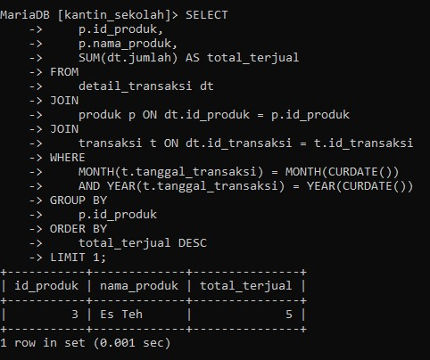

# **STRUKTUR ERD**




# Rancangan Database (MySQL)
Pada database ini terdiri dari tabel **`siswa`**, **`transaksi`**, **`produk`**, **`kategori`**, dan **`detail_transaksi`** dengan relasi sebagai berikut:
- **`siswa`** berelasi **1-N** dengan **`transaksi`** melalui `id_siswa`.
- **`transaksi`** berelasi **1-N** dengan **`detail_transaksi`** melalui `id_transaksi`.
- **`produk`** berelasi **1-N** dengan **`detail_transaksi`** melalui `id_produk`.
- **`kategori`** berelasi **1-N** dengan **`produk`** melalui `id_kategori`.
## **1. Relasi `siswa` ke `transaksi`** (One-to-Many)
- **Alasan**:
    - Setiap siswa dapat melakukan banyak transaksi di kantin.
    - Satu transaksi hanya dilakukan oleh satu siswa.
- **Relasi**: `id_siswa` di tabel **`siswa`** menjadi **primary key**, dan di tabel **`transaksi`** menjadi **foreign key**.
- **Kardinalitas**:
    - **1 siswa** → **banyak transaksi**.
    - **1 transaksi** → hanya **1 siswa**.
## **2. Relasi `transaksi` ke `detail_transaksi`** (One-to-Many)
- **Alasan**:
    - Setiap transaksi dapat memiliki banyak detail pembelian (produk berbeda dalam satu transaksi).
    - Satu detail pembelian hanya terkait dengan satu transaksi.
- **Relasi**: `id_transaksi` di tabel **`transaksi`** menjadi **primary key**, dan di tabel **`detail_transaksi`** menjadi **foreign key**.
- **Kardinalitas**:
    - **1 transaksi** → **banyak detail transaksi**.
    - **1 detail transaksi** → hanya **1 transaksi**.
## **3. Relasi `kategori` ke `produk`** (One-to-Many)
- **Alasan**:
    - Setiap produk memiliki kategori tertentu.
    - Satu kategori dapat mencakup banyak produk.
- **Relasi**: `id_kategori` di tabel **`kategori`** menjadi **primary key**, dan di tabel **`produk`** menjadi **foreign key**.
- **Kardinalitas**:
    - **1 kategori** → **banyak produk**.
    - **1 produk** → hanya **1 kategori**.
## **4. Relasi `produk` ke `detail_transaksi`** (One-to-Many)
- **Alasan**:
    - Satu produk dapat dibeli berkali-kali dalam transaksi berbeda.
    - Satu detail transaksi hanya terkait dengan satu produk.
- **Relasi**: `id_produk` di tabel **`produk`** menjadi **primary key**, dan di tabel **`detail_transaksi`** menjadi **foreign key**.
- **Kardinalitas**:
    - **1 produk** → **banyak detail transaksi**.
    - **1 detail transaksi** → hanya **1 produk**.
## **Kode Pembuatan Tabel**
### **1. Tabel `siswa`**

```sql
CREATE TABLE siswa (
    id_siswa INT AUTO_INCREMENT PRIMARY KEY,
    nama_siswa VARCHAR(100) NOT NULL,
    kelas VARCHAR(50) NOT NULL,
    saldo DECIMAL(10, 2) NULL
);
```
### **2.Tabel `kategori`**
```sql
CREATE TABLE kategori (
    id_kategori INT AUTO_INCREMENT PRIMARY KEY,
    nama_kategori VARCHAR(100) NOT NULL
);
```
### **3. Tabel `produk`**
```sql
CREATE TABLE produk (
    id_produk INT AUTO_INCREMENT PRIMARY KEY,
    id_kategori INT NOT NULL,
    nama_produk VARCHAR(100) NOT NULL,
    harga DECIMAL(10, 2) NOT NULL,
    stok INT NOT NULL,
    FOREIGN KEY (id_kategori) REFERENCES kategori(id_kategori)
);
```
### **4. Tabel `transaksi`**
```sql
CREATE TABLE transaksi (
    id_transaksi INT AUTO_INCREMENT PRIMARY KEY,
    id_siswa INT NOT NULL,
    tanggal_transaksi DATE NOT NULL,
    total_bayar DECIMAL(10, 2) NOT NULL,
    FOREIGN KEY (id_siswa) REFERENCES siswa(id_siswa)
);
```
### **5. Tabel `detail_transaksi`**
```sql
CREATE TABLE detail_transaksi (
    id_detail INT AUTO_INCREMENT PRIMARY KEY,
    id_transaksi INT NOT NULL,
    id_produk INT NOT NULL,
    jumlah INT NOT NULL,
    total_harga DECIMAL(10, 2) NOT NULL,
    FOREIGN KEY (id_transaksi) REFERENCES transaksi(id_transaksi),
    FOREIGN KEY (id_produk) REFERENCES produk(id_produk)
);
```
## **Relasi Antar Tabel**
- **`siswa` ke `transaksi`**: 1 siswa → banyak transaksi.
- **`transaksi` ke `detail_transaksi`**: 1 transaksi → banyak detail transaksi.
- **`kategori` ke `produk`**: 1 kategori → banyak produk.
- **`produk` ke `detail_transaksi`**: 1 produk → banyak detail transaksi.
## **Kesimpulan**
- Relasi **One-to-Many** diterapkan untuk menjaga struktur data yang terorganisasi.
- Integritas data dijamin dengan penggunaan **foreign key** pada tabel relasi.
- Tambahan tabel `kategori` membantu mengelompokkan produk berdasarkan jenis.

# **tampilan tabel yang berealisasi**:

# **tampilan data pada tabel:** 
##### 1. **KATEGORI**

##### 2. **SISWA** 

##### 3. **TRANSAKSI**

##### 4. **DETAIL_TRANSAKSI**

 ##### 5. **PRODUK**

# CONTOH QUERY
### 1. **Rekap Data Penjualan Bulan Ini:**
Tujuan: Menghitung total penjualan untuk setiap produk yang terjual pada bulan ini.
**Query:**
```sql
SELECT 
    p.nama_produk, 
    SUM(dt.jumlah) AS total_terjual, 
    SUM(dt.total_harga) AS total_pendapatan
FROM 
    transaksi t
JOIN 
    detail_transaksi dt ON t.id_transaksi = dt.id_transaksi
JOIN 
    produk p ON dt.id_produk = p.id_produk
WHERE 
    MONTH(t.tanggal_transaksi) = MONTH(CURDATE()) 
    AND YEAR(t.tanggal_transaksi) = YEAR(CURDATE()) 
GROUP BY 
    p.id_produk
HAVING 
    total_terjual > 3
ORDER BY 
    total_pendapatan DESC;
```
**penjelasan:**
1. **Bagian SELECT**:
    - **`p.nama_produk`**: Menampilkan nama produk dari tabel `produk`.
    - **`SUM(dt.jumlah) AS total_terjual`**: Menghitung total jumlah produk yang terjual dari tabel `detail_transaksi`.
    - **`SUM(dt.total_harga) AS total_pendapatan`**: Menghitung total pendapatan dari produk yang terjual.
2. **Bagian FROM dan JOIN**:
    - **`transaksi t`**: Tabel utama yang berisi data transaksi.
    - **`detail_transaksi dt ON t.id_transaksi = dt.id_transaksi`**: Menghubungkan tabel `transaksi` dengan `detail_transaksi` berdasarkan `id_transaksi`.
    - **`produk p ON dt.id_produk = p.id_produk`**: Menghubungkan tabel `detail_transaksi` dengan tabel `produk` berdasarkan `id_produk`.
3. **Bagian WHERE**:
    - **`MONTH(t.tanggal_transaksi) = MONTH(CURDATE())`**: Memfilter data transaksi berdasarkan bulan saat ini.
    - **`YEAR(t.tanggal_transaksi) = YEAR(CURDATE())`**: Memfilter data transaksi berdasarkan tahun saat ini.
4. **Bagian GROUP BY**:
    - **`p.id_produk`**: Mengelompokkan hasil berdasarkan ID produk, sehingga perhitungan total terjual dan pendapatan dilakukan untuk masing-masing produk.
5. **Bagian HAVING**:
    - **`total_terjual > 3`**: Menampilkan hanya produk yang terjual lebih dari 3 unit.
6. **Bagian ORDER BY**:
    - **`total_pendapatan DESC`**: Mengurutkan hasil berdasarkan total pendapatan, dari yang tertinggi ke terendah.
**hasilnya:**

**KESIMPULAN:**
- **Hasil** menunjukkan **4 produk** yang terjual lebih dari 3 unit pada bulan saat ini, diurutkan berdasarkan pendapatan tertinggi.
- **Produk terlaris**: _Sate Ayam_ dengan total terjual **12 unit** dan total pendapatan **36.000**.
- **Produk lainnya**: _Nasi Rendang_, _Coklat Batang_, dan _Biskuit Susu_ juga memiliki penjualan lebih dari 3 unit dengan pendapatan beragam.

### 2.**Barang yang Paling Banyak Laku:**
Tujuan: Menampilkan produk yang paling banyak terjual selama bulan ini.
**Query:**
```sql
SELECT 
    p.id_produk, 
    p.nama_produk, 
    SUM(dt.jumlah) AS total_terjual
FROM 
    detail_transaksi dt
JOIN 
    produk p ON dt.id_produk = p.id_produk
JOIN 
    transaksi t ON dt.id_transaksi = t.id_transaksi
WHERE 
    MONTH(t.tanggal_transaksi) = MONTH(CURDATE()) 
    AND YEAR(t.tanggal_transaksi) = YEAR(CURDATE()) 
GROUP BY 
    p.id_produk
ORDER BY 
    total_terjual DESC
LIMIT 1;

```
**penjelasan:**
- **`SUM(dt.jumlah)`**: Menghitung total jumlah barang yang terjual untuk setiap produk.
- **`MONTH(t.tanggal_transaksi)`**: Mengambil bulan dari kolom `tanggal_transaksi` untuk memfilter transaksi berdasarkan bulan saat ini.
- **`YEAR(t.tanggal_transaksi)`**: Mengambil tahun dari kolom `tanggal_transaksi` untuk memastikan hanya transaksi pada tahun saat ini yang diproses.
- **`WHERE MONTH(t.tanggal_transaksi) = MONTH(CURDATE()) AND YEAR(t.tanggal_transaksi) = YEAR(CURDATE())`**:Digunakan untuk memfilter transaksi yang hanya terjadi pada bulan dan tahun ini.
- **`GROUP BY p.id_produk`**: Mengelompokkan data berdasarkan ID produk, sehingga setiap produk memiliki total jumlah terjualnya.
- **`ORDER BY total_terjual DESC`**: Mengurutkan produk berdasarkan jumlah terjual dari yang terbanyak ke yang paling sedikit.
- **`LIMIT 1`**: Menampilkan hanya satu produk dengan jumlah terjual tertinggi.

**hasilnya:**


**KESIMPULAN:**
Query ini dirancang untuk menentukan produk dengan jumlah penjualan tertinggi selama bulan berjalan. Hasilnya mencakup:
1. **Produk Terlaris:** Menampilkan nama produk dan total jumlah yang terjual.
2. **Bulan dan Tahun Terkini:** Data difokuskan hanya pada transaksi di bulan dan tahun berjalan.
3. **Urutan Berdasarkan Penjualan:** Produk dengan jumlah penjualan terbanyak ditempatkan di urutan teratas.
4. **Hasil Tunggal:** Menampilkan hanya satu produk dengan performa penjualan terbaik.


# Laporan Aktivitas 6 december 2024

| No  | Nama             | Skor Keaktifan | Peran                                                         |
| --- | ---------------- | -------------- | ------------------------------------------------------------- |
| 1   | FAROEK AL QAYYUM | 3              | merancang database dan relasi,mengerjakan contoh soal query 1 |
| 2   | INDRAWAN         | 3              | merancang database dan relasi dan query nomor 2               |
| 3   | RIVALDO GABRIEL  | 3              | merancang database dan relasi ERD                             |
| 4   | VALENTINO        | 3              | membantu contoh soal query 2                                  |
| 5   | IQBAL            | 3              | membantu ERD dan membantu database tabel kategori             |
| 6   | MUHAMMAD ARIEL   | 2              | membantu mengerjakan contoh soal query 1                      |
|     |                  |                |                                                               |
|     |                  |                |                                                               |
|     |                  |                |                                                               |
