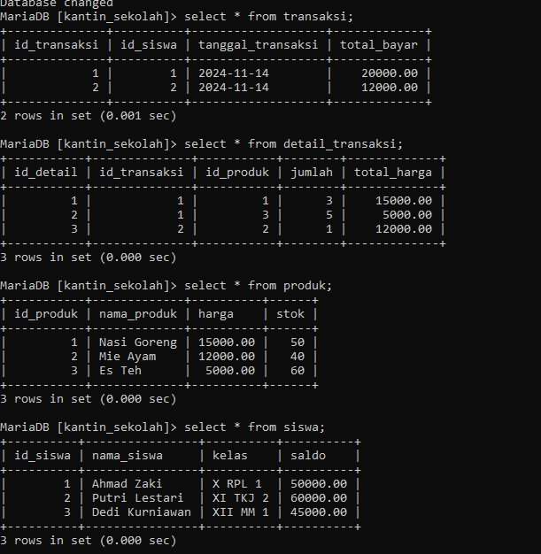

# **1. Rancangan Database (MySQL)**
Pada Database ini terdiri dari tabel `siswa`, `transaksi`, `produk`, dan `detail_transaksi` dengan relasi sebagai berikut:
- **`siswa`** berelasi 1-N dengan **`transaksi`** melalui `id_siswa`.
- **`transaksi`** berelasi 1-N dengan **`detail_transaksi`** melalui `id_transaksi`.
- **`produk`** berelasi 1-N dengan **`detail_transaksi`** melalui `id_produk`.
Tabel dibuat dengan foreign key untuk menjaga integritas data antar tabel.

**kode pembuatan tabel:**
1. **TABEL SISWA**
```sql 
CREATE TABLE siswa (
    id_siswa INT AUTO_INCREMENT PRIMARY KEY,
    nama_siswa VARCHAR(100) NOT NULL,
    kelas VARCHAR(50) NOT NULL,
    saldo DECIMAL(10, 2) NOT NULL
);
```
1. **TABEL TRANSAKSI**
```SQL
CREATE TABLE transaksi (
    id_transaksi INT AUTO_INCREMENT PRIMARY KEY,
    id_siswa INT NOT NULL,
    tanggal_transaksi DATE NOT NULL,
    total_bayar DECIMAL(10, 2) NOT NULL,
    FOREIGN KEY (id_siswa) REFERENCES siswa(id_siswa)
);
```
3. **TABEL PRODUK**
```SQL
CREATE TABLE produk (
    id_produk INT AUTO_INCREMENT PRIMARY KEY,
    nama_produk VARCHAR(100) NOT NULL,
    harga DECIMAL(10, 2) NOT NULL,
    stok INT NOT NULL
);
```
4. **TABEL DETAIL_TRANSAKSI**
```SQL
CREATE TABLE detail_transaksi (
    id_detail INT AUTO_INCREMENT PRIMARY KEY,
    id_transaksi INT NOT NULL,
    id_produk INT NOT NULL,
    jumlah INT NOT NULL,
    total_harga DECIMAL(10, 2) NOT NULL,
    FOREIGN KEY (id_transaksi) REFERENCES transaksi(id_transaksi),
    FOREIGN KEY (id_produk) REFERENCES produk(id_produk)
);
```
**tampilan data yang berealisasi**

# CONTOH 
### tabel yang digunakan 
1. **Tabel `produk`**  
    Menyimpan data produk yang dijual di kantin, dengan kolom-kolom sebagai berikut:
    - `id_produk` (PK): ID unik untuk produk.
    - `nama_produk`: Nama produk.
    - `harga`: Harga per produk.
    - `stok`: Jumlah stok produk yang tersedia.
2. **Tabel `transaksi`**  
    Menyimpan data transaksi yang dilakukan siswa di kantin, dengan kolom-kolom sebagai berikut:
    - `id_transaksi` (PK): ID transaksi.
    - `id_siswa` (FK): ID siswa yang melakukan transaksi.
    - `tanggal_transaksi`: Tanggal transaksi dilakukan.
    - `total_bayar`: Total harga yang dibayar pada transaksi.
3. **Tabel `detail_transaksi`**  
    Menyimpan detail produk yang dibeli dalam transaksi, dengan kolom-kolom sebagai berikut:
    - `id_detail`: ID unik untuk detail transaksi.
    - `id_transaksi` (FK): ID transaksi terkait.
    - `id_produk` (FK): ID produk yang dibeli.
    - `jumlah`: Jumlah produk yang dibeli.
    - `total_harga`: Total harga produk yang dibeli (jumlah * harga).
### 1. **Rekap Data Penjualan Bulan Ini:**
Tujuan: Menghitung total penjualan untuk setiap produk yang terjual pada bulan ini.
**Query:**
```sql
SELECT 
    p.nama_produk, 
    SUM(dt.jumlah) AS total_terjual, 
    SUM(dt.total_harga) AS total_pendapatan
FROM 
    transaksi t
JOIN 
    detail_transaksi dt ON t.id_transaksi = dt.id_transaksi
JOIN 
    produk p ON dt.id_produk = p.id_produk
WHERE 
    MONTH(t.tanggal_transaksi) = MONTH(CURDATE()) 
    AND YEAR(t.tanggal_transaksi) = YEAR(CURDATE()) 
GROUP BY 
    p.id_produk
HAVING 
    total_terjual > 0
ORDER BY 
    total_pendapatan DESC;
```
**penjelasan:**
- **`MONTH(t.tanggal_transaksi)`**: Fungsi `MONTH` digunakan untuk mengambil _bulan_ dari kolom `tanggal_transaksi`.
    - Misalnya, jika `tanggal_transaksi` adalah `2024-11-25`, maka `MONTH(t.tanggal_transaksi)` akan menghasilkan `11` (November).
- **`YEAR(t.tanggal_transaksi)`**: Fungsi `YEAR` digunakan untuk mengambil _tahun_ dari kolom `tanggal_transaksi`.
    - Jika `tanggal_transaksi` adalah `2024-11-25`, maka `YEAR(t.tanggal_transaksi)` akan menghasilkan `2024`.
- **`CURDATE()`**: Fungsi `CURDATE` digunakan untuk mendapatkan tanggal hari ini (tanggal sekarang).
    - Misalnya, jika hari ini adalah `2024-11-27`, maka `CURDATE()` menghasilkan `2024-11-27`.
- **Kenapa digunakan `MONTH(CURDATE())` dan `YEAR(CURDATE())`?**
    - Ini memastikan hanya transaksi pada bulan **sekarang** (bulan dan tahun yang sama dengan `CURDATE()`) yang diambil. Dengan kata lain, hanya data penjualan untuk **bulan berjalan** yang akan diproses dalam query.
- **Bagian Penting Lain:**
    - **`SUM(dt.jumlah)`**: Menghitung total jumlah produk yang terjual.
    - **`SUM(dt.total_harga)`**: Menghitung total pendapatan dari produk tersebut.
    - **`HAVING total_terjual > 0`**: Hanya menampilkan produk yang terjual (tidak menampilkan produk dengan penjualan 0).
**hasilnya:**


### 2.**Barang yang Paling Banyak Laku:**
Tujuan: Menampilkan produk yang paling banyak terjual selama bulan ini.
**Query:**
```sql
SELECT 
    p.id_produk, 
    p.nama_produk, 
    SUM(dt.jumlah) AS total_terjual
FROM 
    detail_transaksi dt
JOIN 
    produk p ON dt.id_produk = p.id_produk
JOIN 
    transaksi t ON dt.id_transaksi = t.id_transaksi
WHERE 
    MONTH(t.tanggal_transaksi) = MONTH(CURDATE()) 
    AND YEAR(t.tanggal_transaksi) = YEAR(CURDATE()) 
GROUP BY 
    p.id_produk
ORDER BY 
    total_terjual DESC
LIMIT 1;

```
**penjelasan:**
- **`SUM(dt.jumlah)`**: Menghitung total jumlah barang yang terjual untuk setiap produk.
- **`MONTH(t.tanggal_transaksi)`**: Mengambil bulan dari kolom `tanggal_transaksi` untuk memfilter transaksi berdasarkan bulan saat ini.
- **`YEAR(t.tanggal_transaksi)`**: Mengambil tahun dari kolom `tanggal_transaksi` untuk memastikan hanya transaksi pada tahun saat ini yang diproses.
- **`WHERE MONTH(t.tanggal_transaksi) = MONTH(CURDATE()) AND YEAR(t.tanggal_transaksi) = YEAR(CURDATE())`**:Digunakan untuk memfilter transaksi yang hanya terjadi pada bulan dan tahun ini.
- **`GROUP BY p.id_produk`**: Mengelompokkan data berdasarkan ID produk, sehingga setiap produk memiliki total jumlah terjualnya.
- **`ORDER BY total_terjual DESC`**: Mengurutkan produk berdasarkan jumlah terjual dari yang terbanyak ke yang paling sedikit.
- **`LIMIT 1`**: Menampilkan hanya satu produk dengan jumlah terjual tertinggi.
**hasilnya:**

