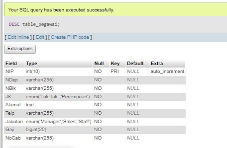

### Buka phpMyAdmin dan buat database baru dengan nama `company_namamu` 
- Klik pada "Databases" di menu kiri
- Masukkan nama database `company_namamu` dan klik "Create"
### Buat tabel dengan nama `pegawai`
- Klik pada database `company_faruq` yang baru saja dibuat
- Klik pada tab "SQL"
- Masukkan perintah SQL untuk membuat tabel `pegawai`:

Lalu pencet "GO".
**penjelasan:**
1. `NIP` 
    - Tipe data: `int` (integer)
    - Constraint: `PRIMARY KEY` Ini berarti setiap nilai pada kolom `NIP` harus unik dan tidak boleh ada duplikasi. Constraint `PRIMARY KEY` juga secara otomatis membuat indeks pada kolom tersebut, sehingga pencarian dan pengaksesan data berdasarkan `NIP` akan lebih cepat.
    - Penjelasan: Kolom `NIP` digunakan sebagai primary key untuk mengidentifikasi setiap pegawai secara unik. Tipe data `int` dipilih karena NIP biasanya berupa angka.
2. `NDep`
    - Tipe data: `varchar(255)`
    - Constraint: `NOT NULL` memastikan bahwa setiap pegawai harus memiliki nama departemen.
    - Penjelasan: Kolom `NDep` menyimpan nama departemen tempat pegawai bekerja. Tipe data `varchar(255)` dipilih untuk mengakomodasi panjang nama departemen yang bervariasi. 
3. `NBlk`
    - Tipe data: `varchar(255)`
    - Constraint: `-` (tidak ada constraint) sehingga nilai dapat diisi atau dibiarkan kosong.
    - Penjelasan: Kolom `NBlk` menyimpan nama blok tempat pegawai bekerja. Tipe data `varchar(255)` dipilih untuk mengakomodasi panjang nama blok yang bervariasi. Kolom ini tidak memiliki 
4. `JK` 
    - Tipe data: `enum('Laki-Laki','Perempuan')`
    - Constraint: `NOT NULL`  memastikan bahwa setiap pegawai harus memiliki jenis kelamin yang didefinisikan.
    - Penjelasan: Kolom `JK` menyimpan jenis kelamin pegawai. Tipe data `enum` dipilih karena hanya ada dua kemungkinan nilai, yaitu 'Laki-Laki' atau 'Perempuan'.
5. `Alamat`
    - Tipe data: `text`
    - Constraint: `NOT NULL`  memastikan bahwa setiap pegawai harus memiliki alamat yang diisi.
    - Penjelasan: Kolom `Alamat` menyimpan informasi alamat pegawai. Tipe data `text` dipilih karena dapat menampung teks yang panjang.
6. `Telp`
    - Tipe data: `varchar(20)`
    - Constraint: `NOT NULL` memastikan bahwa setiap pegawai harus memiliki nomor telepon yang diisi.
    - Penjelasan: Kolom `Telp` menyimpan nomor telepon pegawai. Tipe data `varchar(20)` dipilih untuk mengakomodasi panjang nomor telepon yang bervariasi. 
7. `Jabatan` 
    - Tipe data: `enum('Manager','Supervisor','Staff')`
    - Constraint: `NOT NULL` memastikan bahwa setiap pegawai harus memiliki jabatan yang didefinisikan.
    - Penjelasan: Kolom `Jabatan` menyimpan informasi jabatan pegawai. Tipe data `enum` dipilih karena hanya ada tiga kemungkinan nilai, yaitu 'Manager', 'Supervisor', atau 'Staff'.
8. `Gaji` 
    - Tipe data: `BIGINT`
    - Constraint: `NOT NULL` memastikan bahwa setiap pegawai harus memiliki gaji yang diisi.
    - Penjelasan: Kolom `Gaji` menyimpan informasi gaji pegawai. Tipe data `BIGINT` dipilih karena dapat menampung nilai gaji yang besar. 
9. `NoCab` 
    - Tipe data: `varchar(20)`
    - Constraint: `NOT NULL` memastikan bahwa setiap pegawai harus memiliki nomor cabang yang diisi.
    - Penjelasan: Kolom `NoCab` menyimpan informasi nomor cabang tempat pegawai bekerja. Tipe data `varchar(20)` dipilih untuk mengakomodasi panjang nomor cabang yang bervariasi. 


### Masukkan data-data pada tabel `pegawai`
- Klik pada tabel `pegawai` di panel kiri
- Klik pada tab "Insert"

- Masukkan data-data, lalu klik "Go"

### Masukkan data-data pada tabel `pegawai`menggunakan DESC
 - Klik pada tabel `pegawai` di panel kiri
 - Klik pada tab "Insert" lalu ketik : 
 ```sql
 DESC table_pegawai;
```
hasilnya:


### Masukkan hasil data pada tabel pegawai menggunakan perintah SELECT
- Klik pada tabel `pegawai` di panel kiri
 - Klik pada tab "Insert" lalu ketik :
```sql
SELECT * FROM `table_pegawai`;
```
hasilnya:


### PERINTAH SELECT

#### From
```sql 
SELECT 
    COUNT(NIP) AS JumlahPegawai,
    COUNT(Jabatan) AS JumlahJabatan
FROM table_pegawai;
```
**penjelasan:**
1. **SELECT Clause**:
	 - `COUNT(NIP) AS JumlahPegawai`:
        - `COUNT(NIP)`: Fungsi agregat ini akan menghitung jumlah baris dalam tabel `table_pegawai` di mana kolom `NIP` (Nomor Induk Pegawai) memiliki nilai yang tidak null (kosong).
        - `AS JumlahPegawai`: Hasil penghitungan ini akan ditampilkan dengan alias "JumlahPegawai", yang artinya "Jumlah Pegawai".
    - `COUNT(Jabatan) AS JumlahJabatan`:
        - `COUNT(Jabatan)`: Fungsi agregat ini akan menghitung jumlah baris dalam tabel `table_pegawai` di mana kolom `Jabatan` memiliki nilai yang tidak null (kosong).
        - `AS JumlahJabatan`: Hasil penghitungan ini akan ditampilkan dengan alias "JumlahJabatan", yang artinya "Jumlah Jabatan".
2. **FROM Clause**:
    - `table_pegawai`: Ini adalah nama tabel dari mana data akan diambil.
**hasilnya:**

#### Where
```sql
SELECT COUNT(NIP) AS JumlahPegawai FROM table_pegawai WHERE NoCab = 'C102'
```
**penjelasan:**
1. **SELECT Clause**:
    - `COUNT(NIP) AS JumlahPegawai`: Bagian ini akan menghitung jumlah baris dalam tabel `table_pegawai` di mana kolom `NIP` (Nomor Induk Pegawai) memiliki nilai yang tidak null (kosong). Hasil penghitungan ini akan ditampilkan dengan alias "JumlahPegawai".
2. **FROM Clause**:
    - `table_pegawai`: Ini adalah nama tabel dari mana data akan diambil.
3. **WHERE Clause**:
    - `WHERE NoCab = 'C102'`: Klausa ini akan memfilter baris-baris dalam tabel `table_pegawai` sehingga hanya baris-baris yang memiliki nilai 'C102' pada kolom `NoCab` (Nomor Cabang) yang akan dimasukkan dalam penghitungan.
**hasilnya:**

#### Group By
```sql
	SELECT NoCab,COUNT(NIP) AS Jumlah_Pegawai
FROM table_pegawai
GROUP BY NoCab
```
**penjelasan:**
1. **SELECT Clause**:
    - `NoCab`: Kolom ini akan dipilih dan ditampilkan sebagai hasil query.
    - `COUNT(NIP) AS Jumlah_Pegawai`: Fungsi agregat `COUNT()` akan menghitung jumlah baris (pegawai) untuk setiap nilai unik pada kolom `NoCab`. Hasil penghitungan ini akan ditampilkan dengan alias "Jumlah_Pegawai".
2. **FROM Clause**:
    - `table_pegawai`: Ini adalah nama tabel dari mana data akan diambil.
3. **GROUP BY Clause**:
    - `GROUP BY NoCab`: Klausa ini akan mengelompokkan baris-baris dalam tabel `table_pegawai` berdasarkan nilai unik pada kolom `NoCab` (Nomor Cabang).
**hasilnya:**

#### Having
```sql
SELECT NoCab, COUNT(NIP) AS Jumlah_pegawai
FROM table_pegawai
GROUP BY NoCab HAVING COUNT(NIP) >= 3
```
**penjelasan:**
1. **SELECT Clause**:
    - `NoCab`: Kolom ini akan dipilih dan ditampilkan sebagai hasil query.
    - `COUNT(NIP) AS Jumlah_pegawai`: Fungsi agregat `COUNT()` akan menghitung jumlah baris (pegawai) untuk setiap nilai unik pada kolom `NoCab`. Hasil penghitungan ini akan ditampilkan dengan alias "Jumlah_pegawai".
2. **FROM Clause**:
    - `table_pegawai`: Ini adalah nama tabel dari mana data akan diambil.
3. **GROUP BY Clause**:
    
    - `GROUP BY NoCab`: Klausa ini akan mengelompokkan baris-baris dalam tabel `table_pegawai` berdasarkan nilai unik pada kolom `NoCab` (Nomor Cabang).
4. **HAVING Clause**:
    - `HAVING COUNT(NIP) >= 3`: Klausa ini akan memfilter hasil pengelompokan hanya untuk cabang-cabang yang memiliki jumlah pegawai (hasil `COUNT(NIP)`) sama dengan atau lebih besar dari 3.
**hasilnya:**

#### SUM
```sql
SELECT SUM(Gaji) AS Total_Gaji FROM table_pegawai;
```
**penjelasan:**
1. **SELECT Clause**:
    - `SUM(Gaji) AS Total_Gaji`: Bagian ini akan menjumlahkan seluruh nilai pada kolom `Gaji` dalam tabel `table_pegawai`. Hasil penjumlahan ini akan ditampilkan dengan alias "Total_Gaji".
2. **FROM Clause**:
    - `table_pegawai`: Ini adalah nama tabel dari mana data akan diambil.
**HASILNYA:**


#### SUM
```sql
SELECT SUM(Gaji) AS Gaji_Manager FROM table_pegawai WHERE Jabatan = 'Manager';
```
**penjelasan:**
1. **SELECT Clause**:
    - `SUM(Gaji) AS Gaji_Manager`: Fungsi agregat `SUM()` akan menjumlahkan seluruh nilai pada kolom `Gaji` dalam tabel `table_pegawai`. Hasil penjumlahan ini akan ditampilkan dengan alias "Gaji_Manager".
2. **FROM Clause**:
    - `table_pegawai`: Ini adalah nama tabel dari mana data akan diambil.
3. **WHERE Clause**:
    - `WHERE Jabatan = 'Manager'`: Klausa ini akan memfilter baris-baris dalam tabel `table_pegawai` sehingga hanya baris-baris yang memiliki nilai 'Manager' pada kolom `Jabatan` yang akan dimasukkan dalam penjumlahan.
**hasilnya:**


#### GROUP BY Nocab
```sql
SELECT NoCab, SUM(Gaji) AS TotalGaji
FROM table_pegawai
GROUP BY NoCab
```
**penjelasan:**
1. **SELECT Clause**:
    - `NoCab`: Kolom ini akan dipilih dan ditampilkan sebagai hasil query.
    - `SUM(Gaji) AS TotalGaji`: Fungsi agregat `SUM()` akan menjumlahkan seluruh nilai pada kolom `Gaji` untuk setiap nilai unik pada kolom `NoCab`. Hasil penjumlahan ini akan ditampilkan dengan alias "TotalGaji".
2. **FROM Clause**:
    - `table_pegawai`: Ini adalah nama tabel dari mana data akan diambil.
3. **GROUP BY Clause**:
    - `GROUP BY NoCab`: Klausa ini akan mengelompokkan baris-baris dalam tabel `table_pegawai` berdasarkan nilai unik pada kolom `NoCab` (Nomor Cabang).
**hasilnya:**


##### HAVING SUM
```sql
SELECT NoCab, SUM(Gaji) AS Total_Gaji
FROM table_pegawai 
GROUP BY NoCab HAVING SUM(Gaji) >= 8000000;
```
**penjelasan:**
1. **SELECT Clause**:
    - `NoCab`: Kolom ini akan dipilih dan ditampilkan sebagai hasil query.
    - `SUM(Gaji) AS Total_Gaji`: Fungsi agregat `SUM()` akan menjumlahkan seluruh nilai pada kolom `Gaji` untuk setiap nilai unik pada kolom `NoCab`. Hasil penjumlahan ini akan ditampilkan dengan alias "Total_Gaji".
2. **FROM Clause**:
    - `table_pegawai`: Ini adalah nama tabel dari mana data akan diambil.
3. **GROUP BY Clause**:
    - `GROUP BY NoCab`: Klausa ini akan mengelompokkan baris-baris dalam tabel `table_pegawai` berdasarkan nilai unik pada kolom `NoCab` (Nomor Cabang).
4. **HAVING Clause**:
    - `HAVING SUM(Gaji) >= 8000000`: Klausa ini akan memfilter hasil pengelompokan hanya untuk cabang-cabang yang memiliki total gaji (hasil `SUM(Gaji)`) sama dengan atau lebih besar dari 8.000.000.
**HASILNYA:**


##### AVG 
```SQL
SELECT AVG(Gaji) AS Rata_rata FROM table_pegawai;
```
**penjelasan:**
1. **SELECT Clause**:
    - `AVG(Gaji) AS Rata_rata`: Fungsi agregat `AVG()` akan menghitung rata-rata nilai pada kolom `Gaji` dalam tabel `table_pegawai`. Hasil penghitungan ini akan ditampilkan dengan alias "Rata_rata".
2. **FROM Clause**:
    - `table_pegawai`: Ini adalah nama tabel dari mana data akan diambil.
**hasilnya:**


#### AVG MANAGER
```sql
SELECT AVG(Gaji) AS GajiRatamgr FROM table_pegawai WHERE Jabatan = 'Manager';
```
**penjelasan:**
1. **SELECT Clause**:
    - `AVG(Gaji) AS GajiRata_mgr`: Fungsi agregat `AVG()` akan menghitung rata-rata nilai pada kolom `Gaji` dalam tabel `table_pegawai`. Hasil penghitungan ini akan ditampilkan dengan alias "GajiRata_mgr".
2. **FROM Clause**:
    - `table_pegawai`: Ini adalah nama tabel dari mana data akan diambil.
3. **WHERE Clause**:
    - `WHERE Jabatan = 'Manager'`: Klausa ini akan memfilter baris-baris dalam tabel `table_pegawai` sehingga hanya baris-baris yang memiliki nilai 'Manager' pada kolom `Jabatan` yang akan digunakan dalam penghitungan rata-rata.
**hasilnya:**


#### AS
```sql
SELECT NoCab, AVG(Gaji) AS RataGaji
FROM table_pegawai
GROUP BY NoCab
```
**penjelasan:**
1. **SELECT Clause**:
    - `NoCab`: Kolom ini akan dipilih dan ditampilkan sebagai hasil query.
    - `AVG(Gaji) AS RataGaji`: Fungsi agregat `AVG()` akan menghitung rata-rata nilai pada kolom `Gaji` untuk setiap nilai unik pada kolom `NoCab`. Hasil penghitungan ini akan ditampilkan dengan alias "RataGaji".
2. **FROM Clause**:
    - `table_pegawai`: Ini adalah nama tabel dari mana data akan diambil.
3. **GROUP BY Clause**:
    - `GROUP BY NoCab`: Klausa ini akan mengelompokkan baris-baris dalam tabel `table_pegawai` berdasarkan nilai unik pada kolom `NoCab` (Nomor Cabang).
**hasilnya:**


#### HAVING NoCab
```sql
SELECT NoCab, AVG(Gaji) AS RataGaji 
FROM table_pegawai 
GROUP BY NoCab HAVING NoCab = 'C101' OR NoCab = 'C102'
```
**penjelasan:**
1. **SELECT Clause**:
    - `NoCab`: Kolom ini akan dipilih dan ditampilkan sebagai hasil query.
    - `AVG(Gaji) AS RataGaji`: Fungsi agregat `AVG()` akan menghitung rata-rata nilai pada kolom `Gaji` untuk setiap nilai unik pada kolom `NoCab`. Hasil penghitungan ini akan ditampilkan dengan alias "RataGaji".
2. **FROM Clause**:
    - `table_pegawai`: Ini adalah nama tabel dari mana data akan diambil.
3. **GROUP BY Clause**:
    - `GROUP BY NoCab`: Klausa ini akan mengelompokkan baris-baris dalam tabel `table_pegawai` berdasarkan nilai unik pada kolom `NoCab` (Nomor Cabang).
4. **HAVING Clause**:
    - `HAVING NoCab = 'C101' OR NoCab = 'C102'`: Klausa ini akan memfilter hasil pengelompokan hanya untuk cabang-cabang yang memiliki nilai `NoCab` sama dengan 'C101' atau 'C102'.
**HASILNYA:**


#### AS MIN
```SQL
SELECT MAX(Gaji) AS GajiTerbesar, MIN(Gaji) AS GajiTerkecil
FROM table_pegawai
```
**penjelasannya:**\
1. **SELECT Clause**:
    - `MAX(Gaji) AS GajiTerbesar`: Fungsi agregat `MAX()` akan menghitung nilai terbesar pada kolom `Gaji` dalam tabel `table_pegawai`. Hasil penghitungan ini akan ditampilkan dengan alias "GajiTerbesar".
    - `MIN(Gaji) AS GajiTerkecil`: Fungsi agregat `MIN()` akan menghitung nilai terkecil pada kolom `Gaji` dalam tabel `table_pegawai`. Hasil penghitungan ini akan ditampilkan dengan alias "GajiTerkecil".
2. **FROM Clause**:
    - `table_pegawai`: Ini adalah nama tabel dari mana data akan diambil.
hasilnya:


#### AS MIN MANAGER
```sql
SELECT MAX(Gaji) AS GajiTerbesar, MIN(Gaji) AS GajiTerkecil 
FROM table_pegawai 
WHERE Jabatan = 'Manager';
```
**penjelasannya:**
1. **SELECT Clause**:
    - `MAX(Gaji) AS GajiTerbesar`: Fungsi agregat `MAX()` akan menghitung nilai terbesar pada kolom `Gaji` dalam tabel `table_pegawai`. Hasil penghitungan ini akan ditampilkan dengan alias "GajiTerbesar".
    - `MIN(Gaji) AS GajiTerkecil`: Fungsi agregat `MIN()` akan menghitung nilai terkecil pada kolom `Gaji` dalam tabel `table_pegawai`. Hasil penghitungan ini akan ditampilkan dengan alias "GajiTerkecil".
2. **FROM Clause**:
    - `table_pegawai`: Ini adalah nama tabel dari mana data akan diambil.
3. **WHERE Clause**:
    - `WHERE Jabatan = 'Manager'`: Klausa ini akan memfilter baris-baris dalam tabel `table_pegawai` sehingga hanya baris-baris yang memiliki nilai 'Manager' pada kolom `Jabatan` yang akan digunakan dalam penghitungan nilai terbesar dan terkecil.
**hasilnya:**


#### AS MIN NoCab
```sql
SELECT NoCab, MAX(Gaji) AS GajiTerbesar, MIN(Gaji) AS GajiTerkecil
FROM table_pegawai
GROUP BY NoCab
```
penjelasannya
1. **SELECT Clause**:
    - `NoCab`: Kolom ini akan dipilih dan ditampilkan sebagai hasil query.
    - `MAX(Gaji) AS GajiTerbesar`: Fungsi agregat `MAX()` akan menghitung nilai terbesar pada kolom `Gaji` untuk setiap nilai unik pada kolom `NoCab`. Hasil penghitungan ini akan ditampilkan dengan alias "GajiTerbesar".
    - `MIN(Gaji) AS GajiTerkecil`: Fungsi agregat `MIN()` akan menghitung nilai terkecil pada kolom `Gaji` untuk setiap nilai unik pada kolom `NoCab`. Hasil penghitungan ini akan ditampilkan dengan alias "GajiTerkecil".
2. **FROM Clause**:
    - `table_pegawai`: Ini adalah nama tabel dari mana data akan diambil.
3. **GROUP BY Clause**:
    - `GROUP BY NoCab`: Klausa ini akan mengelompokkan baris-baris dalam tabel `table_pegawai` berdasarkan nilai unik pada kolom `NoCab` (Nomor Cabang).
**hasilnya:**


#### HAVING COUNT
```sql 
SELECT NoCab, MAX(Gaji) AS GajiTerbesar, MIN(Gaji) AS GajiTerkecil
FROM table_pegawai
GROUP BY NoCab HAVING COUNT(NIP) >= 3
```
**penjalasannya**
1. **SELECT Clause**
    - `NoCab`: Kolom ini akan dipilih dan ditampilkan sebagai hasil query.
    - `MAX(Gaji) AS GajiTerbesar`: Fungsi agregat `MAX()` akan menghitung nilai terbesar pada kolom `Gaji` untuk setiap nilai unik pada kolom `NoCab`. Hasil penghitungan ini akan ditampilkan dengan alias "GajiTerbesar".
    - `MIN(Gaji) AS GajiTerkecil`: Fungsi agregat `MIN()` akan menghitung nilai terkecil pada kolom `Gaji` untuk setiap nilai unik pada kolom `NoCab`. Hasil penghitungan ini akan ditampilkan dengan alias "GajiTerkecil".
2. **FROM Clause**:
    - `table_pegawai`: Ini adalah nama tabel dari mana data akan diambil.
3. **GROUP BY Clause**:
    - `GROUP BY NoCab`: Klausa ini akan mengelompokkan baris-baris dalam tabel `table_pegawai` berdasarkan nilai unik pada kolom `NoCab` (Nomor Cabang).
4. **HAVING Clause**:
    - `HAVING COUNT(NIP) >= 3`: Klausa ini akan memfilter hasil pengelompokan hanya untuk cabang-cabang yang memiliki jumlah baris (dihitung berdasarkan kolom `NIP`) sama dengan atau lebih besar dari 3.
**hasilnya:**


#### AS 
```sql
SELECT COUNT(NIP) AS JumlahPegawai, SUM(Gaji) AS TotalGaji,
AVG(Gaji) AS RataGaji,MAX(Gaji) AS GajiMaks,MIN(gaji) AS GajiMin
FROM table_pegawai
```
**penjelasannya:**
1. **SELECT Clause**
    - `COUNT(NIP) AS JumlahPegawai`: Fungsi agregat `COUNT()` akan menghitung jumlah baris (jumlah pegawai) dalam tabel `table_pegawai`. Hasil penghitungan ini akan ditampilkan dengan alias "JumlahPegawai".
    - `SUM(Gaji) AS TotalGaji`: Fungsi agregat `SUM()` akan menjumlahkan seluruh nilai pada kolom `Gaji` dalam tabel `table_pegawai`. Hasil penjumlahan ini akan ditampilkan dengan alias "TotalGaji".
    - `AVG(Gaji) AS RataGaji`: Fungsi agregat `AVG()` akan menghitung rata-rata nilai pada kolom `Gaji` dalam tabel `table_pegawai`. Hasil penghitungan ini akan ditampilkan dengan alias "RataGaji".
    - `MAX(Gaji) AS GajiMaks`: Fungsi agregat `MAX()` akan menghitung nilai terbesar pada kolom `Gaji` dalam tabel `table_pegawai`. Hasil penghitungan ini akan ditampilkan dengan alias "GajiMaks".
    - `MIN(Gaji) AS GajiMin`: Fungsi agregat `MIN()` akan menghitung nilai terkecil pada kolom `Gaji` dalam tabel `table_pegawai`. Hasil penghitungan ini akan ditampilkan dengan alias "GajiMin".
2. **FROM Clause**:
    - `table_pegawai`: Ini adalah nama tabel dari mana data akan diambil.
**hasilnya:**


#### WHERE Jabatan staf or sales
```SQL
SELECT COUNT(NIP) AS JumlahPegawai, SUM(Gaji) AS TotalGaji,
AVG(Gaji) AS RataGaji,MAX(Gaji) AS GajiMaks,MIN(gaji) AS GajiMin
FROM table_pegawai
WHERE Jabatan = 'staf' OR Jabatan ='Sales'
GROUP BY NoCab HAVING SUM(Gaji) <= 2600000
```
**penjelasannya:**
1. **SELECT Clause**:
    - `COUNT(NIP) AS JumlahPegawai`: Fungsi agregat `COUNT()` akan menghitung jumlah baris (jumlah pegawai) dalam tabel `table_pegawai`. Hasil penghitungan ini akan ditampilkan dengan alias "JumlahPegawai".
    - `SUM(Gaji) AS TotalGaji`: Fungsi agregat `SUM()` akan menjumlahkan seluruh nilai pada kolom `Gaji` dalam tabel `table_pegawai`. Hasil penjumlahan ini akan ditampilkan dengan alias "TotalGaji".
    - `AVG(Gaji) AS RataGaji`: Fungsi agregat `AVG()` akan menghitung rata-rata nilai pada kolom `Gaji` dalam tabel `table_pegawai`. Hasil penghitungan ini akan ditampilkan dengan alias "RataGaji".
    - `MAX(Gaji) AS GajiMaks`: Fungsi agregat `MAX()` akan menghitung nilai terbesar pada kolom `Gaji` dalam tabel `table_pegawai`. Hasil penghitungan ini akan ditampilkan dengan alias "GajiMaks".
    - `MIN(Gaji) AS GajiMin`: Fungsi agregat `MIN()` akan menghitung nilai terkecil pada kolom `Gaji` dalam tabel `table_pegawai`. Hasil penghitungan ini akan ditampilkan dengan alias "GajiMin".
2. **FROM Clause**:
    - `table_pegawai`: Ini adalah nama tabel dari mana data akan diambil.
3. **WHERE Clause**:
    - `WHERE Jabatan = 'staf' OR Jabatan = 'Sales'`: Klausa ini akan memfilter baris-baris dalam tabel `table_pegawai` sehingga hanya baris-baris yang memiliki nilai 'staf' atau 'Sales' pada kolom `Jabatan` yang akan digunakan dalam penghitungan.
4. **GROUP BY Clause**:
    - `GROUP BY NoCab`: Klausa ini akan mengelompokkan baris-baris dalam tabel `table_pegawai` berdasarkan nilai unik pada kolom `NoCab` (Nomor Cabang).
5. **HAVING Clause**:
    - `HAVING SUM(Gaji) <= 2600000`: Klausa ini akan memfilter hasil pengelompokan hanya untuk cabang-cabang yang memiliki total gaji (dihitung berdasarkan kolom `Gaji`) sama dengan atau kurang dari 2.600.000.
**hasilnya:**
