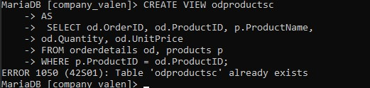
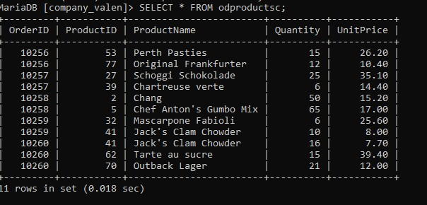
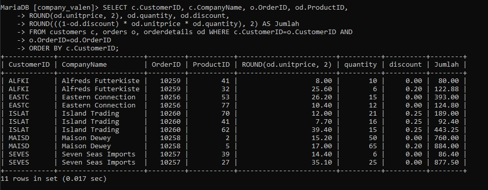
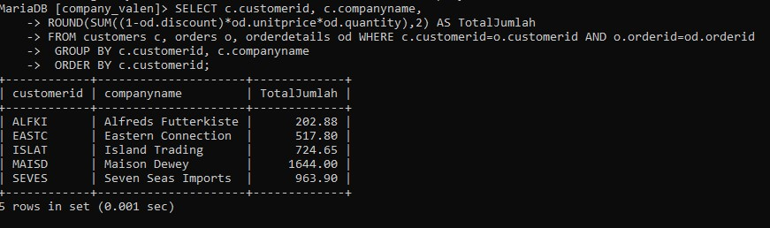

# 1

**QUERY SQL** 
```SQL
SELECT orders.OrderID, orders.OrderDate, orders.CustomerID, customers.CompanyName, customers.ContactName, customers.City, customers.Phone
FROM orders, customers
WHERE orders.CustomerID = customers.customerID;
```
**PENJELASANNYA:**
1. **SELECT**:
    - Bagian ini digunakan untuk memilih kolom-kolom yang ingin ditampilkan dalam hasil query.
    - **orders.OrderID**: Menampilkan kolom `OrderID` dari tabel `orders`, yang merupakan ID pesanan.
    - **orders.OrderDate**: Menampilkan kolom `OrderDate` dari tabel `orders`, yaitu tanggal pemesanan.
    - **orders.CustomerID**: Menampilkan kolom `CustomerID` dari tabel `orders`, yang merujuk ke pelanggan yang melakukan pesanan.
    - **customers.CompanyName**: Menampilkan kolom `CompanyName` dari tabel `customers`, yaitu nama perusahaan pelanggan.
    - **customers.ContactName**: Menampilkan kolom `ContactName` dari tabel `customers`, yaitu nama kontak pelanggan.
    - **customers.City**: Menampilkan kolom `City` dari tabel `customers`, yaitu kota pelanggan.
    - **customers.Phone**: Menampilkan kolom `Phone` dari tabel `customers`, yaitu nomor telepon pelanggan.
2. **FROM**:
    - Menunjukkan tabel-tabel yang terlibat dalam query ini, yaitu `orders` dan `customers`.
    - **orders**: Tabel yang menyimpan informasi tentang pesanan.
    - **customers**: Tabel yang menyimpan informasi tentang pelanggan.
3. **WHERE**:
    - Bagian ini digunakan untuk menentukan kondisi dalam query.
    - **orders.CustomerID = customers.customerID**: Kondisi ini menghubungkan tabel `orders` dengan tabel `customers` berdasarkan kolom `CustomerID`. Artinya, query hanya akan menampilkan data yang cocok antara kolom `CustomerID` di tabel `orders` dengan kolom `customerID` di tabel `customers`.
**HASILNYA:**

# 2

**Query Sql:**
```SQL
SELECT o.OrderID, o.OrderDate, o.CustomerID,
       c.CompanyName, c.ContactName, c.City, c.Phone
FROM orders o
JOIN customers c ON o.CustomerID = c.CustomerID
WHERE c.City = 'London';
```
**Penjelasan:**
1. **SELECT**
	- Bagian `SELECT` digunakan untuk memilih kolom mana yang ingin kita ambil dari tabel-tabel yang digunakan.
	- Dalam query ini, kita mengambil beberapa kolom dari tabel `orders` (yang diwakili oleh alias `o`) dan tabel `customers` (alias `c`).
	- **Kolom yang diambil:**
	    - `o.OrderID`: Menampilkan ID dari order.
	    - `o.OrderDate`: Menampilkan tanggal order dibuat.
	    - `o.CustID`: Menampilkan ID pelanggan yang melakukan order.
	    - `c.CompanyName`: Menampilkan nama perusahaan pelanggan dari tabel `customers`.
	    - `c.ContactName`: Menampilkan nama kontak pelanggan dari tabel `customers`.
	    - `c.City`: Menampilkan kota pelanggan, yang akan difilter berdasarkan kondisi `WHERE`.
	    - `c.Phone`: Menampilkan nomor telepon pelanggan dari tabel `customers`.
    
1. **FROM orders o**
	- Bagian ini menunjukkan tabel utama yang digunakan, yaitu `orders`.
	- `o` adalah **alias** untuk tabel `orders`, yang mempermudah penulisan saat memilih kolom dari tabel tersebut.
	- Alias ini berguna untuk memperpendek penulisan saat ada lebih dari satu tabel yang diakses.

3. **JOIN customers c ON o.CustID = c.CustomerID**
	- **JOIN** adalah cara untuk menghubungkan dua tabel berdasarkan kolom yang memiliki relasi.
	- Di sini, kita menghubungkan tabel `orders` (`o`) dengan tabel `customers` (`c`).
	- Kondisinya adalah `o.CustID = c.CustomerID`, artinya data di tabel `orders` akan dicocokkan dengan data di tabel `customers` berdasarkan ID pelanggan yang sama.
	- Hasil dari `JOIN` ini adalah kita bisa mendapatkan informasi pelanggan dari tabel `customers` yang sesuai dengan order dari tabel `orders`.

4. **WHERE c.City = 'London'**
	- Bagian **WHERE** digunakan untuk memfilter data, hanya menampilkan baris yang memenuhi kondisi tertentu.
	- Kondisi `c.City = 'London'` berarti kita hanya akan menampilkan data pelanggan yang kotanya adalah "London".
	- Filter ini diterapkan ke kolom `City` dari tabel `customers` (`c`), sehingga hanya pelanggan yang tinggal di London yang diambil.
**Hasilnya:**

# 3
**Query Sql:**
```SQL
SELECT o.OrderID, o.OrderDate, c.CompanyName,
c.ContactName, c.Phone, e.LastName, e.Title 
FROM orders o, customers c, employees e 
WHERE o.CustomerID = c.CustomerID AND o.EmpID = e.EmpID;
```
**Penjelasan:**
- **SELECT o.OrderID, o.OrderDate, c.CompanyName, c.ContactName, c.Phone, e.LastName, e.Title**:
    - Bagian ini mendefinisikan kolom-kolom yang akan ditampilkan dalam hasil query.
        - **o.OrderID**: Menampilkan ID dari pesanan.
        - **o.OrderDate**: Menampilkan tanggal pesanan dibuat.
        - **c.CompanyName**: Menampilkan nama perusahaan dari pelanggan yang membuat pesanan.
        - **c.ContactName**: Menampilkan nama kontak pelanggan dari tabel `customers`.
        - **c.Phone**: Menampilkan nomor telepon pelanggan.
        - **e.LastName**: Menampilkan nama belakang karyawan yang menangani pesanan.
        - **e.Title**: Menampilkan jabatan karyawan (misalnya, Sales Rep atau Manager).
- **FROM orders o, customers c, employees e**:
    - Ini mendefinisikan tabel-tabel yang akan digunakan dalam query:
        - **orders**: Tabel yang berisi informasi pesanan (diwakili dengan alias "o").
        - **customers**: Tabel yang berisi data pelanggan (diwakili dengan alias "c").
        - **employees**: Tabel yang berisi informasi karyawan (diwakili dengan alias "e").
- **WHERE o.CustomerID = c.CustomerID AND o.EmpID = e.EmpID**:
    - Bagian **WHERE** berfungsi untuk menghubungkan atau _join_ antara tabel `orders`, `customers`, dan `employees`.
        - **o.CustomerID = c.CustomerID**: Menghubungkan pesanan di tabel `orders` dengan pelanggan di tabel `customers` berdasarkan ID pelanggan (`CustomerID`).
        - **o.EmpID = e.EmpID**: Menghubungkan pesanan di tabel `orders` dengan karyawan di tabel `employees` yang menangani pesanan, berdasarkan ID karyawan (`EmpID`).
**Hasilnya:**

# 4
**Query Sql:**
```SQL
 SELECT o.OrderID, o.OrderDate, c.CompanyName,
     c.ContactName, c.Phone, e.LastName, e.Title
     FROM orders o, customers c, employees e
     WHERE o.CustomerID = c.CustomerID AND o.EmpID = e.EmpID AND e.EmpID AND
     e.FirstName = 'Margaret';
```
**Penjelasan:**
- Klausa SELECT:
    - Menentukan kolom-kolom yang akan ditampilkan dalam hasil query.
    - Mengambil data dari tiga tabel berbeda: orders, customers, dan employees.
    - Kolom yang diambil termasuk ID pesanan, tanggal pesanan, nama perusahaan pelanggan, nama kontak, nomor telepon, nama belakang karyawan, dan jabatan karyawan.
- Klausa FROM:
    - Menentukan tabel-tabel yang digunakan dalam query.
    - Tiga tabel digunakan: orders (o), customers (c), dan employees (e).
    - Setiap tabel diberi alias untuk memudahkan penulisan dan pembacaan query.
- Klausa WHERE:
    - Menentukan kondisi untuk menggabungkan tabel dan memfilter data.
    - o.CustID = c.CustomerID: Menghubungkan tabel orders dengan customers berdasarkan ID pelanggan.
    - o.EmpID = e.EmpID: Menghubungkan tabel orders dengan employees berdasarkan ID karyawan.
    - c.FirstName = 'Margaret': Memfilter hasil untuk hanya menampilkan pesanan dari pelanggan bernama depan Margaret.
**Hasilnya:**

# 5
**Query Sql:**
```SQL
SELECT c.CustomerID, c.CompanyName, o.OrderID,
     o.OrderDate, od.ProductID, p.ProductName,
      od.Quantity AS Qty, od.UnitPrice
     FROM customers c, orders o, orderdetails od, products p
     WHERE c.CustomerID = o.CustomerID AND o.OrderID = od.OrderID
     AND p.ProductID = od.ProductID
     ORDER BY c.CustomerID;
```
**Penjelasan:**
- Klausa SELECT:
    - Memilih kolom-kolom yang akan ditampilkan dari berbagai tabel.
    - CustomerID dan CompanyName dari tabel customers (c)
    - OrderID dan OrderDate dari tabel orders (o)
    - ProductID dari tabel orderdetails (od)
    - ProductName dari tabel products (p)
    - Quantity dari orderdetails, dialiaskan sebagai Qty
    - UnitPrice dari orderdetails
- Klausa FROM:
    - Menentukan tabel-tabel yang digunakan: customers, orders, orderdetails, dan products.
    - Setiap tabel diberi alias (c, o, od, p) untuk memudahkan referensi.
- Klausa WHERE:
    - Menentukan kondisi untuk menggabungkan tabel-tabel:
        - c.CustomerID = o.CustID: Menghubungkan tabel customers dengan orders
        - o.OrderID = od.OrderID: Menghubungkan tabel orders dengan orderdetails
        - p.ProductID = od.ProductID: Menghubungkan tabel products dengan orderdetails
- Klausa ORDER BY:
    - Mengurutkan hasil berdasarkan CustomerID
**Hasilnya:**
	
# 6
**Query Sql:**
```SQL
SELECT c.CustomerID, c.CompanyName, CONCAT(e.LastName, ', ', e.FirstName) AS EmployeeName, od.productid as prodID,
 p.ProductName, od.quantity AS Qty FROM customers c, orders o, orderdetails od,products p, employees e
WHERE c.customerid=o.CustomerID and o.orderid =od.orderid and p.productid=od.productid and e.empid=o.empid order by o.orderID;
```
**Penjelasan:**
1. **Klausa SELECT:**
    - c.CustomerID: Mengambil ID Pelanggan dari tabel customers.
    - c.CompanyName: Mengambil Nama Perusahaan dari tabel customers.
    - CONCAT(e.LastName, ', ', e.FirstName) AS EmployeeName: Menggabungkan Nama Belakang dan Nama Depan Karyawan menjadi satu kolom.
    - od.productid AS prodID: Mengambil ID Produk dari tabel orderdetails, dialiaskan sebagai prodID.
    - p.ProductName: Mengambil Nama Produk dari tabel products.
    - od.quantity AS Qty: Mengambil Jumlah Produk yang dipesan dari tabel orderdetails, dialiaskan sebagai Qty.
2. **Klausa FROM:**
    - customers c: Tabel customers, dialiaskan sebagai c.
    - orders o: Tabel orders, dialiaskan sebagai o.
    - orderdetails od: Tabel orderdetails, dialiaskan sebagai od.
    - products p: Tabel products, dialiaskan sebagai p.
    - employees e: Tabel employees, dialiaskan sebagai e.
3. **Klausa WHERE:**
    - c.customerid = o.CustomerID: Menghubungkan tabel customers dengan orders berdasarkan CustomerID.
    - o.orderid = od.orderid: Menghubungkan tabel orders dengan orderdetails berdasarkan OrderID.
    - p.productid = od.productid: Menghubungkan tabel products dengan orderdetails berdasarkan ProductID.
    - e.empid = o.empid: Menghubungkan tabel employees dengan orders berdasarkan EmpID.
4. **Klausa ORDER BY:**
    - o.orderID: Mengurutkan hasil berdasarkan OrderID dari tabel orders.
**Hasilnya:**

# 7. **Creating a View (`CustOrderEmp`)**:
**Query Sql:**
```SQL
CREATE VIEW CustOrderEmp
    -> AS
    -> SELECT c.CustomerID, c.CompanyName, c.ContactName,
    -> o.OrderID, o.OrderDate, o.EmpID, e.LastName, e.FirstName
    -> FROM customers c, orders o, employees e
    -> WHERE c.CustomerID = o.CustomerID AND o.EmpID = e.EmpID;
```
**Penjelasan:**
**CREATE VIEW CustOrderEmp**
- **`CREATE VIEW`**: Perintah ini digunakan untuk membuat _view_, yaitu tabel virtual yang isinya merupakan hasil dari sebuah query.
- **`CustOrderEmp`**: Nama _view_ yang akan dibuat, yaitu `CustOrderEmp`. Dalam hal ini, _view_ ini akan menyimpan data yang berasal dari tabel `customers`, `orders`, dan `employees`.
 **SELECT c.CustomerID, c.CompanyName, c.ContactName, o.OrderID, o.OrderDate, o.EmpID, e.LastName, e.FirstName**
- **`SELECT`**: Perintah ini digunakan untuk memilih kolom-kolom tertentu dari beberapa tabel.
- **Kolom yang diambil**:
    - **`c.CustomerID`**: ID dari pelanggan yang diambil dari tabel `customers`.
    - **`c.CompanyName`**: Nama perusahaan dari pelanggan, juga diambil dari tabel `customers`.
    - **`c.ContactName`**: Nama kontak dari pelanggan di tabel `customers`.
    - **`o.OrderID`**: ID dari pesanan, diambil dari tabel `orders`.
    - **`o.OrderDate`**: Tanggal pesanan, diambil dari tabel `orders`.
    - **`o.EmpID`**: ID karyawan yang menangani pesanan, diambil dari tabel `orders`.
    - **`e.LastName`**: Nama belakang karyawan, diambil dari tabel `employees`.
    - **`e.FirstName`**: Nama depan karyawan, diambil dari tabel `employees`.
**FROM customers c, orders o, employees e**
- Pada bagian ini, query mengambil data dari tiga tabel:
    - **`customers`**: Aliasnya adalah **`c`**, ini merupakan tabel yang menyimpan informasi tentang pelanggan.
    - **`orders`**: Aliasnya adalah **`o`**, tabel yang menyimpan informasi mengenai pesanan yang dibuat oleh pelanggan.
    - **`employees`**: Aliasnya adalah **`e`**, tabel yang menyimpan informasi tentang karyawan.

**Catatan**: Penggunaan alias **`c`**, **`o`**, dan **`e`** membantu dalam mempersingkat penulisan dan membuat query lebih mudah dibaca.
**WHERE c.CustomerID = o.CustomerID AND o.EmpID = e.EmpID**
- **`WHERE`**: Perintah ini digunakan untuk menentukan kondisi yang harus dipenuhi.
- **Kondisi**:
    - **`c.CustomerID = o.CustomerID`**: Ini menghubungkan tabel `customers` dan `orders`, memastikan bahwa setiap pesanan yang diambil terkait dengan pelanggan yang benar berdasarkan `CustomerID`.
    - **`o.EmpID = e.EmpID`**: Ini menghubungkan tabel `orders` dan `employees`, memastikan bahwa setiap pesanan dikaitkan dengan karyawan yang menangani pesanan tersebut berdasarkan `EmpID`.
**Hasilnya:**


# 8 SQL untuk Membuat _View_ `odproductsc`:

```sql
 CREATE VIEW odproductsc
    -> AS
    -> SELECT od.OrderID, od.ProductID, p.ProductName,
    -> od.Quantity, od.UnitPrice
    -> FROM orderdetails od, products p
    -> WHERE p.ProductID = od.ProductID;
```
**Penjelasan:**
1. **CREATE VIEW odproductsc**: Membuat sebuah _view_ bernama `odproductsc`. Sebuah _view_ adalah tabel virtual yang isinya didasarkan pada hasil dari query. Tujuannya agar kita bisa dengan mudah melihat data gabungan dari beberapa tabel tanpa harus menjalankan query yang kompleks setiap kali kita ingin mengakses data tersebut.
2. **SELECT od.OrderID, od.ProductID, p.ProductName, od.Quantity, od.UnitPrice**: Memilih kolom-kolom yang diinginkan dari dua tabel, yaitu:
    - `od.OrderID`: ID pesanan dari tabel `orderdetails`.
    - `od.ProductID`: ID produk dari tabel `orderdetails`.
    - `p.ProductName`: Nama produk dari tabel `products`.
    - `od.Quantity`: Jumlah produk yang dipesan dari tabel `orderdetails`.
    - `od.UnitPrice`: Harga per unit dari produk yang dipesan dari tabel `orderdetails`.
3. **FROM orderdetails od, products p**: Query ini mengambil data dari dua tabel, yaitu `orderdetails` dengan alias `od`, dan `products` dengan alias `p`.
4. **WHERE p.ProductID = od.ProductID**: Kondisi yang menyatakan bahwa hanya data dari kedua tabel yang memiliki `ProductID` yang sama yang akan diambil. Ini adalah cara untuk menghubungkan dua tabel berdasarkan kolom `ProductID`.
**HASILNYA:**

### Menampilkan Data dari _View_ `odproductsc`:

```sql
SELECT * FROM odproductsc;
```
Query ini digunakan untuk memilih semua data dari _view_ `odproductsc`, yang menampilkan kolom-kolom:
- `OrderID`: ID dari pesanan.
- `ProductID`: ID dari produk yang dipesan.
- `ProductName`: Nama produk yang dipesan.
- `Quantity`: Jumlah produk yang dipesan.
- `UnitPrice`: Harga per unit dari produk tersebut.
**hasilnya:**


# 9
**QUERY SQL:**
```sql
 SELECT c.CustomerID, c.CompanyName, o.OrderID, od.ProductID,
    -> ROUND(od.unitprice, 2), od.quantity, od.discount,
    -> ROUND(((1-od.discount) * od.unitprice * od.quantity), 2) AS Jumlah
    -> FROM customers c, orders o, orderdetails od WHERE c.CustomerID=o.CustomerID AND o.OrderID=od.OrderID
    -> ORDER BY c.CustomerID;
```
**Penjelasan:**
- **SELECT c.customerid, c.companyname, o.orderid, od.productid**:
    - **c.customerid**: Menampilkan ID pelanggan dari tabel `customers` dengan alias `c`.
    - **c.companyname**: Menampilkan nama perusahaan pelanggan dari tabel `customers`.
    - **o.orderid**: Menampilkan ID pesanan dari tabel `orders` dengan alias `o`.
    - **od.productid**: Menampilkan ID produk dari tabel `orderdetails` dengan alias `od`.
- **ROUND(od.unitprice, 2)**:
    - Fungsi **ROUND** digunakan untuk membulatkan harga satuan produk (unit price) dari tabel `orderdetails` ke dua angka desimal.
- **od.quantity**:
    - Menampilkan jumlah barang (quantity) yang dipesan dari tabel `orderdetails`.
- **od.discount**:
    - Menampilkan diskon untuk produk tertentu dari tabel `orderdetails`.
- **ROUND(((1-od.discount) * od.unitprice * od.quantity), 2) AS Jumlah**:
    - Menghitung total harga untuk setiap produk dengan memperhitungkan diskon.
    - Rumus: `(1 - od.discount)` berarti mengurangi diskon dari 1 (atau harga penuh), kemudian dikalikan dengan harga satuan produk (`od.unitprice`) dan jumlah yang dipesan (`od.quantity`). Hasilnya dibulatkan ke dua angka desimal menggunakan **ROUND** dan diberi alias `Jumlah`.
- **FROM customers c, orders o, orderdetails od**:
    - Menyatakan bahwa data diambil dari tiga tabel: `customers` (dengan alias `c`), `orders` (alias `o`), dan `orderdetails` (alias `od`).
- **WHERE c.customerid = o.custid AND o.orderid = od.orderid**:
    - Kondisi pertama: Menghubungkan tabel `customers` dan `orders` melalui kolom `customerid` pada tabel `customers` dengan `custid` pada tabel `orders`.
    - Kondisi kedua: Menghubungkan tabel `orders` dan `orderdetails` melalui kolom `orderid`.
- **ORDER BY c.customerid**:
    - Mengurutkan hasil berdasarkan kolom `customerid` dari tabel `customers`.
**HASILNYA:**


# 10
**QUERY SQL:**
```sql
 SELECT c.customerid, c.companyname, 
 ROUND(SUM((1-od.discount)*od.unitprice*od.quantity),2) AS TotalJumlah
    -> FROM customers c, orders o, orderdetails od WHERE c.customerid=o.customerid AND o.orderid=od.orderid
    -> GROUP BY c.customerid, c.companyname
    -> ORDER BY c.customerid;

```
**Penjelasan:**
- - SELECT:
    - Memilih kolom yang akan ditampilkan: customerid, companyname, dan perhitungan total penjualan yang diberi alias TotalJumlah.
- FROM:
    - Menggunakan tiga tabel: customers (c), orders (o), dan orderdetails (od).
- Perhitungan TotalJumlah:
    - ROUND(..., 2): Membulatkan hasil ke 2 angka desimal.
    - SUM(...): Menjumlahkan total penjualan untuk setiap pelanggan.
    - (1-od.discount)_od.unitprice_od.quantity: Menghitung total penjualan per item dengan memperhitungkan diskon.
- WHERE:
    - Menghubungkan tabel dengan kondisi: c.customerid=o.custid: Mencocokkan pelanggan dengan pesanan mereka. o.orderid=od.orderid: Mencocokkan pesanan dengan detail pesanannya.
- GROUP BY:
    - Mengelompokkan hasil berdasarkan customerid dan companyname.
    - Ini memungkinkan perhitungan total penjualan untuk setiap pelanggan.
- ORDER BY:
    - Mengurutkan hasil berdasarkan customerid.
**HASILNYA:**



