 ## 1. membuat database company_indrawan.
*STRUKTUR "*
SQL
```sql
CREATE TABLE pegawai (
-> NIP INT PRIMARY KEY,
-> NDep VARCHAR(255) NOT NULL,
-> NBlk VARCHAR(255),
-> JK ENUM('L', 'P') NOT NULL,
-> Alamat TEXT NOT NULL,
-> Telp VARCHAR(255) NOT NULL,
Jabatan ENUM('Manager', 'Sales', 'Staff'),
    Gaji BIGINT NOT NULL,
    NoCab VARCHAR(255) NOT NULL
);
```


*PENJELASAN :*
1. **NIP (Nomor Induk Pegawai)**:
    - Tipe data INT dipilih karena NIP biasanya berupa angka yang dapat direpresentasikan dengan tipe data integer.
    - PRIMARY KEY menunjukkan bahwa kolom NIP adalah kunci utama (primary key) yang unik untuk setiap data pegawai.
2. **NDep (Nama Departemen)** dan **NBlk (Nama Belakang)**:
    
    - Tipe data VARCHAR(255)dipilih karena nama departemen dan nama belakang dapat berupa string yang panjangnya bervariasi, namun tidak melebihi 255 karakter.
    - NOT NULL menunjukkan bahwa kolom NDep dan NBlk harus diisi, karena informasi tersebut dianggap penting untuk data pegawai.
3. **JK (Jenis Kelamin)**:
    
    - Tipe data ENUM('L', 'P') dipilih karena jenis kelamin hanya memiliki dua kemungkinan, yaitu 'Laki-laki' dan 'Perempuan'.
    - NOT NULL menunjukkan bahwa kolom JK harus diisi, karena informasi jenis kelamin dianggap penting untuk data pegawai.
4. **Alamat**:
    - Tipe data TEXT dipilih karena alamat dapat berisi string yang lebih panjang daripada VARCHAR(255)
    - NOT NULL menunjukkan bahwa kolom Alamat harus diisi, karena informasi tersebut dianggap penting untuk data pegawai.
5. **Telp (Telepon)**:
    
    - Tipe data VARCHAR(255) dipilih karena nomor telepon dapat berupa string yang panjangnya bervariasi, namun tidak melebihi 255 karakter.
    - NOT NULL menunjukkan bahwa kolom Telp harus diisi, karena informasi kontak pegawai dianggap penting.
6. **Jabatan**:
    
    - Tipe data ENUM('Manager', 'sales', 'Staff') dipilih karena jabatan pegawai hanya memiliki tiga kemungkinan.
    - Tidak ada atribut NOT NULL atau NULL, artinya kolom Jabatan boleh diisi atau dibiarkan kosong.
7. **Gaji**:
    
    - Tipe data BIGINT dipilih karena gaji pegawai dapat berupa angka yang cukup besar.
    - NOT NULL menunjukkan bahwa kolom Gaji harus diisi, karena informasi gaji dianggap penting untuk data pegawai.
8. **NoCab (Nomor Cabang)**:
    
    - Tipe data VARCHAR(255) dipilih karena nomor cabang dapat berupa string yang panjangnya bervariasi, namun tidak melebihi 255 karakter.
    - NOT NULL menunjukkan bahwa kolom NoCab harus diisi, karena informasi cabang dianggap penting untuk data pegawai.

Secara umum, penggunaan tipe data dan atribut NOT NULL atau NULL pada tabel pegawai ini dimaksudkan untuk menjaga integritas dan konsistensi data, serta memastikan bahwa informasi yang dianggap penting untuk data pegawai selalu tersedia.

*HASIL :*
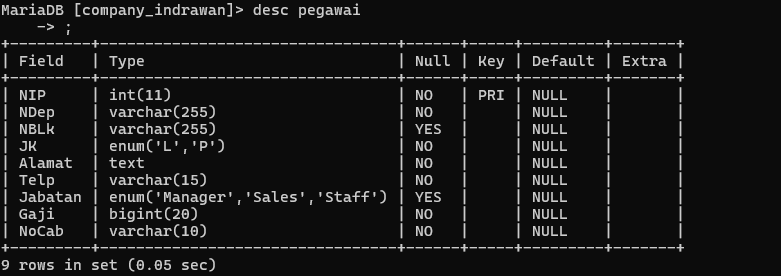


## 2. membuat table pegawai  .
*STRUKTUR "*
SQL
```sql
INSERT INTO pegawai (NIP, NDep, NBlk, JK, Alamat, Telp, Jabatan, Gaji, NoCab) VALUES 
-> (10107, 'Emya', 'Salsalina', 'P', 'JL. Suci 78 Bandung', '022-555768', 'Manager', 5250000, 'C101'), 
-> (10246, 'Dian', 'Anggraini', 'P', 'JL. Mawar 5 Semarang', '024-555102', 'Supervisor', 2750000, 'C103'), 
-> (10324, 'Martin', 'Susanto', 'L', 'JL. Bima 51 Jakarta', '021-555785', 'Staff', 1750000, 'C102'), 
-> (10252, 'Antoni', 'Irawan', 'L', 'JL. A. Yani 15 Jakarta', '021-555888', 'Manager', 5750000, 'C102'), 
-> (10176, 'Diah', 'Wahyuni', 'P', 'JL. Maluku 56 Bandung', '022-555934', 'Supervisor', 2500000, 'C101'), 
-> (10314, 'Ayu', 'Rahmadani', 'P', 'JL. Malaka 342 Jakarta', '021-555098', 'Supervisor', 1950000, 'C102'), 
-> (10307, 'Erik', 'Adrian', 'L', 'JL. Manggis 5 Semarang', '024-555236', 'Manager', 6250000, 'C103'), 
-> (10415, 'Susan', 'Sumantri', 'P', 'JL. Pahlawan 24 Surabaya', '031-555120', '', 2650000, 'C104'), 
-> (10407, 'Rio', 'Gunawan', 'L', 'JL. Melati 356 Surabaya', '031-555231', 'Staff', 1725000, 'C104');
```


*PENJELASAN :*
- *INSERT INTO pegawai*:
    - Menunjukkan bahwa Anda akan menambahkan data ke tabel bernama pegawai.
    
- *(NIP, NDep, NBlk, JK, Alamat, Telp, Jabatan, Gaji, NoCab)*:
    - Ini adalah daftar kolom dalam tabel pegawai yang akan diisi dengan data. Kolom-kolom ini adalah:
        - NIP (Nomor Induk Pegawai)
        - NDep (Nama Depan)
        - NBlk (Nama Belakang)
        - JK (Jenis Kelamin)
    - Alamat (Alamat)
        - Telp (Telepon)
        - Jabatan (Jabatan)
        - Gaji (Gaji)
        - NoCab (Nomor Cabang)
   
- *VALUES*:
    - Menunjukkan data yang akan dimasukkan ke dalam tabel. Data untuk setiap baris harus sesuai dengan urutan kolom yang disebutkan sebelumnya.
    
- *Data yang Dimasukkan*:
    - Baris pertama:
        - NIP: 10107
        - NDep: 'Emya'
        - NBlk: 'Salsalina'
        - JK: 'P' (Perempuan)
        - Alamat: 'JL. Suci 78 Bandung'
        - Telp: '022-555768'
        - Jabatan: 'Manager'
        - Gaji: 5250000
        - NoCab: 'C101'
    - Baris kedua dan seterusnya mengikuti pola yang sama, dengan data yang berbeda.
    
- *Catatan*:
    - Pada baris 10415 untuk Susan Sumantri, kolom Jabatan tidak diisi (''), yang bisa menyebabkan masalah jika kolom Jabatan adalah ENUM dan tidak termasuk nilai kosong. Pastikan kolom Jabatan memiliki nilai yang valid.
    - Jika ada nilai kosong ('') dalam kolom Jabatan, Anda mungkin ingin memperbarui baris ini dengan jabatan yang sesuai, seperti 'Staff', atau menyesuaikan schema tabel untuk mengizinkan nilai kosong jika perlu.

*HASIL :*
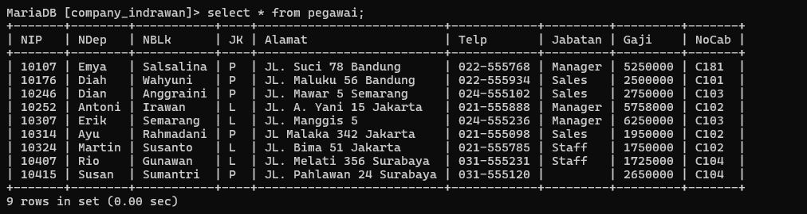


# select table

## jumlahpegawai and jumlahjabatan

### SINTAKS
```sql 
select  COUNT(NIP) AS Jumlahpegawai, COUNT(Jabatan) AS JumlahJabatan FROM pegawai;
```
 
### PENJELASAN 
1. **SELECT**: Ini adalah kata kunci SQL yang digunakan untuk memulai pernyataan SQL untuk mengambil data dari tabel.
2. **COUNT(NIP) AS Jumlahpegawai**:
    - COUNT(NIP) adalah fungsi agregat SQL yang menghitung jumlah baris dalam kolom "NIP" (Nomor Induk Pegawai). Fungsi COUNT menghitung jumlah baris yang memiliki nilai non-NULL dalam kolom yang diberikan.
    - AS Jumlahpegawai adalah penggunaan alias (alias) untuk memberikan nama kolom yang lebih mudah dipahami, yaitu "Jumlahpegawai".
3. **COUNT(Jabatan) AS JumlahJabatan**:
    - COUNT(Jabatan) adalah fungsi agregat SQL yang menghitung jumlah baris dalam kolom "Jabatan". Fungsi COUNT menghitung jumlah baris yang memiliki nilai non-NULL dalam kolom yang diberikan.
    - AS JumlahJabatan adalah penggunaan alias (alias) untuk memberikan nama kolom yang lebih mudah dipahami, yaitu "JumlahJabatan".
4. **FROM pegawai**: Ini adalah klausa SQL yang menentukan tabel dari mana data akan diambil, yaitu tabel "pegawai".
Jadi, pernyataan SQL tersebut akan menghasilkan dua kolom:
wai" yang berisi jumlah baris (jumlah pegawai) dalam tabel "pegawai".
2. "JumlahJabatan" yang berisi jumlah baris (jumlah jabatan) dalam tabel "pegawai".

### HASIL : 
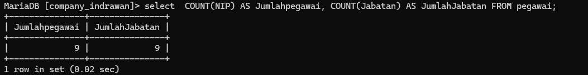


## jumlah pegawai

### sintaks
```SQL
 SELECT COUNT(NIP) AS Jumlahpegawai
    -> FROM pegawai
    -> where NoCab ='C102';
```

### PENJELASAN
1. **SELECT COUNT(NIP) AS Jumlahpegawai**:
    - SELECT: Ini adalah kata kunci SQL yang digunakan untuk memulai pernyataan SQL untuk mengambil data dari tabel.
    - COUNT(NIP): Ini adalah fungsi agregat SQL yang menghitung jumlah baris dalam kolom "NIP" (Nomor Induk Pegawai). Fungsi COUNT menghitung jumlah baris yang memiliki nilai non-NULL dalam kolom yang diberikan.
    - AS Jumlahpegawai: Ini adalah penggunaan alias (alias) untuk memberikan nama kolom yang lebih mudah dipahami, yaitu "Jumlahpegawai".
2. **FROM pegawai**:
    - FROM: Ini adalah klausa SQL yang menentukan tabel dari mana data akan diambil, yaitu tabel "pegawai".
3. **WHERE NoCab ='C102'**:
    - WHERE: Ini adalah klausa SQL yang digunakan untuk memfilter baris berdasarkan kondisi tertentu.
    - NoCab =C102: Ini adalah kondisi yang akan digunakan untuk memfilter baris di mana nilai kolom "NoCab" (Nomor Cabang) sama dengan 'C102'.
Jadi, pernyataan SQL tersebut akan menghasilkan satu kolom:
- "Jumlahpegawai" yang berisi jumlah baris (jumlah pegawai) dalam tabel "pegawai" di mana nilai "NoCab" (Nomor Cabang) sama dengan 'C102'.


### HASIL:
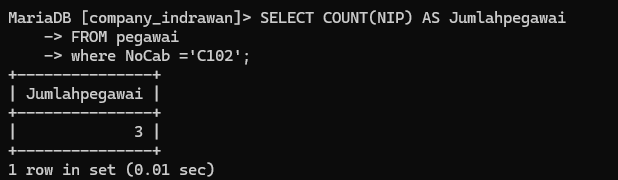

## NoCab jumlahpegawai

### sintaks
```sql
SELECT NoCab,COUNT(NIP) AS Jumlahpegawai
    -> FROM  Pegawai
    -> GROUP BY NoCab;
```
### PENJELASAN
1. SELECT NoCab, COUNT(NIP) AS Jumlahpegawai:
    - SELECT: Ini adalah kata kunci SQL yang digunakan untuk memulai pernyataan SQL untuk mengambil data dari tabel.
    - NoCab: Ini adalah nama kolom yang akan diambil dari tabel. Kolom ini mungkin berisi nomor cabang.
    - COUNT(NIP): Ini adalah fungsi agregat SQL yang menghitung jumlah baris dalam kolom "NIP" (Nomor Induk Pegawai). Fungsi COUNT menghitung jumlah baris yang memiliki nilai non-NULL dalam kolom yang diberikan.
    - AS Jumlahpegawai: Ini adalah penggunaan alias (alias) untuk memberikan nama kolom yang lebih mudah dipahami, yaitu "Jumlahpegawai".
2. FROM Pegawai:
    - FROM: Ini adalah klausa SQL yang menentukan tabel dari mana data akan diambil, yaitu tabel "Pegawai".
3. GROUP BY NoCab:
    - GROUP BY: Ini adalah klausa SQL yang digunakan untuk mengelompokkan baris berdasarkan satu atau lebih kolom.
    - NoCab: Ini adalah kolom yang akan digunakan untuk mengelompokkan baris. Dalam hal ini, baris akan dikelompokkan berdasarkan nilai kolom "NoCab" (Nomor Cabang).
Jadi, pernyataan SQL tersebut akan menghasilkan dua kolom:
- "NoCab" yang berisi nomor cabang
- "Jumlahpegawai" yang berisi jumlah pegawai untuk setiap nomor cabang

### HASIL:
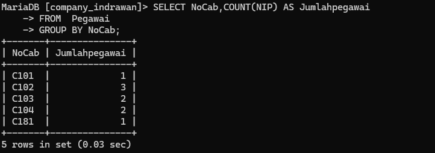

## NoCab jumlah pegawai having
### sintaks
```sql
Select Nocab, Count(NIP) AS Jumlahpegawai
    -> FROM pegawai
    -> GROUP BY NoCab HAVING COUNT(NIP)>= 3;
```
### PENJELASAN
1. SELECT NoCab, COUNT(NIP) AS Jumlahpegawai:
    - SELECT: Ini adalah kata kunci SQL yang digunakan untuk memulai pernyataan SQL untuk mengambil data dari tabel.
    - NoCab: Ini adalah nama kolom yang akan diambil dari tabel. Kolom ini mungkin berisi nomor cabang.
    - COUNT(NIP): Ini adalah fungsi agregat SQL yang menghitung jumlah baris dalam kolom "NIP" (Nomor Induk Pegawai). Fungsi COUNT menghitung jumlah baris yang memiliki nilai non-NULL dalam kolom yang diberikan.
    - AS Jumlahpegawai: Ini adalah penggunaan alias (alias) untuk memberikan nama kolom yang lebih mudah dipahami, yaitu "Jumlahpegawai".
2. FROM pegawai:
    - FROM: Ini adalah klausa SQL yang menentukan tabel dari mana data akan diambil, yaitu tabel "pegawai".
3. GROUP BY NoCab:
    - GROUP BY: Ini adalah klausa SQL yang digunakan untuk mengelompokkan baris berdasarkan satu atau lebih kolom.
    - NoCab: Ini adalah kolom yang akan digunakan untuk mengelompokkan baris. Dalam hal ini, baris akan dikelompokkan berdasarkan nilai kolom "NoCab" (Nomor Cabang).
4. HAVING COUNT(NIP) >= 3:
    - HAVING: Ini adalah klausa SQL yang digunakan untuk memfilter kelompok berdasarkan kondisi tertentu, setelah pengelompokan dilakukan.
    - COUNT(NIP) >= 3: Ini adalah kondisi yang akan digunakan untuk memfilter kelompok di mana jumlah baris (jumlah pegawai) dalam setiap grup (cabang) lebih besar atau sama dengan 3.
Jadi, pernyataan SQL tersebut akan menghasilkan dua kolom:
- "NoCab" yang berisi nomor cabang
- "Jumlahpegawai" yang berisi jumlah pegawai untuk setiap nomor cabang yang memiliki jumlah pegawai lebih besar atau sama dengan 3.
### HASIL:
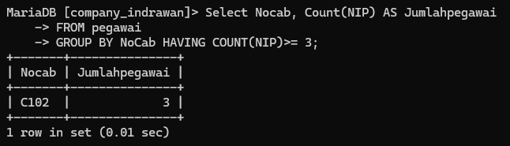

## total_gaji
### sintaks
```sql
SELECT SUM(Gaji) AS Total_GAJI
    -> FROM pegawai;
```
### PENJELASAN
1. SELECT:
    - Ini adalah kata kunci SQL yang digunakan untuk memulai pernyataan SQL untuk mengambil data dari tabel.
2. SUM(Gaji):
    - SUM: Ini adalah fungsi agregat SQL yang menghitung jumlah total dari nilai-nilai dalam kolom yang diberikan.
    - Gaji: Ini adalah nama kolom yang akan dijumlahkan, yaitu kolom "Gaji".
3. AS:
    - Ini adalah kata kunci SQL yang digunakan untuk memberikan alias (nama baru) pada kolom hasil.
4. Total_GAJI:
    - Ini adalah alias (nama baru) yang diberikan pada kolom yang berisi jumlah total gaji.
5. FROM:
    - Ini adalah kata kunci SQL yang menentukan tabel dari mana data akan diambil.
6. pegawai:
    - Ini adalah nama tabel dari mana data akan diambil.
Jadi, keseluruhan pernyataan SQL tersebut akan mengambil data dari tabel "pegawai", menghitung jumlah total gaji dari semua pegawai, dan menampilkannya dengan nama kolom "Total_GAJI".

### HASIL:
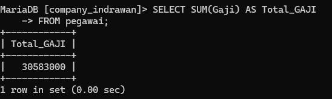

## gaji manager
### sintaks
```sql
SELECT SUM(Gaji) AS Gaji_Manager
    -> FROM pegawai
    -> WHERE Jabatan = 'Manager';
```
### PENJELASAN
1. SELECT SUM(Gaji) AS Gaji_Manager:
    - SELECT: Ini adalah kata kunci SQL yang digunakan untuk memulai pernyataan SQL untuk mengambil data dari tabel.
    - SUM(Gaji): Ini adalah fungsi agregat SQL yang menghitung jumlah total dari nilai-nilai dalam kolom "Gaji".
    - AS Gaji_Manager: Ini adalah penggunaan alias (nama baru) untuk memberikan nama kolom yang lebih mudah dipahami, yaitu "Gaji_Manager".
2. FROM pegawai:
    - FROM: Ini adalah klausa SQL yang menentukan tabel dari mana data akan diambil, yaitu tabel "pegawai".
3. WHERE Jabatan = 'Manager':
    - WHERE: Ini adalah klausa SQL yang digunakan untuk memfilter data berdasarkan kondisi tertentu.
    - Jabatan = 'Manager': Ini adalah kondisi filter yang akan memilih hanya data di mana nilai kolom "Jabatan" adalah 'Manager'.
Jadi, pernyataan SQL tersebut akan:
1. Mengambil data dari tabel "pegawai".
2. Menghitung jumlah total gaji dari semua pegawai yang memiliki jabatan "Manager".
3. Menampilkan hasil jumlah total gaji dengan nama kolom "Gaji_Manager".
### HASIL:
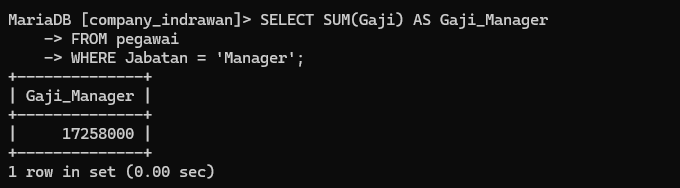

## NoCab Total_gaji
### sintaks
```sql
SELECT NoCab, SUM(Gaji) AS Total_Gaji
    -> FROM pegawai
    -> GROUP BY NoCab;
```
### PENJELASAN 
1. SELECT NoCab, SUM(Gaji) AS Total_Gaji
    - SELECT: Ini adalah kata kunci untuk menentukan kolom-kolom yang ingin ditampilkan dalam hasil query.
    - NoCab: Kolom yang berisi nomor cabang tempat seorang pegawai bekerja.
    - SUM(Gaji): Fungsi agregat yang akan menjumlahkan seluruh nilai pada kolom Gaji.
    - AS Total_Gaji: Memberikan alias atau nama baru untuk hasil penjumlahan gaji, yaitu "Total_Gaji".
2. FROM pegawai
    - FROM: Kata kunci yang menentukan tabel tempat data berasal.
    - pegawai: Nama tabel yang berisi data-data pegawai.
3. GROUP BY NoCab
    - GROUP BY: Kata kunci yang akan mengelompokkan baris-baris data berdasarkan nilai pada kolom NoCab.
    - Jadi, query ini akan menghitung total gaji untuk setiap nomor cabang yang ada pada tabel pegawai.
Secara keseluruhan, query ini akan menghasilkan sebuah tabel dengan dua kolom:
1. NoCab: Menampilkan nomor cabang
2. Total_Gaji: Mena
### HASIL:
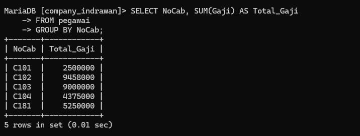
## Total gaji nocab having SUM
### sintaks
```sql
SELECT Nocab, SUM(gaji) AS Total_gaji
    -> FROM pegawai
    -> GROUP BY NoCab HAVING SUM(Gaji)>= 8000000;
```
### PENJELASAN
1. SELECT NoCab, SUM(Gaji) AS Total_Gaji
    - SELECT: Menentukan kolom-kolom yang akan ditampilkan dalam hasil query.
    - NoCab: Kolom yang berisi nomor cabang tempat pegawai bekerja.
    - SUM(Gaji): Fungsi agregat yang akan menjumlahkan seluruh nilai pada kolom Gaji.
    - AS Total_Gaji: Memberikan alias "Total_Gaji" untuk hasil penjumlahan gaji.
2. FROM pegawai
    - FROM: Menentukan tabel sumber data, yaitu tabel "pegawai".
3. GROUP BY NoCab
    - GROUP BY: Mengelompokkan baris-baris data berdasarkan nilai pada kolom NoCab.
4. HAVING SUM(Gaji) >= 8000000

    - HAVING: Menambahkan kondisi filter pada hasil pengelompokkan.
    - SUM(Gaji) >= 8000000: Hanya menampilkan kelompok-kelompok (cabang) yang memiliki total gaji lebih besar atau sama dengan 8.000.000.
Jadi, query ini akan menghasilkan tabel yang berisi:
1. NoCab: Nomor cabang
2. Total_Gaji: Total gaji untuk
### HASIL:
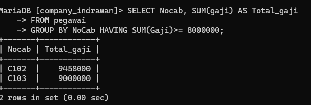

## select AVG(gaji)
 ### sintaks
```sql
select AVG(gaji) AS Rata_rata -> FROM pegawai;
```
### PENJELASAN
1. SELECT AVG(Gaji) AS Rata_rata
    
    - SELECT: Menentukan kolom yang akan ditampilkan dalam hasil query.
    - AVG(Gaji): Fungsi agregat yang akan menghitung rata-rata (average) dari nilai-nilai pada kolom Gaji.
    - AS Rata_rata: Memberikan alias "Rata_rata" untuk hasil perhitungan rata-rata gaji.
2. FROM pegawai
    
    - FROM: Menentukan tabel sumber data, yaitu tabel "pegawai".

Jadi, query ini akan menghasilkan sebuah tabel dengan satu baris dan satu kolom, yang berisi nilai rata-rata gaji dari seluruh pegawai yang terdapat dalam tabel "pegawai".
### HASIL:
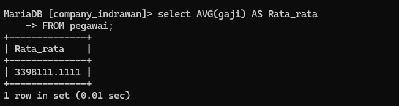

## select gaji maneger

### sintaks
```sql
SELECT AVG(gaji) AS GajiRataMgr
    -> FROM pegawai
    -> WHERE Jabatan = 'Manager';
```
### PENJELASAN
1. SELECT AVG(Gaji) AS GajiRataMgr
    - SELECT: Menentukan kolom yang akan ditampilkan dalam hasil query.
    - AVG(Gaji): Fungsi agregat yang akan menghitung rata-rata (average) dari nilai-nilai pada kolom Gaji.
    - AS GajiRataMgr: Memberikan alias "GajiRataMgr" untuk hasil perhitungan rata-rata gaji.
2. FROM pegawai
    - FROM: Menentukan tabel sumber data, yaitu tabel "pegawai".
3. WHERE Jabatan = 'Manager'
    - WHERE: Menambahkan kondisi filter pada baris-baris data.
    - Jabatan = 'Manager': Hanya akan memilih baris-baris data di mana nilai pada kolom Jabatan adalah 'Manager'.
Jadi, query ini akan menghasilkan sebuah tabel dengan satu baris dan satu kolom, yang berisi nilai rata-rata gaji dari seluruh pegawai yang memiliki jabatan sebagai Manager.
### HASIL:
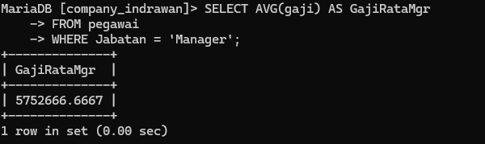


## avg ratagaji

### sintaks
```sql
SELECT NoCab,AVG(Gaji) AS Ratagaji
    -> FROM pegawai
    -> GROUP BY NoCab;
```
### PENJELASAN
1. SELECT NoCab, AVG(Gaji) AS RataGaji
    - SELECT: Menentukan kolom-kolom yang akan ditampilkan dalam hasil query.
    - NoCab: Kolom yang berisi nomor cabang tempat pegawai bekerja.
    - AVG(Gaji): Fungsi agregat yang akan menghitung rata-rata (average) dari nilai-nilai pada kolom Gaji.
    - AS RataGaji: Memberikan alias "RataGaji" untuk hasil perhitungan rata-rata gaji.
2. FROM pegawai
    - FROM: Menentukan tabel sumber data, yaitu tabel "pegawai".
3. GROUP BY NoCab
    - GROUP BY: Mengelompokkan baris-baris data berdasarkan nilai pada kolom NoCab.
Jadi, query ini akan menghasilkan sebuah tabel dengan dua kolom:
1. NoCab: Nomor cabang
2. RataGaji: Rata-rata gaji untuk masing-masing cabang
### HASIL:
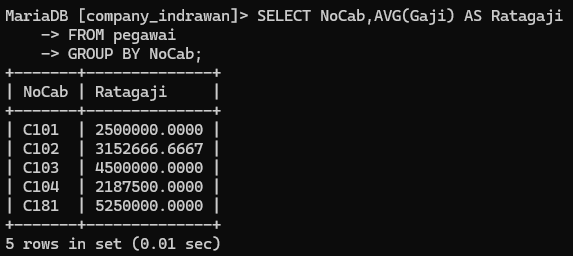

## avg ratagaji no cab-no cab
### sintaks
```sql
SELECT Nocab, AVG(gaji) AS Ratagaji
    -> FROM pegawai
    -> GROUP BY NoCab HAVING NoCab ='C101' OR NoCAB = 'C102';
```
### PENJELASAN
1. SELECT NoCab, AVG(Gaji) AS RataGaji
    - SELECT: Menentukan kolom-kolom yang akan ditampilkan dalam hasil query.
    - NoCab: Kolom yang berisi nomor cabang tempat pegawai bekerja.
    - AVG(Gaji): Fungsi agregat yang akan menghitung rata-rata (average) dari nilai-nilai pada kolom Gaji.
    - AS RataGaji: Memberikan alias "RataGaji" untuk hasil perhitungan rata-rata gaji.
2. FROM pegawai
    - FROM: Menentukan tabel sumber data, yaitu tabel "pegawai".
3. GROUP BY NoCab
    - GROUP BY: Mengelompokkan baris-baris data berdasarkan nilai pada kolom NoCab.
4. HAVING NoCab = 'C101' OR NoCab = 'C102'
    - HAVING: Menambahkan kondisi filter pada hasil pengelompokkan.
    - NoCab = 'C101' OR NoCab = 'C102': Hanya akan menampilkan kelompok-kelompok (cabang) yang memiliki nomor cabang 'C101' atau 'C102'.
Jadi, query ini akan menghasilkan sebuah tabel dengan dua kolom:
1. NoCab: Nomor cabang (hanya 'C101' dan 'C102')
2. RataGaji: Rata-rata gaj
### HASIL:
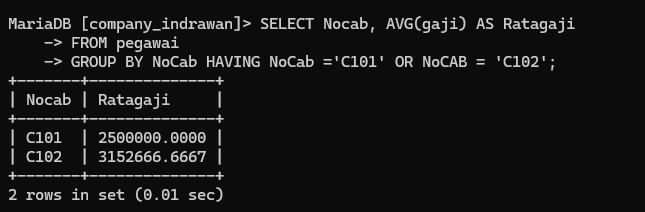

## SELECT MAX  Gajiterkecil AS GajiTerbesar
### sintaks
```sql
SELECT MAX(Gaji) AS GajiTerbesar, MIN(Gaji) AS GajiTerkecil
    -> FROM pegawai;
```
### PENJELASAN
mari saya jelaskan query SQL ini:
1. SELECT MAX(Gaji) AS GajiTerbesar, MIN(Gaji) AS GajiTerkecil
    - SELECT: Menentukan kolom-kolom yang akan ditampilkan dalam hasil query.
    - MAX(Gaji): Fungsi agregat yang akan menghitung nilai gaji terbesar.
    - MIN(Gaji): Fungsi agregat yang akan menghitung nilai gaji terkecil.
    - AS GajiTerbesar: Memberikan alias "GajiTerbesar" untuk hasil perhitungan nilai gaji terbesar.
    - AS GajiTerkecil: Memberikan alias "GajiTerkecil" untuk hasil perhitungan nilai gaji terkecil.
2. FROM pegawai
    - FROM: Menentukan tabel sumber data, yaitu tabel "pegawai".
Jadi, query ini akan menghasilkan sebuah tabel dengan dua baris dan dua kolom:
1. Baris pertama: Nilai gaji terbesar di antara semua pegawai.
2. Baris kedua: Nilai gaji terkecil di antara semua pegawai.
### HASIL:
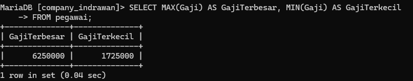

##  SELECT  MAX Gajiterkecil AS GajiTerbesar manager
### sintaks
```sql
SELECT MAX(Gaji) AS GajiTerbesar, MIN(Gaji) AS GajiTerkecil
    -> FROM pegawai
    -> WHERE Jabatan = 'Manager';
```
### PENJELASAN
1. SELECT MAX(Gaji) AS GajiTerbesar, MIN(Gaji) AS GajiTerkecil
    - SELECT: Menentukan kolom-kolom yang akan ditampilkan dalam hasil query.
    - MAX(Gaji): Fungsi agregat yang akan menghitung nilai gaji terbesar.
    - MIN(Gaji): Fungsi agregat yang akan menghitung nilai gaji terkecil.
    - AS GajiTerbesar: Memberikan alias "GajiTerbesar" untuk hasil perhitungan nilai gaji terbesar.
    - AS GajiTerkecil: Memberikan alias "GajiTerkecil" untuk hasil perhitungan nilai gaji terkecil.
2. FROM pegawai
    - FROM: Menentukan tabel sumber data, yaitu tabel "pegawai".
3. WHERE Jabatan = 'Manager'
    - WHERE: Menambahkan kondisi filter pada baris-baris data.
    - Jabatan = 'Manager': Hanya akan memilih baris-baris data di mana nilai pada kolom Jabatan adalah 'Manager'.
Jadi, query ini akan menghasilkan sebuah tabel dengan dua baris dan dua kolom:
1. Baris pertama: Nilai gaji terbesar di antara seluruh pegawai yang memiliki jabatan sebagai Manager.
2. Baris kedua: Nilai gaji terkecil di antara seluruh pegawai yang memiliki jabatan sebagai Manager.
### HASIL:
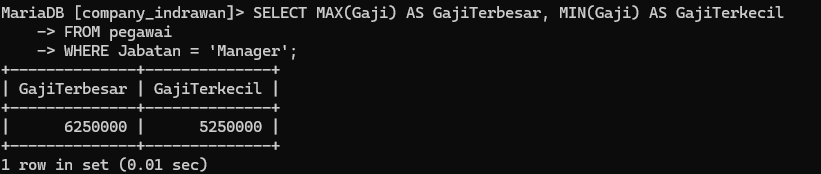

##  SELECT NoCAB, MAX(Gaji) AS GajiTerbesar, MIN(Gaji)
### sintaks
```sql
 SELECT NoCAB, MAX(Gaji) AS GajiTerbesar, MIN(Gaji) AS GajiTerkecil
    -> FROM pegawai
    -> GROUP BY NoCab;
```
### PENJELASAN
1. SELECT NoCab, MAX(Gaji) AS GajiTerbesar, MIN(Gaji) AS GajiTerkecil:
    - SELECT berfungsi untuk menentukan kolom-kolom yang akan ditampilkan dalam hasil query.
    - NoCab adalah kolom yang berisi nomor cabang tempat pegawai bekerja.
    - MAX(Gaji) adalah fungsi agregat yang akan menghitung nilai gaji terbesar untuk masing-masing cabang.
    - MIN(Gaji) adalah fungsi agregat yang akan menghitung nilai gaji terkecil untuk masing-masing cabang.
    - AS GajiTerbesar dan AS GajiTerkecil memberikan alias untuk hasil perhitungan nilai gaji terbesar dan terkecil.
2. FROM pegawai:
    - FROM menentukan tabel sumber data, yaitu tabel "pegawai".
3. GROUP BY NoCab:
    - GROUP BY mengelompokkan baris-baris data berdasarkan nilai pada kolom NoCab.
Dengan query ini, hasilnya akan berupa tabel yang berisi:
1. Kolom NoCab: Nomor cabang tempat pegawai bekerja.
2. Kolom GajiTerbesar: Nilai gaji terbesar untuk masing-masing cabang.
3. Kolom GajiTerkecil: Nilai gaji terkecil untuk masing-masing cabang.
### HASIL:
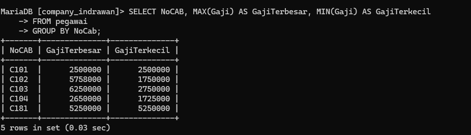
## SELECT NoCAB, MAX(Gaji) AS GajiTerbesar, MIN(Gaji) (3)
### sintaks
```sql
 SELECT NoCAB, MAX(Gaji) AS GajiTerbesar, MIN(Gaji) AS GajiTerkecil
    -> FROM pegawai
    -> GROUP BY NoCab;
```
### PENJELASAN
1. SELECT NoCab, MAX(Gaji) AS GajiTerbesar, MIN(Gaji) AS GajiTerkecil
    - SELECT: Menentukan kolom-kolom yang akan ditampilkan dalam hasil query.
    - NoCab: Kolom yang berisi nomor cabang tempat pegawai bekerja.
    - MAX(Gaji): Fungsi agregat yang akan menghitung nilai gaji terbesar untuk masing-masing cabang.
    - MIN(Gaji): Fungsi agregat yang akan menghitung nilai gaji terkecil untuk masing-masing cabang.
    - AS GajiTerbesar: Memberikan alias "GajiTerbesar" untuk hasil perhitungan nilai gaji terbesar.
    - AS GajiTerkecil: Memberikan alias "GajiTerkecil" untuk hasil perhitungan nilai gaji terkecil.
2. FROM pegawai
    - FROM: Menentukan tabel sumber data, yaitu tabel "pegawai".
3. GROUP BY NoCab
    - GROUP BY: Mengelompokkan baris-baris data berdasarkan nilai pada kolom NoCab.
Jadi, query ini akan menghasilkan sebuah tabel dengan tiga kolom:
1. NoCab: Nomor cabang tempat pegawai bekerja.
2. GajiTerbesar: Nilai gaji terbesar untuk masing-masing cabang.
3. GajiTerkecil: Nilai gaji terkecil untuk masing-masing cabang
### HASIL:
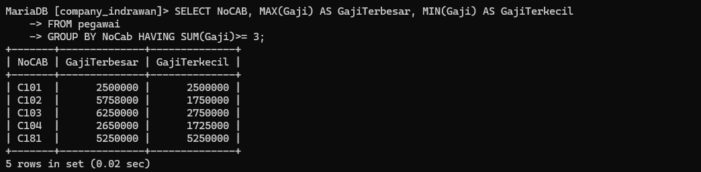


## SELECT COUNT(NIP) AS Jumlahpegawai, SUM(Gaji) AS Totalgaji

### sintaks
```sql
 SELECT COUNT(NIP) AS Jumlahpegawai, SUM(Gaji) AS Totalgaji,
    -> AVG(Gaji) AS RataGaji, MAX(Gaji) AS GajiMaks, Min(gaji) AS Gajmin
    -> FROM pegawai;
```
### PENJELASAN
1. SELECT COUNT(NIP) AS Jumlahpegawai:
    - Fungsi COUNT(NIP) menghitung jumlah baris/record pada tabel "pegawai".
    - Hasil hitungan ini diberikan alias "Jumlahpegawai".
2. SUM(Gaji) AS Totalgaji:
    - Fungsi SUM(Gaji) menjumlahkan seluruh nilai gaji pada tabel "pegawai".
    - Hasil penjumlahan ini diberikan alias "Totalgaji".
3. AVG(Gaji) AS RataGaji:
    - Fungsi AVG(Gaji) menghitung rata-rata nilai gaji pada tabel "pegawai".
    - Hasil perhitungan rata-rata ini diberikan alias "RataGaji".
4. MAX(Gaji) AS GajiMaks:
    
    - Fungsi MAX(Gaji) mencari nilai gaji terbesar pada tabel "pegawai".
    - Hasil nilai terbesar ini diberikan alias "GajiMaks".
5. MIN(Gaji) AS GajiMin:
    - Fungsi MIN(Gaji) mencari nilai gaji terkecil pada tabel "pegawai".
    - Hasil nilai terkecil ini diberikan alias "GajiMin".
6. FROM pegawai:
    - Menentukan tabel sumber data, yaitu tabel "pegawai".
Jadi, query ini akan menghasilkan sebuah tabel dengan 5 kolom:
1. Jumlahpegawai: Jumlah total pegawai
2. Totalgaji: Total seluruh gaji pegawai
3. RataGaji: Rata-rata gaji pegawai
4. GajiMaks: Gaji terbesar
5. GajiMin: Gaji terkecil
### HASIL:
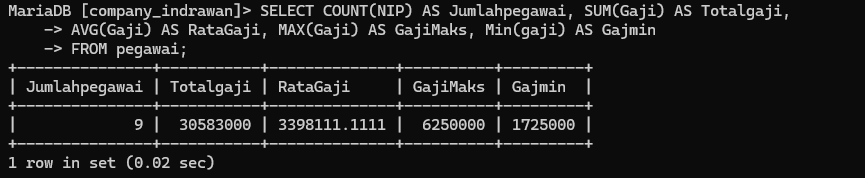

## SELECT COUNT(NIP) AS Jumlahpegawai, SUM(Gaji) AS Totalgaji,NoCab HAVING SUM(Gaji) <= 2600000 

### sintaks
```sql
AS Jumlahpegawai, SUM(Gaji) AS Totalgaji,
    -> AVG(Gaji) AS RataGaji, MAX(Gaji) AS GajiMaks, Min(gaji) AS Gajmin
    -> FROM pegawai
    -> WHERE Jabatan = 'Staf' OR Jabatan ='Sales'
    -> GROUP BY NoCab HAVING SUM(Gaji) <= 2600000 ;
```
### PENJELASAN
1. SELECT COUNT(NIP) AS Jumlahpegawai, SUM(Gaji) AS Totalgaji, AVG(Gaji) AS RataGaji, MAX(Gaji) AS GajiMaks, MIN(Gaji) AS GajiMin:
    - Ini sama dengan penjelasan sebelumnya, menggunakan fungsi agregat untuk menghitung jumlah pegawai, total gaji, rata-rata gaji, gaji maksimum, dan gaji minimum.
2. FROM pegawai:
    - Mengambil data dari tabel "pegawai".
3. WHERE Jabatan = 'Staf' OR Jabatan ='Sales':
    - Memfilter data hanya untuk pegawai yang memiliki jabatan "Staf" atau "Sales".
4. GROUP BY NoCab:
    - Mengelompokkan hasil perhitungan berdasarkan nomor cabang (NoCab).
5. HAVING SUM(Gaji) <= 2600000:
    - Memfilter kelompok-kelompok data berdasarkan total gaji, hanya menampilkan kelompok yang memiliki total gaji <= Rp 2.600.000.
Jadi, query ini akan menghasilkan tabel yang berisi:
1. Jumlahpegawai: Jumlah pegawai berjabatan Staf atau Sales di setiap cabang.
2. Totalgaji: Total gaji pegawai berjabatan Staf atau Sales di setiap cabang yang total gajinya <= Rp 2.600.000.
3. RataGaji: Rata-rata gaji pegawai berjabatan Staf atau Sales di setiap cabang yang total gajinya <= Rp 2.600.000.
4. GajiMaks: Gaji maksimum pegawai berjabatan Staf atau Sales di setiap cabang yang total gajinya <= Rp 2.600.000.
5. GajiMin: Gaji minimum pegawai berjabatan Staf atau Sales di setiap cabang yang total gajinya <= Rp 2.600.000.
### HASIL:
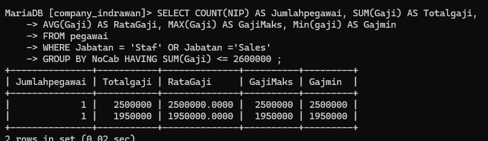

## praktikum 7

# 1

*QUERY SQL* 
SQL
```sql
SELECT orders.OrderID, orders.OrderDate, orders.CustomerID, customers.CompanyName, customers.ContactName, customers.City, customers.Phone
FROM orders, customers
WHERE orders.CustomerID = customers.customerID;
```

*PENJELASANNYA:*
1. *SELECT*:
    - Bagian ini digunakan untuk memilih kolom-kolom yang ingin ditampilkan dalam hasil query.
    - *orders.OrderID*: Menampilkan kolom OrderID dari tabel orders, yang merupakan ID pesanan.
    - *orders.OrderDate*: Menampilkan kolom OrderDate dari tabel orders, yaitu tanggal pemesanan.
    - *orders.CustomerID*: Menampilkan kolom CustomerID dari tabel orders, yang merujuk ke pelanggan yang melakukan pesanan.
    - *customers.CompanyName*: Menampilkan kolom CompanyName dari tabel customers, yaitu nama perusahaan pelanggan.
    - *customers.ContactName*: Menampilkan kolom ContactName dari tabel customers, yaitu nama kontak pelanggan.
    - *customers.City*: Menampilkan kolom City dari tabel customers, yaitu kota pelanggan.
    - *customers.Phone*: Menampilkan kolom Phone dari tabel customers, yaitu nomor telepon pelanggan.
2. *FROM*:
    - Menunjukkan tabel-tabel yang terlibat dalam query ini, yaitu orders dan customers.
    - *orders*: Tabel yang menyimpan informasi tentang pesanan.
    - *customers*: Tabel yang menyimpan informasi tentang pelanggan.
3. *WHERE*:
    - Bagian ini digunakan untuk menentukan kondisi dalam query.
    - *orders.CustomerID = customers.customerID*: Kondisi ini menghubungkan tabel orders dengan tabel customers berdasarkan kolom CustomerID. Artinya, query hanya akan menampilkan data yang cocok antara kolom CustomerID di tabel orders dengan kolom customerID di tabel customers.
*HASILNYA:*

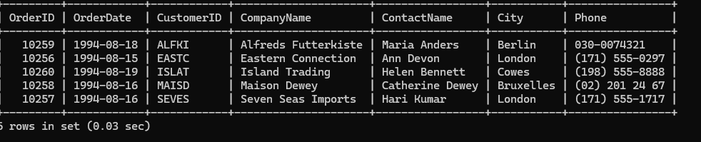

# 2

*Query Sql:*
SQL
```sql
SELECT o.OrderID, o.OrderDate, o.CustomerID,
       c.CompanyName, c.ContactName, c.City, c.Phone
FROM orders o
JOIN customers c ON o.CustomerID = c.CustomerID
WHERE c.City = 'London';
```

*Penjelasan:*
1. *SELECT*
	- Bagian SELECT digunakan untuk memilih kolom mana yang ingin kita ambil dari tabel-tabel yang digunakan.
	- Dalam query ini, kita mengambil beberapa kolom dari tabel orders (yang diwakili oleh alias o) dan tabel customers (alias c).
	- *Kolom yang diambil:*
	    - o.OrderID: Menampilkan ID dari order.
	    - o.OrderDate: Menampilkan tanggal order dibuat.
	    - o.CustID: Menampilkan ID pelanggan yang melakukan order.
	    - c.CompanyName: Menampilkan nama perusahaan pelanggan dari tabel customers.
	    - c.ContactName: Menampilkan nama kontak pelanggan dari tabel customers.
	    - c.City: Menampilkan kota pelanggan, yang akan difilter berdasarkan kondisi WHERE.
	    - c.Phone: Menampilkan nomor telepon pelanggan dari tabel customers.
    
1. *FROM orders o*
	- Bagian ini menunjukkan tabel utama yang digunakan, yaitu orders.
	- o adalah *alias* untuk tabel orders, yang mempermudah penulisan saat memilih kolom dari tabel tersebut.
	- Alias ini berguna untuk memperpendek penulisan saat ada lebih dari satu tabel yang diakses.

3. *JOIN customers c ON o.CustID = c.CustomerID*
	- *JOIN* adalah cara untuk menghubungkan dua tabel berdasarkan kolom yang memiliki relasi.
	- Di sini, kita menghubungkan tabel orders (o) dengan tabel customers (c).
	- Kondisinya adalah o.CustID = c.CustomerID, artinya data di tabel orders akan dicocokkan dengan data di tabel customers berdasarkan ID pelanggan yang sama.
	- Hasil dari JOIN ini adalah kita bisa mendapatkan informasi pelanggan dari tabel customers yang sesuai dengan order dari tabel orders.

4. *WHERE c.City = 'London'*
	- Bagian *WHERE* digunakan untuk memfilter data, hanya menampilkan baris yang memenuhi kondisi tertentu.
	- Kondisi c.City = 'London' berarti kita hanya akan menampilkan data pelanggan yang kotanya adalah "London".
	- Filter ini diterapkan ke kolom City dari tabel customers (c), sehingga hanya pelanggan yang tinggal di London yang diambil.
*Hasilnya:*
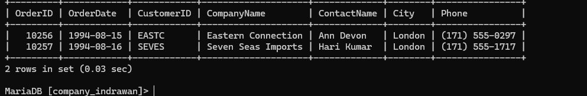

# 3
*Query Sql:*
SQL
```sql
SELECT o.OrderID, o.OrderDate, c.CompanyName,
c.ContactName, c.Phone, e.LastName, e.Title 
FROM orders o, customers c, employees e 
WHERE o.CustomerID = c.CustomerID AND o.EmpID = e.EmpID;
```

*Penjelasan:*
- *SELECT o.OrderID, o.OrderDate, c.CompanyName, c.ContactName, c.Phone, e.LastName, e.Title*:
    - Bagian ini mendefinisikan kolom-kolom yang akan ditampilkan dalam hasil query.
        - *o.OrderID*: Menampilkan ID dari pesanan.
        - *o.OrderDate*: Menampilkan tanggal pesanan dibuat.
        - *c.CompanyName*: Menampilkan nama perusahaan dari pelanggan yang membuat pesanan.
        - *c.ContactName*: Menampilkan nama kontak pelanggan dari tabel customers.
        - *c.Phone*: Menampilkan nomor telepon pelanggan.
        - *e.LastName*: Menampilkan nama belakang karyawan yang menangani pesanan.
        - *e.Title*: Menampilkan jabatan karyawan (misalnya, Sales Rep atau Manager).
- *FROM orders o, customers c, employees e*:
    - Ini mendefinisikan tabel-tabel yang akan digunakan dalam query:
        - *orders*: Tabel yang berisi informasi pesanan (diwakili dengan alias "o").
        - *customers*: Tabel yang berisi data pelanggan (diwakili dengan alias "c").
        - *employees*: Tabel yang berisi informasi karyawan (diwakili dengan alias "e").
- *WHERE o.CustomerID = c.CustomerID AND o.EmpID = e.EmpID*:
    - Bagian *WHERE* berfungsi untuk menghubungkan atau join antara tabel orders, customers, dan employees.
        - *o.CustomerID = c.CustomerID*: Menghubungkan pesanan di tabel orders dengan pelanggan di tabel customers berdasarkan ID pelanggan (CustomerID).
        - *o.EmpID = e.EmpID*: Menghubungkan pesanan di tabel orders dengan karyawan di tabel employees yang menangani pesanan, berdasarkan ID karyawan (EmpID).
*Hasilnya:*
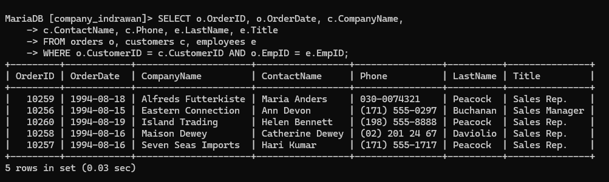

# 4
*Query Sql:*
SQL
```sql
 SELECT o.OrderID, o.OrderDate, c.CompanyName,
     c.ContactName, c.Phone, e.LastName, e.Title
     FROM orders o, customers c, employees e
     WHERE o.CustomerID = c.CustomerID AND o.EmpID = e.EmpID AND e.EmpID AND
     e.FirstName = 'Margaret';
```

*Penjelasan:*
- Klausa SELECT:
    - Menentukan kolom-kolom yang akan ditampilkan dalam hasil query.
    - Mengambil data dari tiga tabel berbeda: orders, customers, dan employees.
    - Kolom yang diambil termasuk ID pesanan, tanggal pesanan, nama perusahaan pelanggan, nama kontak, nomor telepon, nama belakang karyawan, dan jabatan karyawan.
- Klausa FROM:
    - Menentukan tabel-tabel yang digunakan dalam query.
    - Tiga tabel digunakan: orders (o), customers (c), dan employees (e).
    - Setiap tabel diberi alias untuk memudahkan penulisan dan pembacaan query.
- Klausa WHERE:
    - Menentukan kondisi untuk menggabungkan tabel dan memfilter data.
    - o.CustID = c.CustomerID: Menghubungkan tabel orders dengan customers berdasarkan ID pelanggan.
    - o.EmpID = e.EmpID: Menghubungkan tabel orders dengan employees berdasarkan ID karyawan.
    - c.FirstName = 'Margaret': Memfilter hasil untuk hanya menampilkan pesanan dari pelanggan bernama depan Margaret.
*Hasilnya:*
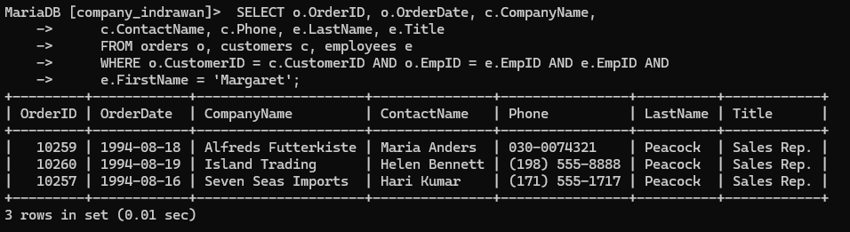

# 5
*Query Sql:*
SQL
```sql
SELECT c.CustomerID, c.CompanyName, o.OrderID,
     o.OrderDate, od.ProductID, p.ProductName,
      od.Quantity AS Qty, od.UnitPrice
     FROM customers c, orders o, orderdetails od, products p
     WHERE c.CustomerID = o.CustomerID AND o.OrderID = od.OrderID
     AND p.ProductID = od.ProductID
     ORDER BY c.CustomerID;
```

*Penjelasan:*
- Klausa SELECT:
    - Memilih kolom-kolom yang akan ditampilkan dari berbagai tabel.
    - CustomerID dan CompanyName dari tabel customers (c)
    - OrderID dan OrderDate dari tabel orders (o)
    - ProductID dari tabel orderdetails (od)
    - ProductName dari tabel products (p)
    - Quantity dari orderdetails, dialiaskan sebagai Qty
    - UnitPrice dari orderdetails
- Klausa FROM:
    - Menentukan tabel-tabel yang digunakan: customers, orders, orderdetails, dan products.
    - Setiap tabel diberi alias (c, o, od, p) untuk memudahkan referensi.
- Klausa WHERE:
    - Menentukan kondisi untuk menggabungkan tabel-tabel:
        - c.CustomerID = o.CustID: Menghubungkan tabel customers dengan orders
        - o.OrderID = od.OrderID: Menghubungkan tabel orders dengan orderdetails
        - p.ProductID = od.ProductID: Menghubungkan tabel products dengan orderdetails
- Klausa ORDER BY:
    - Mengurutkan hasil berdasarkan CustomerID
*Hasilnya:*
	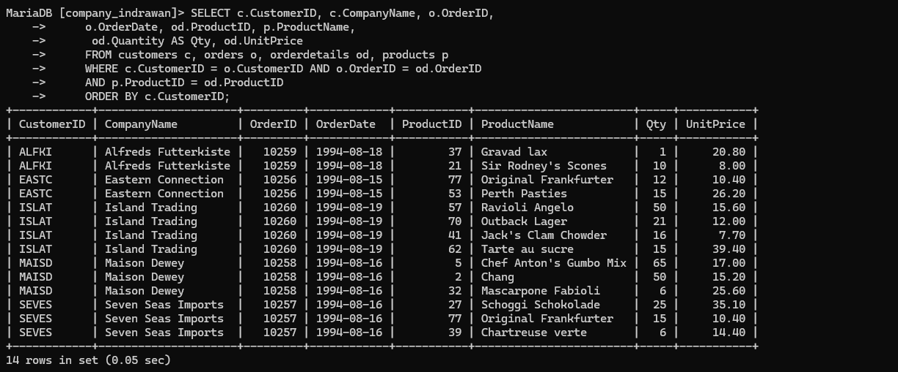

# 6
*Query Sql:*
SQL
```sql
SELECT c.CustomerID, c.CompanyName, CONCAT(e.LastName, ', ', e.FirstName) AS EmployeeName, od.productid as prodID,
 p.ProductName, od.quantity AS Qty FROM customers c, orders o, orderdetails od,products p, employees e
WHERE c.customerid=o.CustomerID and o.orderid =od.orderid and p.productid=od.productid and e.empid=o.empid order by o.orderID;
```

*Penjelasan:*
1. *Klausa SELECT:*
    - c.CustomerID: Mengambil ID Pelanggan dari tabel customers.
    - c.CompanyName: Mengambil Nama Perusahaan dari tabel customers.
    - CONCAT(e.LastName, ', ', e.FirstName) AS EmployeeName: Menggabungkan Nama Belakang dan Nama Depan Karyawan menjadi satu kolom.
    - od.productid AS prodID: Mengambil ID Produk dari tabel orderdetails, dialiaskan sebagai prodID.
    - p.ProductName: Mengambil Nama Produk dari tabel products.
    - od.quantity AS Qty: Mengambil Jumlah Produk yang dipesan dari tabel orderdetails, dialiaskan sebagai Qty.
2. *Klausa FROM:*
    - customers c: Tabel customers, dialiaskan sebagai c.
    - orders o: Tabel orders, dialiaskan sebagai o.
    - orderdetails od: Tabel orderdetails, dialiaskan sebagai od.
    - products p: Tabel products, dialiaskan sebagai p.
    - employees e: Tabel employees, dialiaskan sebagai e.
3. *Klausa WHERE:*
    - c.customerid = o.CustomerID: Menghubungkan tabel customers dengan orders berdasarkan CustomerID.
    - o.orderid = od.orderid: Menghubungkan tabel orders dengan orderdetails berdasarkan OrderID.
    - p.productid = od.productid: Menghubungkan tabel products dengan orderdetails berdasarkan ProductID.
    - e.empid = o.empid: Menghubungkan tabel employees dengan orders berdasarkan EmpID.
4. *Klausa ORDER BY:*
    - o.orderID: Mengurutkan hasil berdasarka   n OrderID dari tabel orders.
*Hasilnya:*
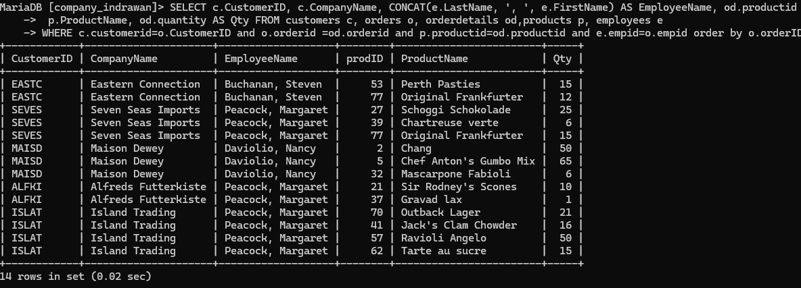


# 7. **Creating a View (CustOrderEmp):
*Query Sql:*
SQL
```sql
SELECT c.CustomerID, c.CompanyName, CONCAT(e.LastName, ', ', e.FirstName) AS EmployeeName, od.productid as prodID,
 p.ProductName, od.quantity AS Qty FROM customers c, orders o, orderdetails od,products p, employees e
WHERE c.customerid=o.CustomerID and o.orderid =od.orderid and p.productid=od.productid and e.empid=o.empid order by o.orderID;

```
*Penjelasan:*
*CREATE VIEW CustOrderEmp*
- **CREATE VIEW**: Perintah ini digunakan untuk membuat view, yaitu tabel virtual yang isinya merupakan hasil dari sebuah query.
- **CustOrderEmp**: Nama view yang akan dibuat, yaitu CustOrderEmp. Dalam hal ini, view ini akan menyimpan data yang berasal dari tabel customers, orders, dan employees.
 *SELECT c.CustomerID, c.CompanyName, c.ContactName, o.OrderID, o.OrderDate, o.EmpID, e.LastName, e.FirstName*
- **SELECT**: Perintah ini digunakan untuk memilih kolom-kolom tertentu dari beberapa tabel.
- *Kolom yang diambil*:
    - **c.CustomerID**: ID dari pelanggan yang diambil dari tabel customers.
    - **c.CompanyName**: Nama perusahaan dari pelanggan, juga diambil dari tabel customers.
    - **c.ContactName**: Nama kontak dari pelanggan di tabel customers.
    - **o.OrderID**: ID dari pesanan, diambil dari tabel orders.
    - **o.OrderDate**: Tanggal pesanan, diambil dari tabel orders.
    - **o.EmpID**: ID karyawan yang menangani pesanan, diambil dari tabel orders.
    - **e.LastName**: Nama belakang karyawan, diambil dari tabel employees.
    - **e.FirstName**: Nama depan karyawan, diambil dari tabel employees.
*FROM customers c, orders o, employees e*
- Pada bagian ini, query mengambil data dari tiga tabel:
    - **customers**: Aliasnya adalah **c**, ini merupakan tabel yang menyimpan informasi tentang pelanggan.
    - **orders**: Aliasnya adalah **o**, tabel yang menyimpan informasi mengenai pesanan yang dibuat oleh pelanggan.
    - **employees**: Aliasnya adalah **e**, tabel yang menyimpan informasi tentang karyawan.

*Catatan*: Penggunaan alias **c**, **o**, dan **e** membantu dalam mempersingkat penulisan dan membuat query lebih mudah dibaca.
*WHERE c.CustomerID = o.CustomerID AND o.EmpID = e.EmpID*
- **WHERE**: Perintah ini digunakan untuk menentukan kondisi yang harus dipenuhi.
- *Kondisi*:
    - **c.CustomerID = o.CustomerID**: Ini menghubungkan tabel customers dan orders, memastikan bahwa setiap pesanan yang diambil terkait dengan pelanggan yang benar berdasarkan CustomerID.
    - **o.EmpID = e.EmpID**: Ini menghubungkan tabel orders dan employees, memastikan bahwa setiap pesanan dikaitkan dengan karyawan yang menangani pesanan tersebut berdasarkan EmpID.
*Hasilnya:*
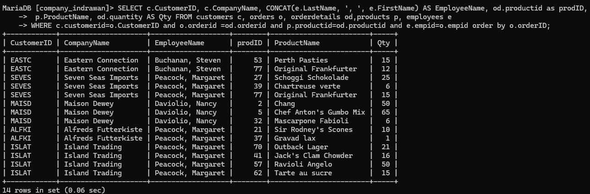


# 8
### SQL untuk Membuat View odproductsc:

sql
```sql
CREATE VIEW odproductsc
    AS
    SELECT od.OrderID, od.ProductID, p.ProductName,
    od.Quantity, od.UnitPrice
    FROM orderdetails od, products p
    WHERE p.ProductID = od.ProductID;
```

*Penjelasan:*
1. *CREATE VIEW odproductsc*: Membuat sebuah view bernama odproductsc. Sebuah view adalah tabel virtual yang isinya didasarkan pada hasil dari query. Tujuannya agar kita bisa dengan mudah melihat data gabungan dari beberapa tabel tanpa harus menjalankan query yang kompleks setiap kali kita ingin mengakses data tersebut.
2. *SELECT od.OrderID, od.ProductID, p.ProductName, od.Quantity, od.UnitPrice*: Memilih kolom-kolom yang diinginkan dari dua tabel, yaitu:
    - od.OrderID: ID pesanan dari tabel orderdetails.
    - od.ProductID: ID produk dari tabel orderdetails.
    - p.ProductName: Nama produk dari tabel products.
    - od.Quantity: Jumlah produk yang dipesan dari tabel orderdetails.
    - od.UnitPrice: Harga per unit dari produk yang dipesan dari tabel orderdetails.
3. *FROM orderdetails od, products p*: Query ini mengambil data dari dua tabel, yaitu orderdetails dengan alias od, dan products dengan alias p.
4. *WHERE p.ProductID = od.ProductID*: Kondisi yang menyatakan bahwa hanya data dari kedua tabel yang memiliki ProductID yang sama yang akan diambil. Ini adalah cara untuk menghubungkan dua tabel berdasarkan kolom ProductID.
*HASILNYA:*
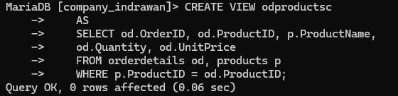
*hasilnya:*
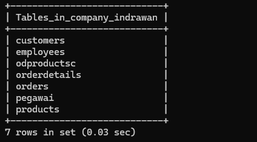
### SQL untuk Menampilkan Data dari View odproductsc:

sql
`SELECT * FROM odproductsc;`

Query ini digunakan untuk memilih semua data dari view odproductsc, yang menampilkan kolom-kolom:
- OrderID: ID dari pesanan.
- ProductID: ID dari produk yang dipesan.
- ProductName: Nama produk yang dipesan.
- Quantity: Jumlah produk yang dipesan.
- UnitPrice: Harga per unit dari produk tersebut.
*hasilnya:*
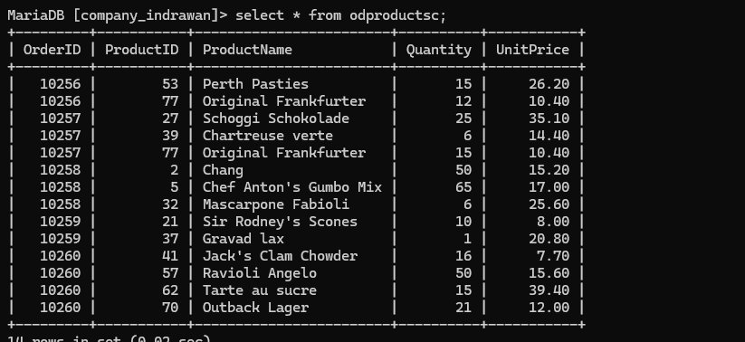

# 9
*QUERY SQL:*
sql
```sql
SELECT c.CustomerID, c.CompanyName, o.OrderID, od.ProductID,
ROUND(od.unitprice, 2), od.quantity, od.discount,
 ROUND(((1-od.discount) * od.unitprice * od.quantity), 2) AS Jumlah
FROM customers c, orders o, orderdetails od WHERE c.CustomerID=o.CustomerID AND o.OrderID=od.OrderID
ORDER BY c.CustomerID;

```
*Penjelasan:*
- *SELECT c.customerid, c.companyname, o.orderid, od.productid*:
    - *c.customerid*: Menampilkan ID pelanggan dari tabel customers dengan alias c.
    - *c.companyname*: Menampilkan nama perusahaan pelanggan dari tabel customers.
    - *o.orderid*: Menampilkan ID pesanan dari tabel orders dengan alias o.
    - *od.productid*: Menampilkan ID produk dari tabel orderdetails dengan alias od.
- *ROUND(od.unitprice, 2)*:
    - Fungsi *ROUND* digunakan untuk membulatkan harga satuan produk (unit price) dari tabel orderdetails ke dua angka desimal.
- *od.quantity*:
    - Menampilkan jumlah barang (quantity) yang dipesan dari tabel orderdetails.
- *od.discount*:
    - Menampilkan diskon untuk produk tertentu dari tabel orderdetails.
- *ROUND(((1-od.discount) * od.unitprice * od.quantity), 2) AS Jumlah*:
    - Menghitung total harga untuk setiap produk dengan memperhitungkan diskon.
    - Rumus: (1 - od.discount) berarti mengurangi diskon dari 1 (atau harga penuh), kemudian dikalikan dengan harga satuan produk (od.unitprice) dan jumlah yang dipesan (od.quantity). Hasilnya dibulatkan ke dua angka desimal menggunakan *ROUND* dan diberi alias Jumlah.
- *FROM customers c, orders o, orderdetails od*:
    - Menyatakan bahwa data diambil dari tiga tabel: customers (dengan alias c), orders (alias o), dan orderdetails (alias od).
- *WHERE c.customerid = o.custid AND o.orderid = od.orderid*:
    - Kondisi pertama: Menghubungkan tabel customers dan orders melalui kolom customerid pada tabel customers dengan custid pada tabel orders.
    - Kondisi kedua: Menghubungkan tabel orders dan orderdetails melalui kolom orderid.
- *ORDER BY c.customerid*:
    - Mengurutkan hasil berdasarkan kolom customerid dari tabel customers.
*HASILNYA:*
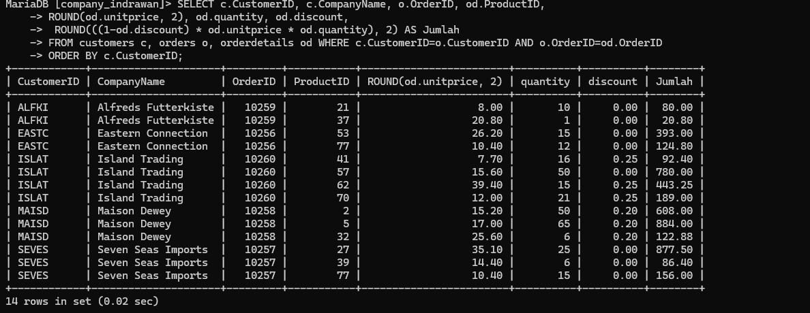

# 10
*QUERY SQL:*
sql
```sql
 SELECT c.customerid, c.companyname, ROUND(SUM((1-od.discount)*od.unitprice*od.quantity),2) AS TotalJumlah
     FROM customers c, orders o, orderdetails od WHERE c.customerid=o.customerid AND o.orderid=od.orderid
     GROUP BY c.customerid, c.companyname
     ORDER BY c.customerid;

```

*Penjelasan:*
- - SELECT:
    - Memilih kolom yang akan ditampilkan: customerid, companyname, dan perhitungan total penjualan yang diberi alias TotalJumlah.
- FROM:
    - Menggunakan tiga tabel: customers (c), orders (o), dan orderdetails (od).
- Perhitungan TotalJumlah:
    - ROUND(..., 2): Membulatkan hasil ke 2 angka desimal.
    - SUM(...): Menjumlahkan total penjualan untuk setiap pelanggan.
    - (1-od.discount)_od.unitprice_od.quantity: Menghitung total penjualan per item dengan memperhitungkan diskon.
- WHERE:
    - Menghubungkan tabel dengan kondisi: c.customerid=o.custid: Mencocokkan pelanggan dengan pesanan mereka. o.orderid=od.orderid: Mencocokkan pesanan dengan detail pesanannya.
- GROUP BY:
    - Mengelompokkan hasil berdasarkan customerid dan companyname.
    - Ini memungkinkan perhitungan total penjualan untuk setiap pelanggan.
- ORDER BY:
    - Mengurutkan hasil berdasarkan customerid.
*HASILNYA:*
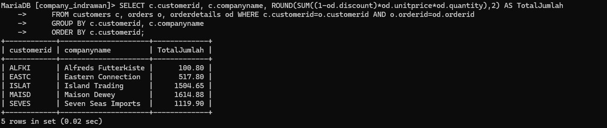