### Buka phpMyAdmin dan buat database baru dengan nama `company_namamu` 
- Klik pada "Databases" di menu kiri
- Masukkan nama database `company_namamu` dan klik "Create"
### Buat tabel dengan nama `pegawai`
- Klik pada database `company_faruq` yang baru saja dibuat
- Klik pada tab "SQL"
- Masukkan perintah SQL untuk membuat tabel `pegawai`:

Lalu pencet "GO".
**penjelasan:**
1. `NIP` 
    - Tipe data: `int` (integer)
    - Constraint: `PRIMARY KEY` Ini berarti setiap nilai pada kolom `NIP` harus unik dan tidak boleh ada duplikasi. Constraint `PRIMARY KEY` juga secara otomatis membuat indeks pada kolom tersebut, sehingga pencarian dan pengaksesan data berdasarkan `NIP` akan lebih cepat.
    - Penjelasan: Kolom `NIP` digunakan sebagai primary key untuk mengidentifikasi setiap pegawai secara unik. Tipe data `int` dipilih karena NIP biasanya berupa angka.
2. `NDep`
    - Tipe data: `varchar(255)`
    - Constraint: `NOT NULL` memastikan bahwa setiap pegawai harus memiliki nama departemen.
    - Penjelasan: Kolom `NDep` menyimpan nama departemen tempat pegawai bekerja. Tipe data `varchar(255)` dipilih untuk mengakomodasi panjang nama departemen yang bervariasi. 
3. `NBlk`
    - Tipe data: `varchar(255)`
    - Constraint: `-` (tidak ada constraint) sehingga nilai dapat diisi atau dibiarkan kosong.
    - Penjelasan: Kolom `NBlk` menyimpan nama blok tempat pegawai bekerja. Tipe data `varchar(255)` dipilih untuk mengakomodasi panjang nama blok yang bervariasi. Kolom ini tidak memiliki 
4. `JK` 
    - Tipe data: `enum('Laki-Laki','Perempuan')`
    - Constraint: `NOT NULL`  memastikan bahwa setiap pegawai harus memiliki jenis kelamin yang didefinisikan.
    - Penjelasan: Kolom `JK` menyimpan jenis kelamin pegawai. Tipe data `enum` dipilih karena hanya ada dua kemungkinan nilai, yaitu 'Laki-Laki' atau 'Perempuan'.
5. `Alamat`
    - Tipe data: `text`
    - Constraint: `NOT NULL`  memastikan bahwa setiap pegawai harus memiliki alamat yang diisi.
    - Penjelasan: Kolom `Alamat` menyimpan informasi alamat pegawai. Tipe data `text` dipilih karena dapat menampung teks yang panjang.
6. `Telp`
    - Tipe data: `varchar(20)`
    - Constraint: `NOT NULL` memastikan bahwa setiap pegawai harus memiliki nomor telepon yang diisi.
    - Penjelasan: Kolom `Telp` menyimpan nomor telepon pegawai. Tipe data `varchar(20)` dipilih untuk mengakomodasi panjang nomor telepon yang bervariasi. 
7. `Jabatan` 
    - Tipe data: `enum('Manager','Supervisor','Staff')`
    - Constraint: `NOT NULL` memastikan bahwa setiap pegawai harus memiliki jabatan yang didefinisikan.
    - Penjelasan: Kolom `Jabatan` menyimpan informasi jabatan pegawai. Tipe data `enum` dipilih karena hanya ada tiga kemungkinan nilai, yaitu 'Manager', 'Supervisor', atau 'Staff'.
8. `Gaji` 
    - Tipe data: `BIGINT`
    - Constraint: `NOT NULL` memastikan bahwa setiap pegawai harus memiliki gaji yang diisi.
    - Penjelasan: Kolom `Gaji` menyimpan informasi gaji pegawai. Tipe data `BIGINT` dipilih karena dapat menampung nilai gaji yang besar. 
9. `NoCab` 
    - Tipe data: `varchar(20)`
    - Constraint: `NOT NULL` memastikan bahwa setiap pegawai harus memiliki nomor cabang yang diisi.
    - Penjelasan: Kolom `NoCab` menyimpan informasi nomor cabang tempat pegawai bekerja. Tipe data `varchar(20)` dipilih untuk mengakomodasi panjang nomor cabang yang bervariasi. 


### Masukkan data-data pada tabel `pegawai`
- Klik pada tabel `pegawai` di panel kiri
- Klik pada tab "Insert"

- Masukkan data-data, lalu klik "Go"

### Masukkan data-data pada tabel `pegawai`menggunakan DESC
 - Klik pada tabel `pegawai` di panel kiri
 - Klik pada tab "Insert" lalu ketik : 
 ```sql
 DESC table_pegawai;
```
hasilnya:


### Masukkan hasil data pada tabel pegawai menggunakan perintah SELECT
- Klik pada tabel `pegawai` di panel kiri
 - Klik pada tab "Insert" lalu ketik :
```sql
SELECT * FROM `table_pegawai`;
```
hasilnya:


# PRAKTIKKUM 5
### PERINTAH SELECT
#### From
```sql 
SELECT 
    COUNT(NIP) AS JumlahPegawai,
    COUNT(Jabatan) AS JumlahJabatan
FROM pegawai;
```
**penjelasan:**
- `SELECT `= untuk memilih kolom apa saja yang ingin dipilih (untuk dihitung). 
- `COUNT (NIP)` = untuk menghitung Jumlah barisan data yang mempunyai dari kolom Yan dipilih. NIP adalah nama kolom Yang dipilih untuk dihitung. 
- `AS `= untuk mengubah nama dari suatu kolom untuk sementara. Jumlah Pegawai = merupakan nama ubahan dari Perintah AS yang digunakan. merupakan nama sementara dari Perintah COUNT (NIP). 
- `COUNT (Jabatan) `untuk menghitung jumlah barisan data yang mempunyai isi data dan kolom yang dipilih. Jabatan adalah nama kolom Yang dipilih untuk dihitung 
- `AS `= untuk mengubah nama dari suatu kolom untuk sementara. Jumlah Jabatan = merupakan nama sementara dari perintah COUNT (Jabatan). 
- `FROM Pegawai` = merupakan dari tabel mana datanya yang digunakan Pegawai adalah nama tabel Yang datanya ingin digunakan.
- **Hasilnya** = karena ada 9 barisan data, Yang ingin dihitung adalah kolom NIP, Jumlah dari kolom NIP (isi datanya) ada 9, ditampilkan sebagai Jumlah pesawai. Kolom Jabatan Jusa dihitung, akan tetapi ada satu data yang berisi Null (kosong), oleh karena itu hanya ada 8 data ditampilkan sebagai Jumlah Jabatan.

**hasilnya:**

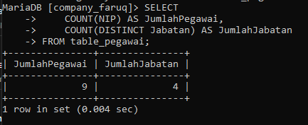
#### Where
```sql
SELECT COUNT(NIP) AS JumlahPegawai FROM table_pegawai WHERE NoCab = 'C102'
```
**penjelasan:**
- SELECT= untuk memilih kolom mana saja yang di ingin dipilih untuk dihitung.
- COUNT(NIP)= untuk menghitung jumlah basis data yang mempunyai data dari kolom yang dipilih, NIP adalah nama kolom yang dipilih untuk dihitung.
- AS= untuk mengubah nama dari suatu kolom untuk sementara.
- jumlahpegawai= nama sementara yang dipilih untuk colom COUNT(NIP).
- FROM pegawai= dari tabel mana datanya akan digunakan, pegawai adalah nama tabel yang dipilih untuk digunakan.
- WHERE= merupakan kondisi yang harus dipenuhi agar datanya dapat dihitung dengan query COUNT(NIP).
- (NoCab = C102;) = adalah kondisi dari WHERE yang harus dipenuhi, jadi hanya barisan data yang memiliki C102 dikolom NoCab yang bisa dihitung.
*Hasilnya:* di 9 barisan data yang ada pada tabel pegawai, kita ingin menghitung jumlah barisan data yang memiliki nilai C102 pada kolom NoCab nya dengan menggunakan COUNT. jadi yang muncul adalah 2 barisan data. kita juga ingin mengubah nama dari kolom hasil perintah COUNT secara sementara dengan perintah AS, namanya adalah jumlahpegawai.

**hasilnya:**

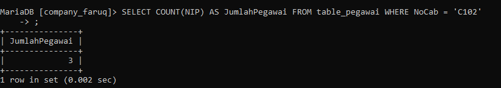
#### Group By
```sql
	SELECT NoCab,COUNT(NIP) AS Jumlah_Pegawai
FROM table_pegawai
GROUP BY NoCab
```
**penjelasan:**
 - `SELECT` untuk memilih kolom mana saja yang ingin dihitung atau ditampilkan. 
 -  Nocab = merupakan nama kolom Yang ingin ditampilkan. 
- `COUNT (NIP)` = untuk menghitung Jumlah barisan data Yang mempunyai isi data dari kolom Yang dipilih. 
- ` NIP` adalah nama kolom yang dipilih untuk dihitung. AS untuk mengubah nama dari suatu kolom untuk sementara. 
- `Jumlah Pegawai` = merupakan nama sementara dari  kolom hasil COUNT (NIP). 
- `FROM Pegawai` dari tabel mana Yang data kolomnya ingin digunakan. Pegawai adalah nama tabel Yang dipilih untuk digunakan. 
- `GROUP BY` untuk mengelompokkan data berdasarkan nilai data yang telah ditentuka Pada kolom Yang dipilih. Nocab hama kolom Yang dipilih untuk datanya dikelompokkan. 
- **Hasilnya** = Berdasarkan. 9 barisan data, masing-masing. nilai, dalam kolom Nocab

**hasilnya:**

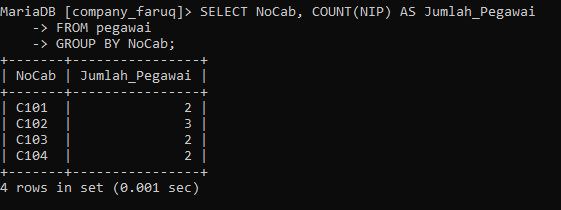
#### Having
```sql
SELECT NoCab, COUNT(NIP) AS Jumlah_pegawai
FROM table_pegawai
GROUP BY NoCab HAVING COUNT(NIP) >= 3
```
**penjelasan:**
- `SELECT `= untuk memilih kolom mana sasa Yang ingin dihitung atau ditampilkan. 
- `Nocab` = merupakan nama kolom yang ingin ditampilkan. 
- `COUNT (NIP)` = untuk menghitung jumlah barisan data yang mempunyai isi data dari kolom Yang dipilih. NIP adalah nama kolom Yang dipilih untuk dihitung. 
- ` AS `= untuk mengubah nama dari suatu kolom untuk sementara. 
- `Jumlah-Pegawai` = nama sementara dari kolom hasil COUNT (NIP). 
- `FROM Pegawai` = untuk memilih dari tabel mana Yang data kolomnya ingin digunakan.Pesawai adalah nama tabel Yang dipilih untuk digunakan. 
- `GROUP BY` = untuk mengelompokkan data berdasarkan nilai data Yang telah ditentukan Pada kolom Yan dipilih. Nocab-nama kolom Yang dipilih untuk dikelompokkan datanya. 
- `HAVING` = untuk menentukan kondisi (Yang harus dipenuhi) oleh suatu kelompok data agar bisa ditampilkan. 
- `(COUNT (NIP) >= 3)` = merupakan kondisi Yang harus dipenuhi oleh suatu kelompok data. Jadi hanya kelompok data Yang hasil hitungannya lebih atau Sama dengan 3. 
- **Hasilnya** seperti sebelumnya, ada 9 barisan data dibadi sesuai Nocab nya masing- - masing. Namun Yang ingin ditampilkan adalah hasil hitungan yang lebih dari atau sama dengan 3. Yaitu Nocab C102 Yang ada 3. Yand lain clol ada 2, c103 ada 2, c104 ada 2.

**hasilnya:**

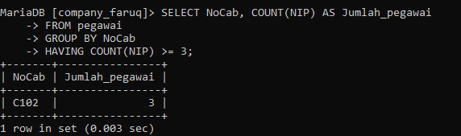
#### SUM
```sql
SELECT SUM(Gaji) AS Total_Gaji FROM table_pegawai;
```
**penjelasan:**
- `SELECT` = untuk memilih kolom mana saja yang dipilih untuk dijumlahkan. 
- `SUM (Gaji)` untuk menghitung Jumlah data (khusus andka) Pada kolom Yang dipilih. Gaji merupakan nama kolom Yang dipilih untuk dihitung Jumlah isi datanya 
- `AS `= untuk mengganti nama dari kolom hasil Sum (Gaji) untuk sementara. 
- `Total_Gaji `= merupakan nama sementara dari perintah As. 
- `FROM Pegawai` = untuk memilih dari tabel mana Yang kolom datanya akan digunakan. Pegawai adalah nama dari tabel Yang dipilih. 
- **Hasilnya** = kolom gaji Yang isi datanya berupa angka-angka, semuanya dijumlahkan menjadi satu seperti ditotalkan (Sama seperti matematika Pada umumnya). hasilnya adalah 30 575 000. Adapun nama kolom dari hasil Jumlah tersebut diubah dari SUM(Gasi) menjadi Total-gaji.

**HASILNYA:**

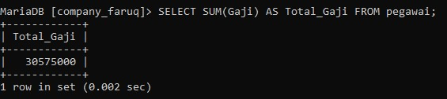

#### SUM
```sql
SELECT SUM(Gaji) AS Gaji_Manager FROM table_pegawai WHERE Jabatan = 'Manager';
```
**penjelasan:**
- `SELECT` = untuk memilih kolom mana saja yang dipilih untuk dijumlahkan. 
- `Sum (Gaji)` = untuk menghitung Jumlah isi data (khusus angka) Pada kolom Yang dipilih. Gaji adalah nama kolom Yang dipilih untuk dijumlahkan isi datanya. 
- `AS` = untuk mengganti nama dari kolom hasil SUM (Gaji) secara sementara. 
- `Gaji_Manager` = merupakan nama Sementara dari Perintah AS. 
- `FROM Pegawai` = untuk memilih dari tabel mana Yang kolom datanya akan digunakan. `Pegawai `adalah nama dari table yang dipilih. 
- `WHERE` = kondisi Yang harus dipenuhi oleh suatu kolom agar datanya bisa dijumlah. 
- `(Jabatan = "manager")` = merupakan kondisi dari WHERE. Hanya barisan data yang kolom Jabatannya bersi kolom Gajinya bisa diJumlahkan. 
- **Hasilnya** = barison data Yang kolom Jabatannya berisi manajer akan dijumlah kolom Gajinya menjadi. 17250 000. Jadi hanya beberapa kolom. Saja yang dijumalah

**hasilnya:**

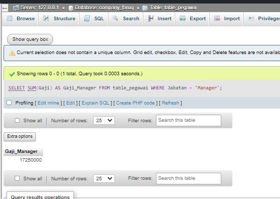

#### GROUP BY Nocab
```sql
SELECT NoCab, SUM(Gaji) AS TotalGaji
FROM table_pegawai
GROUP BY NoCab
```
**penjelasan:**
- `SELECT` = untuk memilih Kolom mana saja yang dipilih untuk ditampilkan/dijumlahkan. 
- `Nocab` = adalah nama kolom yang ingin ditampilkan. 
- `SUM (Gaji) `= untuk menghitung Jumlah data (khusus angka) Pada kolom Yang dipilih. Gaji adalah nama kolom Yang dipilih untuk dijumlahkan isi datanya. 
- `AS` = untuk mengganti nama dari kolom hasil SUM(Gaji) untuk sementara. 
- `Totalgaji` = merupakan nama sementara dari Perintah AS. 
- `FROM Pegawai` =untuk memilih dari tabel mana Yang data kolomnya akan digunakan. Pegawai adalah nama tabel yang dipilih. 
- `GROUP BY `= untuk mengelompokkan data berdasarkan nilai data yang telah ditentukan pada kolom yang dipilih. 
- `Nocab` = nama kolom Yang datanya dipilih untuk dikelompokkan. 
- **Hasilnya** = Jadi, berdasarkan kolom Nocab, barisan data yang kolom Nocab nya bensi clol maka kolom Gaji dari barisan data itu dijumlahkan bersama barisan data Yang memiliki Nocab clol dua. Maka kolom Gaji dijumlahkan sesuai dengan kolom Nocab nya masinmasing, mulai dari c101 memiliki 2 kolom Gaji Yang bisa dijumlahkan. Sama dengan c103 dan c104. Adapun cl02 memiliki 3 kolom Gaji yang dapat dijumlahkan. Total Gaji merupakan hasil Perintah dari AS untuk mengubah nama kolom hasil dari Sum(Gaji).

**hasilnya:**

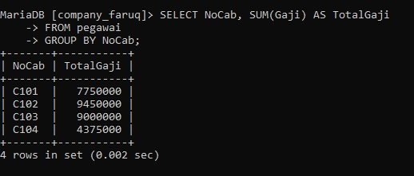

##### HAVING SUM
```sql
SELECT NoCab, SUM(Gaji) AS Total_Gaji
FROM table_pegawai 
GROUP BY NoCab HAVING SUM(Gaji) >= 8000000;
```
**penjelasan:**
- `SELECT` = untuk memilih kolom mana saja yang dipilih untuk ditampilkan / dijumlahkan. Nocab nama kolom Yang dipilih untuk ditampilkan. 
- `SUM(Gaji) `= untuk menghitung Jumlah data (khusus angka) Pada kolom Yang dipilih. Gaji, adalah nama kolom Yang dipilih untuk dijumlahkan isi datanya.
- `AS` = untuk menganti nama dari kolom hasil Sum (Gaji) untuk sementara. 
- `Total_Gaji` = nama Sementara dari Perintah AS. 
- `FROM Pegawai` = untuk memilih dari tabel mana Yang data kolomnya ingin digunakan. Pegawai adalah nama dari tabel yang dipilih. 
- `GROUP BY` = untuk mengelompokkan data berdasarkan nilai data Yang telah ditentukan Pada kolom yang dipilih. 
- `Nocab` = nama kolom Yang dipilih untuk datanya dikelompokkan. Having = kondisi Yang harus dipenuhi oleh suatu kelompok data agar bisa ditampilkan. 
- `(SUM (Gaji) >= 8000000)` = Kondisi dari HAVING, Hasil dari Penjumlahan Gaji Yang hanya bisa ditampilkan adalah Hasil yang lebih dari atau sama dengan 8000000. 
- **Hasilnya** = Sama seperti sebelumnya, tetapi No cab Yang memenuhi kondisi tersebut hanyala clo2 dan c103 karena hasil Jumlah kolom Gaji nya lebih dari atau sama dengan 8000000. Adapun hasil kolom SUMCGaji) diganti Jadi Total_Gaji.

**HASILNYA:**

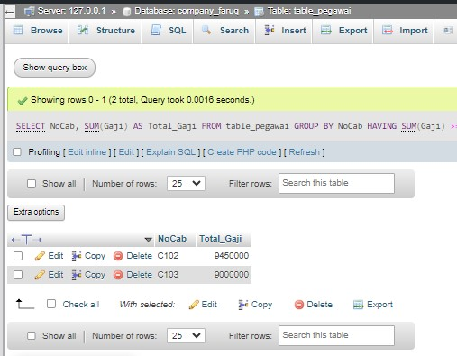

##### AVG 
```SQL
SELECT AVG(Gaji) AS Rata_rata FROM table_pegawai;
```
**penjelasan:**
- `SELECT` = untuk memilih kolom mana Sara Yang dipilih untuk ditampilkan. 
- `AVG (Gaji)` = untuk menghitung rata-rata dari data yang ada pada kolom Yang dipilih. Gaji adalah nama kolom Yang dipilih untuk dihitung rata-ratanya. 
- `AS` = untuk menganti nama dari kolom hasil AVG (Gari) untuk sementara. 
- `Rata-rata` = nama sementara dari Perintah AS. 
- `FROM Pegawai `= untuk memilih dari tabel mana Yang data kolomnya ingin digunakan. Pegawai adalah nama dari tabel yang dipilih. 
- **Hasilnya** = 3397222.2222 merupakan hasil rata-rata dari semua 9 barisan data Pada kolom Gaji. Adapun nama kolom hasil dari AVG (Gaji) Yaitu Rata-rata.

**hasilnya:**

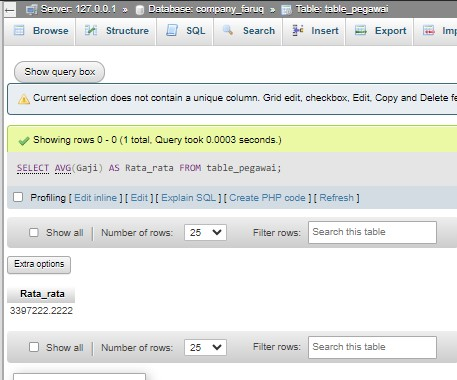

#### AVG MANAGER
```sql
SELECT AVG(Gaji) AS GajiRatamgr FROM table_pegawai WHERE Jabatan = 'Manager';
```
**penjelasan:**
- `SELECT` untuk memilih kolom mana saja yang dipilih untuk ditampilkan.
- `AVG (Gaji)` = untuk menghitung rata-rata dari data yang ada pada kolom Yang dipilih Gaji adalah nama kolam Yang dipilih untuk dihitung rata-ratanya. 
- `AS` = untuk mengganti nama dari kolom hasil AVG (Gaji) untuk sementara. 
- `Gaji Ratamgr` = nama sementara dari Perintah AS. 
- `FROM Pegawai` = untuk memilih dan tabel mana Yang data kolomnya ingin digunakan Pegawai adalah nama dari tabel Yang dipilih.
- `WHERE` = Kondisi Yang harus dipenuhi oleh suatu kolom agar datanya bisa dihitung rataratarya (Jabatan = 'Manajer') kondisi dari `WHERE`. Barisan data yang kolom Jabatannya Manajer akan dihitung rata-rata kolom Gajinya. 
- **Hasilnya** = 5750000.0000 merupakan hasil hitung rata-rata dari barisan data yang memiliki manajer di kolom Jabatan nya, dari situ kolom Gaji nya di hitung.

**hasilnya:**

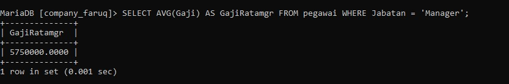

#### AS
```sql
SELECT NoCab, AVG(Gaji) AS RataGaji
FROM table_pegawai
GROUP BY NoCab
```
**penjelasan:**
- `SELECT `= untuk memilih Kolom mana saja yang dipilih untuk ditampilkan, dihitung.
- `Nocab` = Kolom Yang dipilih untuk ditampilkan. 
- `AVG (Gaji)` = untuk menghitung rata-rata dari data yang ada pada kolom Yang dipilih. Gaji adalah nama kolom Yang dipilih untuk dihitung rata-ratanya. 
- `As` = untuk menganti nama dari kolom hasil AVG(Gajii) untuk sementara. 
- `Rata Gaji` = adalah nama sementara dari Perintah As. 
- `FROM Pegawai` = untuk memilih dan tabel mana yang data kolomnya ingin digunakan. Pegawai adalah nama dari tabel yang dipilih. 
- `GROUP BY` = untuk mengelompokkan data berdasarkan nilai data yang telah ditentukan.Pada kolom Yong dipilih.
- `Nocab` = nama kolom Yang dipilih untuk datanya dikelompokkan. 
- **Hasilnya** = Hampir sama seperti no.7, masing-masing kolom Nocab dihitung rata-ratanya

**hasilnya:**

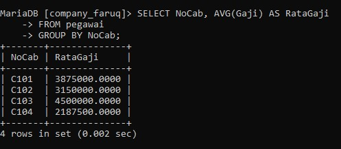

#### HAVING NoCab
```sql
SELECT NoCab, AVG(Gaji) AS RataGaji 
FROM table_pegawai 
GROUP BY NoCab HAVING NoCab = 'C101' OR NoCab = 'C102'
```
**penjelasan:**
- `SELECT` = untuk memilih kolom mana saja yang dipilih untuk ditampilkan, dihitung. 
- `Nocab `= Kolom Yong dipilih untuk ditampilkan. 
- `AVG (Gaji)` = untuk menghitung rata-rata dari data yang ada pada kolom Yang dipilih. Gaji adalah nama kolom Yang dipilih untuk dihitung rata-ratanya. 
- `AS` = untuk menganti nama dari kolom hasil AVG (Gaji) untuk sementara. 
- `rata Gaji` = nama sementara dari Perintah As. 
- `FROM Pegawai` untuk memilih dari tabel mana Yang datanya Kolomnya ingin dignakan Pegawai adalah nama dari tabel Yang dipilih. 
- `GROUP BY` = untuk mengelompokkan data berdasarkan nilai data Yang telah ditentukan Pada kolom Yang dipilih. 
- `Nocab `= nama Kolom Yand dipilih untuk datanya dikelompokkan.
- `HAVING` = kondisi Yang harus dipenuhi oleh suatu kelompok data.
- `(Nocab101' OR Nocab = 'c102')` = merupakan kondisi dari Having. Jadi kolom Nocab Yang memiliki c101 atav C102 Yang hanya akan ditampilkan. OR adalah kondisi Yang hanya salah satu datanya yang harus dipenuhi.

**HASILNYA:**

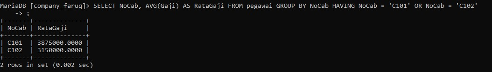

#### AS MIN
```SQL
SELECT MAX(Gaji) AS GajiTerbesar, MIN(Gaji) AS GajiTerkecil
FROM table_pegawai
```
**penjelasannya:**
- `SELECT` = untuk memilih kolom mana saja yang dipilih untuk ditampilkan. 
- `MAX(gaji)` = untuk menampilkan nilai maksimum atau terbesar / tertinggi dari suatu data dalam kolom Yang dipilih. Gaji adalah nama kolom Yang dipilih.
- `As Gajiterbesar` = untuk mengganti nama dari kolom hasil Min(Gaji), menjadi nama Sementaranya Yaitu Gaji Terbesar. 
- `MIN (Gaji)` = untuk menampilkan nilai minimum atau terkecil/terendah dari suatu data dalam kolom yg dipilih. Gaji adalah nama kolam Yang dipilih. 
- `As Gaji Terkecil` = untuk mengganti nama dari kolom hasil MIN (Gaji) menjadi Gaji Terkecil untuk sementara. 
- `FROM Pegawai` = untuk memilih dari tabel mana yang dat kolomnya ingin ditampilkan.
- **Hasilnya** = Jadi dari 9 nilai yang ada di kolam Gaji, Gaji maksimumnya adalah 6250000 dan namanya diubah menjadi Gajiterbesar. Gajii minimumnya adalah 1725000 dan namanya diubah menadi Gajiterkecil.

**hasilnya:**

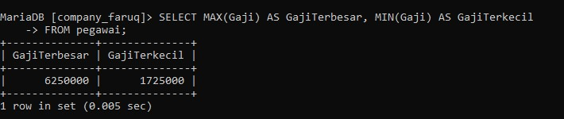

#### AS MAX MANAGER
```sql
SELECT MAX(Gaji) AS GajiTerbesar, MIN(Gaji) AS GajiTerkecil 
FROM table_pegawai 
WHERE Jabatan = 'Manager';
```
**penjelasannya:**
- ` SELECT` = untuk memilih kolom mana saja yang dipilih untuk ditampilkan. 
- `MAX (Gaji)` = untuk menampilkan nilai terbesar dari suatu data dalam kolom Yang dipilih Gajii adalah nama kolom yang dipilih. 
- `AS GajiTerbesar` = untuk mengganti nama dari kolom hasil max (Gaji) menjadi Gajiterbesar untuk sementara. 
- `MIN (Gaji)` = untuk menampilkan nilai terkecil dari Suatu data dalam kolam Gaji adalah nama kolom Yang dipilih. 
- `AS Gajiterkecil` = untuk menganti nama dari kolom hasil MIN (Gaji) menjadi Gaji terkecil untuk sementara. 
- `FROM Pegawai` = untuk memilih dari tabel mana Yand data kolomnya ingin ditampilkan.
- `WHERE kondisi` = Yang harus dipenuhi oleh suatu kolom data agar bisa ditampilkan. 
- `(jabatan Manajer)` = kondisi dari WHERE Yang harus dipenuhi. Barisan data yang kolom Jabatannya berisi manajer akan ditampilkan kolom Gajinya. 
- **Hasilnya** Jabatan Manajer Yang memiliki nilai maksimum adalah 6250000 Kolom hasil MAX nya diubah Jadi Gaji terbesar. sedangkan nilai minimumnya adalah $250000 Kolam hasil MIN nya diubah Tadi Gaji Terkecil.

**hasilnya:**

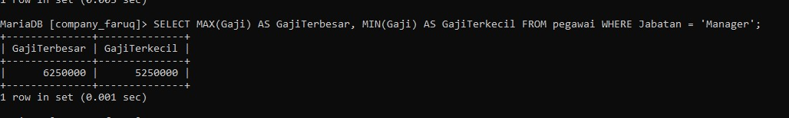

#### AS MIN NoCab
```sql
SELECT NoCab, MAX(Gaji) AS GajiTerbesar, MIN(Gaji) AS GajiTerkecil
FROM table_pegawai
GROUP BY NoCab
```
penjelasannya
- `SELECT` = untuk memilih kolom mana saja yang dipilih untuk ditampilkan.
- `Nocab`= nama kolom Youd ingin ditampilkan.
- `MAX (Gaji)` = untuk menampilkan nilai terbesar dari suatu data dalam kolom Yong dish Gari nama kolom Yang dipilih. 
- `AS GajiTerbesar` = untuk mengganti nama kolom hasil MAX (Gaji) menjadi Gaji terbesar untuk sementara. 
- `MIN (Gaji)` = untuk menampilkan nilai terkecil dari suatu data dalam kolom Yang dipilih Gaji nama kolom Yang dipilih. 
- `As Gajiterkecil `= untuk mengganti nama kolom hasil MIN (Gaji) menjadi Gaji Terkecil untuk sementara. 
- `FROM Pegawai` = untuk memilih dari tabel mana Yang data kolomnya ingin ditampilkan. Pegawai adalah nama tabel Yang dipilih untuk ditampilkan. 
- `GROUP BY` = untuk mengelompokkan data berdasarkan nilai data yang telah ditentukan Pada kolom Yan dipilih. 
- `Nocab` = nama Kolom yang ingin dikelompokkan. 
- **Hasilnya** = masing-masing Nocab dicari nilai maksimum dan minimumnya. mulai dari clol, c102, c103, c104. dan nama hasil kolannya diubah Jadi Gajiterbesar dan GajiTerkecil.

**hasilnya:**

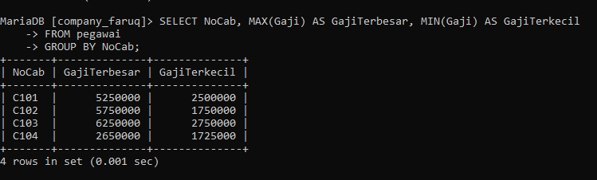

#### HAVING COUNT
```sql 
SELECT NoCab, MAX(Gaji) AS GajiTerbesar, MIN(Gaji) AS GajiTerkecil
FROM table_pegawai
GROUP BY NoCab HAVING COUNT(NIP) >= 3
```
**penjalasannya**
- `SELECT` untuk memilih kolom mana sara Yang dipilih untuk ditampilkan. 
- `Nocab` = nama kolom Yang ingin ditampilkan. 
- `MAX (Gaji)` = untuk menampilkan nilai terbesar dan suatu data dalam kolom Yang dipilih Gat adalah nama kolom Yang dipilih. 
- `AS Gaiterbesar` = untur menssanti nama kolom hasil MAX (Gaji) menjadi GariTerbesar Untuk Sementara.
- `MIN (Gaji)` = untuk menampilkan nilai terkecil dari suatu data dalam kolom yg dipilih. Gaji adalah nama Kolam Yang dipilih. 
- `AS Gaji` = Terkecil untuk mengganti nama kolom hasil MIN (Gaji) menjadi Gajiterkecil untuk sementara. 
- `FROM Pegawai` = adalah untuk memilih dari tabel mana Yang data kolomnya ingin ditampilkan,Pegawai adalah nama tabel Yang dipilih. 
- `GROUP BY` = untuk mengelompokkan data Pada kolom Yang dipilih. 
- `Nocab` = nama kolom Yand dipilih untuk dikelompokkan. Having = Kondisi Yang harus dipenuhi oleh suatu kelompok data. 
- `(COUNT(NIP) >= 3)`= kondisi dri HAVING. Hanya hasil hitung kolom NIP Yang lebih dari atau sama dengan 3 Yang muncul.
- **Hasilnya** seperti no. 4, Yang mempunyai hasil hitung lebih dari atau Sama dengan 3 Nocab C102 Jadi hanya itu Yandg dicari Nilai maksimum dan adalah minimumnya Pada kolom Gaji.

**hasilnya:**


#### AS 
```sql
SELECT COUNT(NIP) AS JumlahPegawai, SUM(Gaji) AS TotalGaji,
AVG(Gaji) AS RataGaji,MAX(Gaji) AS GajiMaks,MIN(gaji) AS GajiMin
FROM table_pegawai
```
**penjelasannya:**
- `SELECT` = untuk memilih kolam mana saja yang dipilih untuk ditampilkan. 
- `COUNT (NIP)` = untuk menghitung jumlah barisan data yang ada pada kolam Yang dipilih.
- `AS Jumlah Pesawai `= untuk menssanti nama kolam hasil COUNT (NIP) menjadi Jumlah Pegawai.
- `SUM (Gaji)` = untuk menjumlah data Yang ada pada kolom Yang dipilih. Gaji adalah kojom Yand dipilih. AS Total Gaji untuk mengganti nama kolom hasil SUM (Gaji) menjadi Total Gaji. 
- `AVG (Gaji)` = untuk menghitung rata-ratanya suatu data dalam kolom yang dipilih. Gaji adalah nama kolom Yang dipilih untuk dihitung.
- `AS RataGaji` = untuk mengganti nama kolom hasil AVG (Gari) menjadi RataGaji. 
- `MAX (Gaji)` = untuk menampilkan nilai terbesar dari suatu data dalam kolam Yang dipilih Gaji adalah nama kolom yang dipilih.
- `AS Gajimaks` = untuk mengganti nama dari kolom hasil MAX(Gari) menjadi Garimaks. untuk Sementara. MIN (Gaji) untuk menampilkan nilai terkecil dari suatu kalam Yang dipilih. Gaji nama kolom Yang dipilih. 
- `AS GajiMIN` = untuk menganti nama dari kolom hasil MIN (Gaji) menjadi Gajimin. Untuk sementara.
- `FROM Pegawai` = untuk memilih tabel mana yang dipilih untuk ditampilkan. Pegawai adalah nama tabel Yang dipilih. 
- **Hasilnya** = Dihitung berapa NIP, Di Jumlahkan semua data Pada kolom Gaji, Dihitung Rata-tata datri kolom Gaji, Ditampilkan nilai terbesar Pada kolom Gaji, dan Nilai terkecil dalam Kolom Gaji.

**hasilnya:**

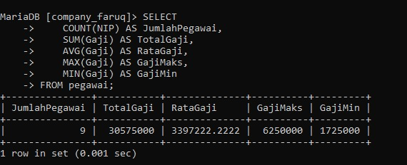

#### WHERE Jabatan staf or sales
```SQL
SELECT COUNT(NIP) AS JumlahPegawai, SUM(Gaji) AS TotalGaji,
AVG(Gaji) AS RataGaji,MAX(Gaji) AS GajiMaks,MIN(gaji) AS GajiMin
FROM table_pegawai
WHERE Jabatan = 'staf' OR Jabatan ='Sales'
GROUP BY NoCab HAVING SUM(Gaji) <= 2600000
```
**penjelasannya:**
- ` SELECT` = untuk memilih kolam mana saja yang ingin digunakan. 
- `COUNT (NIP)` = untuk menghitung barisan data yang ada Pada kolom Yang dipilih. AS Jumlah
- `pegawai` = untuk mengganti nama dari kolom hasil COUNT (NIP) menjadi Jumlah Pegawai untuk sementara. 
- `SUM (Gaji)` = untuk menjumlah data Yang ada Pada kolom Yang dipilih. Gaji adalah nama kolom Yang dipilih. 
- `As Total Gaji` = untuk mengganti nama dari kolom hasil SUM(Gaji) menjadi Total Gaji Untuk Sementara. AVG (Gaji) untuk menghitung rata-rata dari kolom Yand dipilih. Gaji adalah nama kolom Yang dipilih.
- `As Rata Gaji` = untuk mengganti nama dari kolom hasil AVG (Gaji) menjadi Rata Gaji Untuk sementara. MAX (Gaji) untuk menampilkan nilai 2 terbesar dan suatu data dalam kolom Yang dipilih Gaji adalah nama kolom. Yang dipilih.

**hasilnya:**

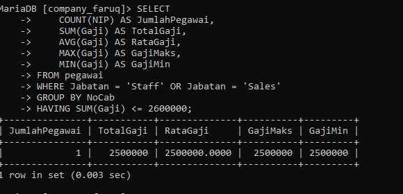

# TABEL KESELURUHAN PADA PRAKTIK KALI INI

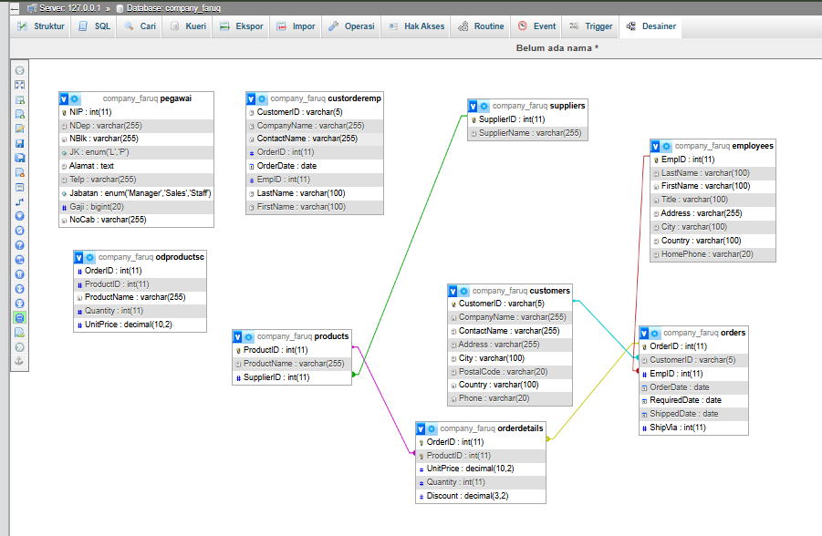