## Pembuatan Database Dan Tabel Pegawai
*1. Contoh Tabel Yang Harus Dibuat*

*2. Struktur Tabel Yang Di Buat*
~~~sql
CREATE TABLE pegawai (
-> NIP INT PRIMARY KEY,
-> NDep VARCHAR(255) NOT NULL,
-> NBlk VARCHAR(255),
-> JK ENUM('L', 'P') NOT NULL,
-> Alamat TEXT NOT NULL,
-> Telp VARCHAR(255) NOT NULL,
-> Jabatan ENUM('Manager', 'Sales', 'Staff'),
-> Gaji BIGINT NOT NULL,
-> NoCab VARCHAR(255) NOT NULL
);
~~~

Penjelasan :
- *NIP INT PRIMARY KEY*:
    - *NIP*: Kolom ini menyimpan Nomor Induk Pegawai yang bertipe data integer (INT).
    - *PRIMARY KEY*: Menandakan bahwa kolom NIP adalah kunci utama dari tabel ini. Kunci utama harus memiliki nilai yang unik untuk setiap baris dan tidak boleh NULL.
    
- *NDep VARCHAR(255) NOT NULL*:
    - *NDep*: Kolom ini menyimpan Nama Depan pegawai bertipe data string dengan panjang maksimum 255 karakter (VARCHAR(255)).
    - *NOT NULL*: Menandakan bahwa kolom ini tidak boleh berisi nilai kosong (NULL); artinya, setiap baris harus memiliki nilai untuk kolom ini.
    
- *NBlk VARCHAR(255)*:
    - *NBlk*: Kolom ini menyimpan Nama Belakang pegawai bertipe data string dengan panjang maksimum 255 karakter (VARCHAR(255)).
    - Kolom ini tidak memiliki batasan NOT NULL, sehingga nilai kosong (NULL) diizinkan.
    
- *JK ENUM('L', 'P') NOT NULL*:
    - *JK*: Kolom ini menyimpan Jenis Kelamin pegawai dengan tipe data ENUM. Hanya dua nilai yang diperbolehkan: 'L' (Laki-laki) atau 'P' (Perempuan).
    - *NOT NULL*: Menandakan bahwa kolom ini tidak boleh kosong; artinya, setiap baris harus memiliki nilai untuk kolom ini.

- *Alamat TEXT NOT NULL*:
    - *Alamat*: Kolom ini menyimpan alamat pegawai dengan tipe data TEXT, yang bisa menampung teks dalam jumlah besar.
    - *NOT NULL*: Menandakan bahwa kolom ini harus diisi dengan nilai; nilai kosong (NULL) tidak diperbolehkan.

- *Telp VARCHAR(255) NOT NULL*:
    - *Telp*: Kolom ini menyimpan nomor telepon pegawai dengan tipe data string dan panjang maksimum 255 karakter (VARCHAR(255)).
    - *NOT NULL*: Menandakan bahwa kolom ini harus diisi; nilai kosong (NULL) tidak diperbolehkan.
    
- *Jabatan ENUM('Manager', 'Sales', 'Staff')*:
    - *Jabatan*: Kolom ini menyimpan jabatan pegawai dengan tipe data ENUM. Nilai yang diperbolehkan adalah 'Manager', 'Sales', atau 'Staff'.
    - Kolom ini tidak memiliki batasan NOT NULL, sehingga nilai kosong (NULL) diizinkan.
    
- *Gaji BIGINT NOT NULL*:
    - *Gaji*: Kolom ini menyimpan gaji pegawai dengan tipe data BIGINT, yang dapat menampung bilangan bulat yang sangat besar.
    - *NOT NULL*: Menandakan bahwa kolom ini harus diisi; nilai kosong (NULL) tidak diperbolehkan.
    
- *NoCab VARCHAR(255) NOT NULL*:
    - *NoCab*: Kolom ini menyimpan nomor cabang pegawai dengan tipe data string dan panjang maksimum 255 karakter (VARCHAR(255)).
    - *NOT NULL*: Menandakan bahwa kolom ini harus diisi; nilai kosong (NULL) tidak diperbolehkan.

Hasil : 


*3. Isian Tabel Yang Telah Di Buat*
~~~sql
INSERT INTO pegawai (NIP, NDep, NBlk, JK, Alamat, Telp, Jabatan, Gaji, NoCab) VALUES 
-> (10107, 'Emya', 'Salsalina', 'P', 'JL. Suci 78 Bandung', '022-555768', 'Manager', 5250000, 'C101'), 
-> (10246, 'Dian', 'Anggraini', 'P', 'JL. Mawar 5 Semarang', '024-555102', 'Sales', 2750000, 'C103'), 
-> (10324, 'Martin', 'Susanto', 'L', 'JL. Bima 51 Jakarta', '021-555785', 'Staff', 1750000, 'C102'), 
-> (10252, 'Antoni', 'Irawan', 'L', 'JL. A. Yani 15 Jakarta', '021-555888', 'Manager', 5750000, 'C102'), 
-> (10176, 'Diah', 'Wahyuni', 'P', 'JL. Maluku 56 Bandung', '022-555934', 'Sales', 2500000, 'C101'), 
-> (10314, 'Ayu', 'Rahmadani', 'P', 'JL. Malaka 342 Jakarta', '021-555098', 'Sales', 1950000, 'C102'), 
-> (10307, 'Erik', 'Adrian', 'L', 'JL. Manggis 5 Semarang', '024-555236', 'Manager', 6250000, 'C103'), 
-> (10415, 'Susan', 'Sumantri', 'P', 'JL. Pahlawan 24 Surabaya', '031-555120', '', 2650000, 'C104'), 
-> (10407, 'Rio', 'Gunawan', 'L', 'JL. Melati 356 Surabaya', '031-555231', 'Staff', 1725000, 'C104');
~~~

Penjelasan : 
- *INSERT INTO pegawai*:
    - Menunjukkan bahwa Anda akan menambahkan data ke tabel bernama pegawai.
    
- *(NIP, NDep, NBlk, JK, Alamat, Telp, Jabatan, Gaji, NoCab)*:
    - Ini adalah daftar kolom dalam tabel pegawai yang akan diisi dengan data. Kolom-kolom ini adalah:
        - NIP (Nomor Induk Pegawai)
        - NDep (Nama Depan)
        - NBlk (Nama Belakang)
        - JK (Jenis Kelamin)
        - Alamat (Alamat)
        - Telp (Telepon)
        - Jabatan (Jabatan)
        - Gaji (Gaji)
        - NoCab (Nomor Cabang)
        
- *VALUES*:
    - Menunjukkan data yang akan dimasukkan ke dalam tabel. Data untuk setiap baris harus sesuai dengan urutan kolom yang disebutkan sebelumnya.
    
- *Data yang Dimasukkan*:
    - Baris pertama:
        - NIP: 10107
        - NDep: 'Emya'
        - NBlk: 'Salsalina'
        - JK: 'P' (Perempuan)
        - Alamat: 'JL. Suci 78 Bandung'
        - Telp: '022-555768'
        - Jabatan: 'Manager'
        - Gaji: 5250000
        - NoCab: 'C101'
    - Baris kedua dan seterusnya mengikuti pola yang sama, dengan data yang berbeda.

Hasil : 
.png)

# PRAKTIKKUM 5
## Latihan-1
**GAMBAR : **
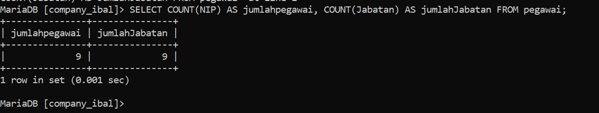

*STRIKTUR :*
~~~sql
SELECT COUNT(NIP) AS JumlahPegawai, COUNT(Jabatan) AS JumlahJabatan FROM pegawai;
~~~

*PENJELASAN :* 
- `SELECT `= untuk memilih kolom apa saja yang ingin dipilih (untuk dihitung). 
- `COUNT (NIP)` = untuk menghitung Jumlah barisan data yang mempunyai dari kolom Yan dipilih. NIP adalah nama kolom Yang dipilih untuk dihitung. 
- `AS `= untuk mengubah nama dari suatu kolom untuk sementara. Jumlah Pegawai = merupakan nama ubahan dari Perintah AS yang digunakan. merupakan nama sementara dari Perintah COUNT (NIP). 
- `COUNT (Jabatan) `untuk menghitung jumlah barisan data yang mempunyai isi data dan kolom yang dipilih. Jabatan adalah nama kolom Yang dipilih untuk dihitung 
- `AS `= untuk mengubah nama dari suatu kolom untuk sementara. Jumlah Jabatan = merupakan nama sementara dari perintah COUNT (Jabatan). 
- `FROM Pegawai` = merupakan dari tabel mana datanya yang digunakan Pegawai adalah nama tabel Yang datanya ingin digunakan.
- **Hasilnya** = karena ada 9 barisan data, Yang ingin dihitung adalah kolom NIP, Jumlah dari kolom NIP (isi datanya) ada 9, ditampilkan sebagai Jumlah pesawai. Kolom Jabatan Jusa dihitung, akan tetapi ada satu data yang berisi Null (kosong), oleh karena itu hanya ada 8 data ditampilkan sebagai Jumlah Jabatan.
## Latihan-2
**GAMBAR : **


*STRIKTUR :*
~~~sql
select count(NIP) AS JumlahPegawai
    -> FROM pegawai
    -> WHERE NoCab = 'C102';
~~~

*PENJELASAN :* 
- `SELECT` = untuk memilih kolom mana saja yang ingin dipilih untuk dihitung. 
- `COUNT (NIP)` = untuk menghitung Jumlah barisan data yang mempunyai data dari kolom Yang dipilih. NIP adalah nama kolom Yang dipilih untuk dihitung. 
- `As` = untuk mengubah nama dari suatu kolom untuk sementara. 
- `Jumlah Pesawai` = nama sementara Yang dipilih untuk kolom COUNT (NIP) 
- `FROM Pegawai` = dari tabel mana datanya akan digunakan. Pesawai adalah nama tabel Yang dipilih untuk digunakan. 
- `WHERE` = merupakan kondisi Yang harus dipenuhi agar datanya dapat dengan query COUNT (NIP). 
- `(Nocab = 'C102')` = adalah kondisi dari WHERE Yang harus dipenuhi, Jadi hanya barisan data yang memiliki Clo2 di kolom "vocab Yang bisa dihitung. 
- **Hasilnya** = Di 9 barisan data Yangaja Pada tabel Pegawai, kita ingin menghitung Jumlah barisan data yang memiliki nilai 'clo₂ Pada kolom "Nocab" nya dengan menggunakan COUNT. Jadi Yang muncul adalah 3 0 barisan data. kita Juga ingin mengubah nama dari kolom hasil Perintah `COUNT` secara sementara dengan Perintah AS, namanya adalah Jumlah Pegawai.
## Latihan-3
**GAMBAR :** 
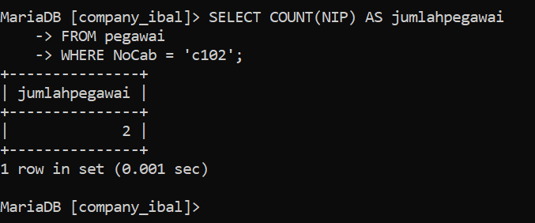

*STRIKTUR :*
~~~sql
SELECT SUM(Gaji) AS Gaji_Manager
    -> FROM pegawai
    -> WHERE Jabatan = 'Manager';
~~~

*PENJELASAN :* 
SELECT = untuk memilih kolom mana saja yang dipilih untuk dijumlahkan. 
Sum (Gaji) = untuk menghitung Jumlah isi data (khusus angka) Pada kolom Yang dipilih. Gaji adalah nama kolom Yang dipilih untuk dijumlahkan isi datanya. 
AS = untuk mengganti nama dari kolom hasil SUM (Gaji) secara sementara. 
Gaji_Manager = merupakan nama Sementara dari Perintah AS. 
FROM Pegawai = untuk memilih dari tabel mana Yang kolom datanya akan digunakan. Pegawai adalah nama dari table yang dipilih. 
WHERE = kondisi Yang harus dipenuhi oleh suatu kolom agar datanya bisa dijumlah. 
(Jabatan = "manager") = merupakan kondisi dari WHERE. Hanya barisan data yang kolom Jabatannya bersi kolom Gajinya bisa diJumlahkan. 
Hasilnya = barison data Yang kolom Jabatannya berisi manajer akan dijumlah kolom Gajinya menjadi. 17250 000. Jadi hanya beberapa kolom. Saja yang dijumalah
## Latihan-4
**GAMBAR :** 
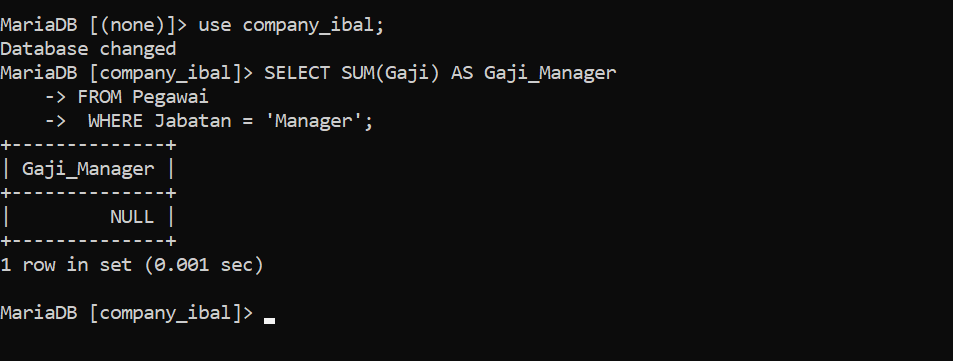

*STRIKTUR :*
~~~sql
SELECT NoCab, COUNT(NIP) AS Jumlah_pegawai
    -> FROM pegawai
    -> GROUP BY NoCab;
~~~

*PENJELASAN :* 
 - `SELECT` untuk memilih kolom mana saja yang ingin dihitung atau ditampilkan. 
 -  Nocab = merupakan nama kolom Yang ingin ditampilkan. 
- `COUNT (NIP)` = untuk menghitung Jumlah barisan data Yang mempunyai isi data dari kolom Yang dipilih. 
- NIP adalah nama kolom yang dipilih untuk dihitung. AS untuk mengubah nama dari suatu kolom untuk sementara. 
- Jumlah Pegawai = merupakan nama sementara dari  kolom hasil COUNT (NIP). 
- FROM Pegawai dari tabel mana Yang data kolomnya ingin digunakan. Pegawai adalah nama tabel Yang dipilih untuk digunakan. 
- GROUP BY untuk mengelompokkan data berdasarkan nilai data yang telah ditentuka Pada kolom Yang dipilih. Nocab hama kolom Yang dipilih untuk datanya dikelompokkan. 
- Hasilnya = Berdasarkan. 9 barisan data, masing-masing. nilai, dalam kolom Nocab
## Latihan-5
**GAMBAR :** 
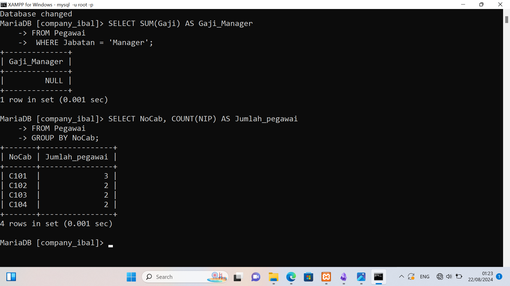

*STRIKTUR :*
~~~sql
SELECT NoCab, COUNT(NIP) AS Jumlah_pegawai
    -> FROM pegawai
    -> GROUP BY NoCab HAVING COUNT(NIP) >= 3;
~~~

*PENJELASAN :* 
- `SELECT `= untuk memilih kolom mana sasa Yang ingin dihitung atau ditampilkan. 
- `Nocab` = merupakan nama kolom yang ingin ditampilkan. 
- `COUNT (NIP)` = untuk menghitung jumlah barisan data yang mempunyai isi data dari kolom Yang dipilih. NIP adalah nama kolom Yang dipilih untuk dihitung. 
- ` AS `= untuk mengubah nama dari suatu kolom untuk sementara. 
- `Jumlah-Pegawai` = nama sementara dari kolom hasil COUNT (NIP). 
- FROM Pegawai = untuk memilih dari tabel mana Yang data kolomnya ingin digunakan.Pesawai adalah nama tabel Yang dipilih untuk digunakan. 
- `GROUP BY` = untuk mengelompokkan data berdasarkan nilai data Yang telah ditentukan Pada kolom Yan dipilih. Nocab-nama kolom Yang dipilih untuk dikelompokkan datanya. 
- `HAVING` = untuk menentukan kondisi (Yang harus dipenuhi) oleh suatu kelompok data agar bisa ditampilkan. 
- `(COUNT (NIP) >= 3)` = merupakan kondisi Yang harus dipenuhi oleh suatu kelompok data. Jadi hanya kelompok data Yang hasil hitungannya lebih atau Sama dengan 3. 
- **Hasilnya** seperti sebelumnya, ada 9 barisan data dibadi sesuai Nocab nya masing- - masing. Namun Yang ingin ditampilkan adalah hasil hitungan yang lebih dari atau sama dengan 3. Yaitu Nocab C102 Yang ada 3. Yand lain clol ada 2, c103 ada 2, c104 ada 2.

## Latihan-6
**GAMBAR : **
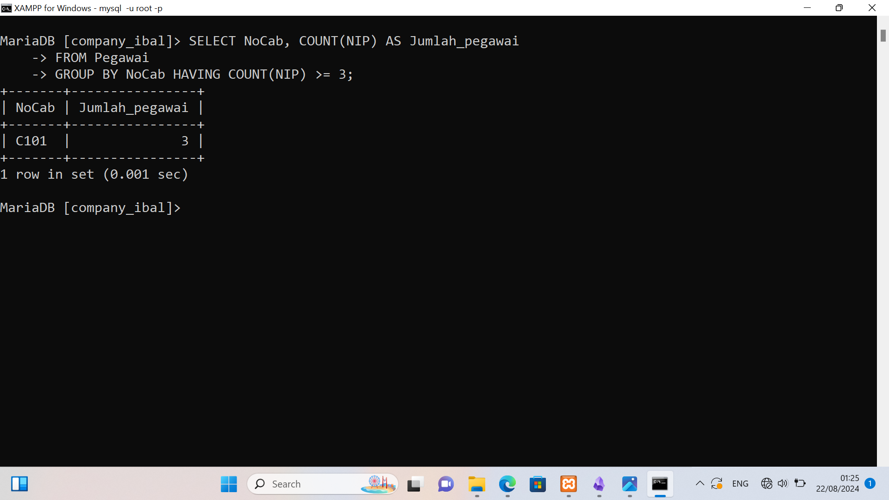
*STRIKTUR :*
~~~sql
SELECT SUM(Gaji) AS Total_Gaji
    -> FROM pegawai;
~~~

*PENJELASAN :* 
- SELECT = untuk memilih kolom mana saja yang dipilih untuk dijumlahkan. 
- SUM (Gaji) untuk menghitung Jumlah data (khusus andka) Pada kolom Yang dipilih. Gaji merupakan nama kolom Yang dipilih untuk dihitung Jumlah isi datanya 
- AS = untuk mengganti nama dari kolom hasil Sum (Gaji) untuk sementara. 
- Total_Gaji = merupakan nama sementara dari perintah As. 
- FROM Pegawai = untuk memilih dari tabel mana Yang kolom datanya akan digunakan. Pegawai adalah nama dari tabel Yang dipilih. 
- Hasilnya = kolom gaji Yang isi datanya berupa angka-angka, semuanya dijumlahkan menjadi satu seperti ditotalkan (Sama seperti matematika Pada umumnya). hasilnya adalah 30 575 000. Adapun nama kolom dari hasil Jumlah tersebut diubah dari SUM(Gasi) menjadi Total-gaji.
## Latihan-7
**GAMBAR : 
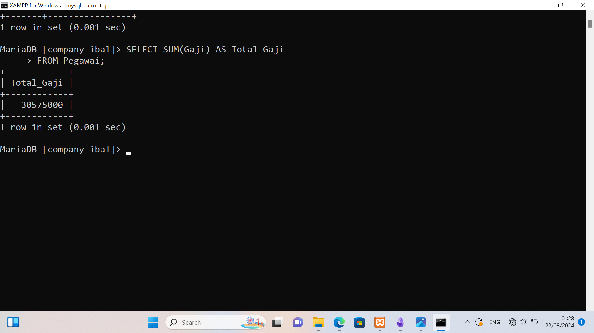

*STRIKTUR :*
~~~sql
SELECT SUM(Gaji) AS Gaji_Manager
    -> FROM pegawai
    -> WHERE Jabatan = 'Manager';
~~~

*PENJELASAN :* 
SELECT = untuk memilih kolom mana saja yang dipilih untuk dijumlahkan. 
Sum (Gaji) = untuk menghitung Jumlah isi data (khusus angka) Pada kolom Yang dipilih. Gaji adalah nama kolom Yang dipilih untuk dijumlahkan isi datanya. 
AS = untuk mengganti nama dari kolom hasil SUM (Gaji) secara sementara. 
Gaji_Manager = merupakan nama Sementara dari Perintah AS. 
FROM Pegawai = untuk memilih dari tabel mana Yang kolom datanya akan digunakan. Pegawai adalah nama dari table yang dipilih. 
WHERE = kondisi Yang harus dipenuhi oleh suatu kolom agar datanya bisa dijumlah. 
(Jabatan = "manager") = merupakan kondisi dari WHERE. Hanya barisan data yang kolom Jabatannya bersi kolom Gajinya bisa diJumlahkan. 
Hasilnya = barison data Yang kolom Jabatannya berisi manajer akan dijumlah kolom Gajinya menjadi. 17250 000. Jadi hanya beberapa kolom. Saja yang dijumalah
## Latihan-8
**GAMBAR : **
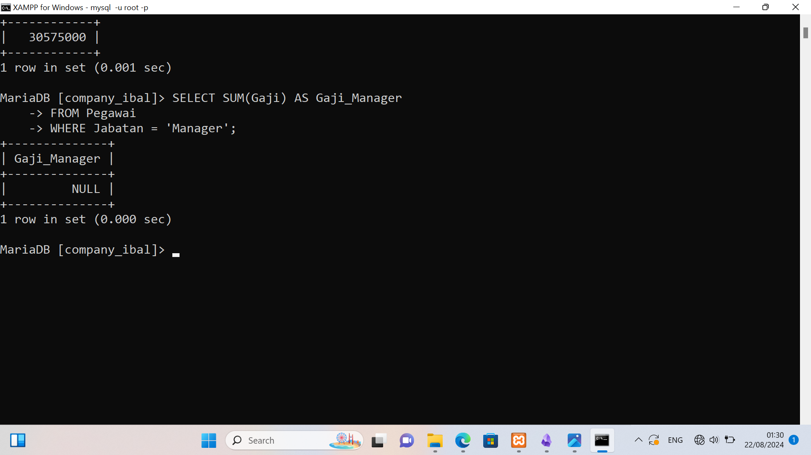

*STRIKTUR :*
~~~sql
SELECT NoCab, SUM(Gaji) AS TotalGaji
    -> FROM pegawai
    -> GROUP BY NoCab;
~~~

*PENJELASAN :* 
- SELECT = untuk memilih Kolom mana saja yang dipilih untuk ditampilkan/dijumlahkan. Nocab = adalah nama kolom yang ingin ditampilkan. 
- SUM (Gaji) = untuk menghitung Jumlah data (khusus angka) Pada kolom Yang dipilih. Gaji adalah nama kolom Yang dipilih untuk dijumlahkan isi datanya. 
- AS = untuk mengganti nama dari kolom hasil SUM(Gaji) untuk sementara. 
- Totalgaji = merupakan nama sementara dari Perintah AS. 
- FROM Pegawai =untuk memilih dari tabel mana Yang data kolomnya akan digunakan. Pegawai adalah nama tabel yang dipilih. 
- GROUP BY = untuk mengelompokkan data berdasarkan nilai data yang telah ditentukan pada kolom yang dipilih. 
- Nocab = nama kolom Yang datanya dipilih untuk dikelompokkan. 
- Hasilnya = Jadi, berdasarkan kolom Nocab, barisan data yang kolom Nocab nya bensi clol maka kolom Gaji dari barisan data itu dijumlahkan bersama barisan data Yang memiliki Nocab clol dua. Maka kolom Gaji dijumlahkan sesuai dengan kolom Nocab nya masinmasing, mulai dari c101 memiliki 2 kolom Gaji Yang bisa dijumlahkan. Sama dengan c103 dan c104. Adapun cl02 memiliki 3 kolom Gaji yang dapat dijumlahkan. Total Gaji merupakan hasil Perintah dari AS untuk mengubah nama kolom hasil dari Sum(Gaji).
## Latihan-9
**GAMBAR : ** 
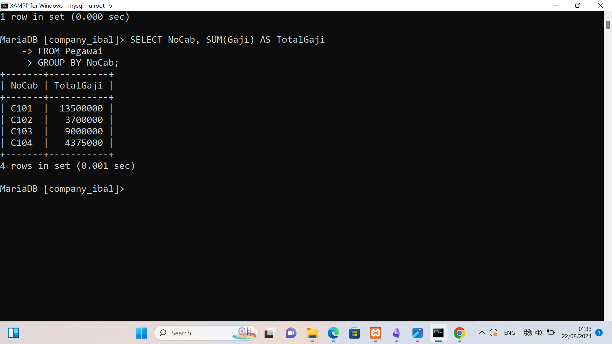

*STRIKTUR :*
```sql
SELECT NoCab, SUM(Gaji) AS Total_Gaji
    -> FROM pegawai
    -> GROUP BY NoCab HAVING SUM(Gaji) >= 8000000;
```

*PENJELASAN :* 
- SELECT = untuk memilih kolom mana saja yang dipilih untuk ditampilkan / dijumlahkan. Nocab nama kolom Yang dipilih untuk ditampilkan. 
- SUM(Gaji) = untuk menghitung Jumlah data (khusus angka) Pada kolom Yang dipilih. Gaji, adalah nama kolom Yang dipilih untuk dijumlahkan isi datanya.
- AS = untuk menganti nama dari kolom hasil Sum (Gaji) untuk sementara. 
- Total_Gaji = nama Sementara dari Perintah AS. 
- FROM Pegawai = untuk memilih dari tabel mana Yang data kolomnya ingin digunakan. Pegawai adalah nama dari tabel yang dipilih. 
- GROUP BY = untuk mengelompokkan data berdasarkan nilai data Yang telah ditentukan Pada kolom yang dipilih. 
- Nocab = nama kolom Yang dipilih untuk datanya dikelompokkan. Having = kondisi Yang harus dipenuhi oleh suatu kelompok data agar bisa ditampilkan. 
- (SUM (Gaji) >= 8000000) = Kondisi dari HAVING, Hasil dari Penjumlahan Gaji Yang hanya bisa ditampilkan adalah Hasil yang lebih dari atau sama dengan 8000000. 
- Hasilnya = Sama seperti sebelumnya, tetapi No cab Yang memenuhi kondisi tersebut hanyala clo2 dan c103 karena hasil Jumlah kolom Gaji nya lebih dari atau sama dengan 8000000. Adapun hasil kolom SUMCGaji) diganti Jadi Total_Gaji.
## Latihan-10
**GAMBAR :** 
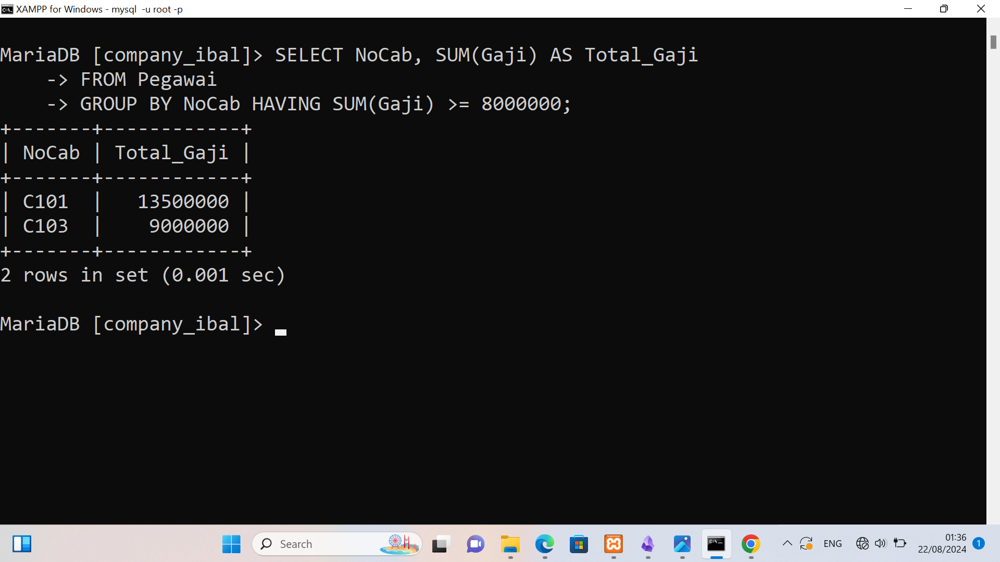

*STRIKTUR :*
~~~sql
SELECT AVG(Gaji) AS Rata_rata
    -> FROM pegawai;
~~~

*PENJELASAN :* 
- SELECT = untuk memilih kolom mana Sara Yang dipilih untuk ditampilkan. 
- AVG (Gaji) = untuk menghitung rata-rata dari data yang ada pada kolom Yang dipilih. Gaji adalah nama kolom Yang dipilih untuk dihitung rata-ratanya. 
- AS = untuk menganti nama dari kolom hasil AVG (Gari) untuk sementara. 
- Rata-rata = nama sementara dari Perintah AS. 
- FROM Pegawai = untuk memilih dari tabel mana Yang data kolomnya ingin digunakan. Pegawai adalah nama dari tabel yang dipilih. 
- Hasilnya = 3397222.2222 merupakan hasil rata-rata dari semua 9 barisan data Pada kolom Gaji. Adapun nama kolom hasil dari AVG (Gaji) Yaitu Rata-rata.
## Latihan-11
**GAMBAR : **
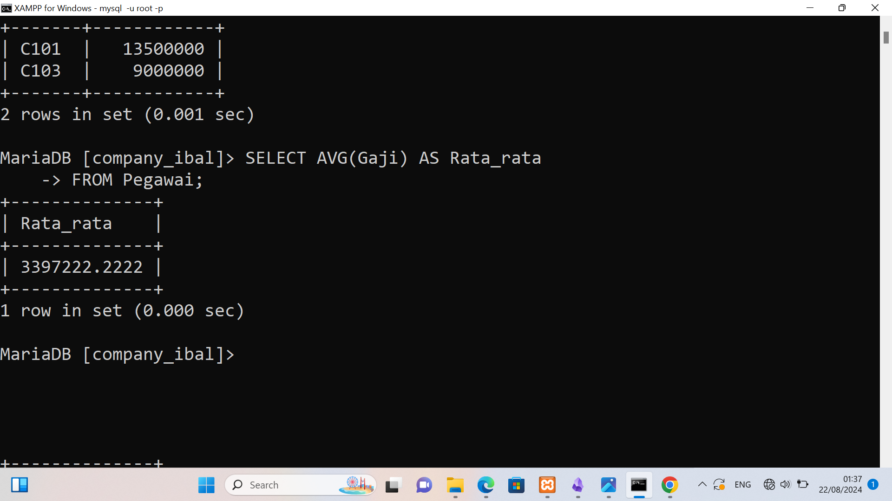

*STRIKTUR :*
~~~sql
SELECT AVG(Gaji) AS GajiRataMgr
    -> FROM pegawai
    -> WHERE Jabatan = 'Manager';
~~~

*PENJELASAN :* 
- *SELECT AVG(Gaji) AS GajiRataMgr*:
    - *AVG(Gaji)*: Menghitung rata-rata nilai dari kolom Gaji. Fungsi agregat AVG() digunakan untuk menghitung nilai rata-rata gaji.
    - *AS GajiRataMgr*: Memberikan alias GajiRataMgr pada hasil perhitungan ini. Alias ini akan digunakan sebagai nama kolom dalam hasil query, memberikan deskripsi yang jelas bahwa nilai tersebut adalah rata-rata gaji untuk jabatan 'Manager'.

- *FROM pegawai*:
    - Menunjukkan bahwa data yang akan diambil berasal dari tabel pegawai.

- *WHERE Jabatan = 'Manager'*:
    - Menetapkan kondisi filter sehingga hanya pegawai yang memiliki nilai Jabatan sama dengan 'Manager' yang dihitung. Ini berarti hanya gaji dari pegawai dengan jabatan 'Manager' yang akan dimasukkan dalam perhitungan rata-rata.

## Latiahan-12
**GAMBAR :** 
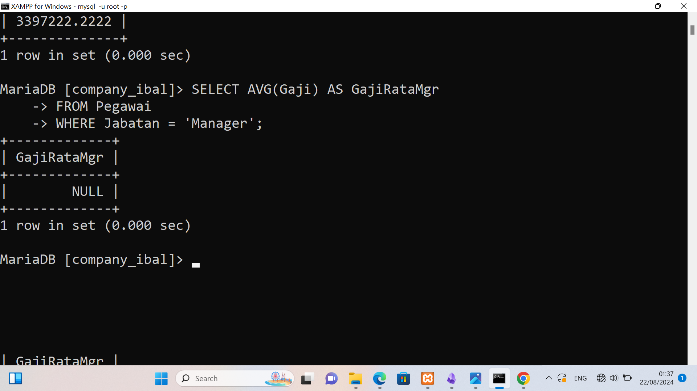

*STRIKTUR :*
~~~sql
SELECT NoCab, AVG(Gaji) AS RataGaji
    -> FROM pegawai
    -> GROUP BY NoCab;
~~~

*PENJELASAN :* 
- *SELECT NoCab, AVG(Gaji) AS RataGaji*:
    - *SELECT*: Digunakan untuk menentukan kolom mana yang ingin ditampilkan dalam hasil query.
    - *NoCab*: Kolom pertama yang akan ditampilkan dalam hasil query. Ini adalah kolom yang menunjukkan kode cabang (misalnya, NoCab bisa merujuk pada nomor cabang dari tabel pegawai).
    - *AVG(Gaji) AS RataGaji: Menghitung rata-rata nilai kolom Gaji untuk setiap grup yang dikelompokkan (dalam hal ini, berdasarkan NoCab). Fungsi *AVG* adalah fungsi agregat yang menghitung nilai rata-rata dari kolom yang ditentukan. *AS RataGaji** memberikan alias atau nama lain pada kolom hasil perhitungan rata-rata tersebut, sehingga hasilnya akan ditampilkan dengan nama RataGaji.

- *FROM pegawai*:
    - Menunjukkan tabel dari mana data diambil, dalam hal ini tabel yang bernama pegawai.

- *GROUP BY NoCab*:
    - *GROUP BY*: Digunakan untuk mengelompokkan baris-baris yang memiliki nilai kolom yang sama. Dalam hal ini, data akan dikelompokkan berdasarkan kolom NoCab. Setiap grup berisi baris-baris dengan nilai NoCab yang sama.
    - Setelah pengelompokan, fungsi agregat (seperti AVG) diterapkan pada setiap grup.
## Latiahan-13
**GAMBAR :** 
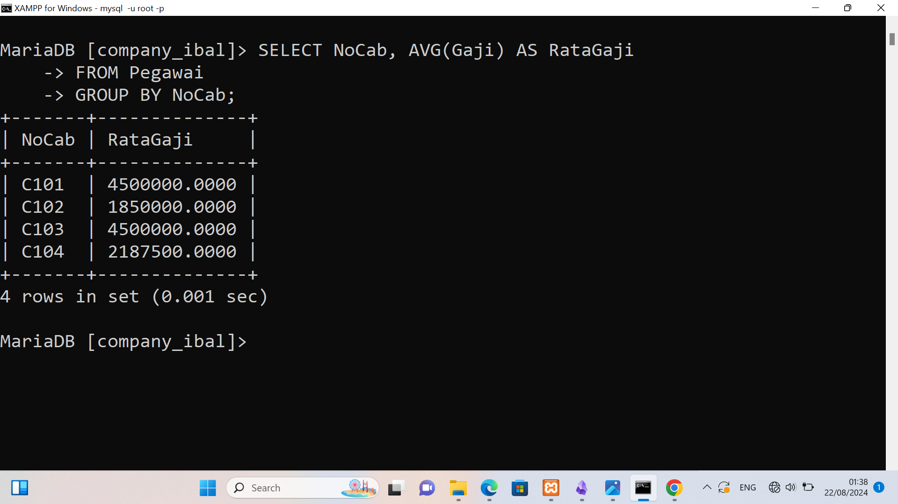

*STRIKTUR :*
~~~sql
SELECT NoCab, AVG(Gaji) AS RataGaji
    -> FROM pegawai
    -> GROUP BY NoCab HAVING NoCab = 'C101' OR NoCab = 'C102';
~~~

*PENJELASAN :* 
- *SELECT NoCab, AVG(Gaji) AS RataGaji*:
    - *SELECT*: Digunakan untuk menentukan kolom yang ingin ditampilkan dalam hasil query.
    - *NoCab*: Kolom pertama yang ditampilkan dalam hasil query, yang mewakili kode cabang.
    - *AVG(Gaji) AS RataGaji: Fungsi agregat *AVG** digunakan untuk menghitung rata-rata nilai dari kolom Gaji untuk setiap grup yang dibentuk berdasarkan NoCab. Hasilnya diberi nama alias RataGaji.

- *FROM pegawai*:
    - Menunjukkan bahwa data diambil dari tabel pegawai.

- *GROUP BY NoCab*:
    - *GROUP BY* digunakan untuk mengelompokkan data berdasarkan nilai kolom NoCab. Setiap nilai unik dari NoCab akan menjadi satu grup, dan rata-rata gaji (AVG(Gaji)) dihitung untuk masing-masing grup.

- *HAVING NoCab = 'C101' OR NoCab = 'C102'*:
    - *HAVING* adalah klausul yang digunakan untuk memfilter hasil setelah pengelompokan data dengan GROUP BY.
    - Dalam konteks ini, HAVING membatasi hasil query hanya pada grup-grup di mana NoCab adalah 'C101' atau 'C102'.
    - Ini berbeda dari WHERE karena WHERE digunakan sebelum pengelompokan, sedangkan HAVING digunakan setelah pengelompokan.
## Latiahan-14
**GAMBAR :** 
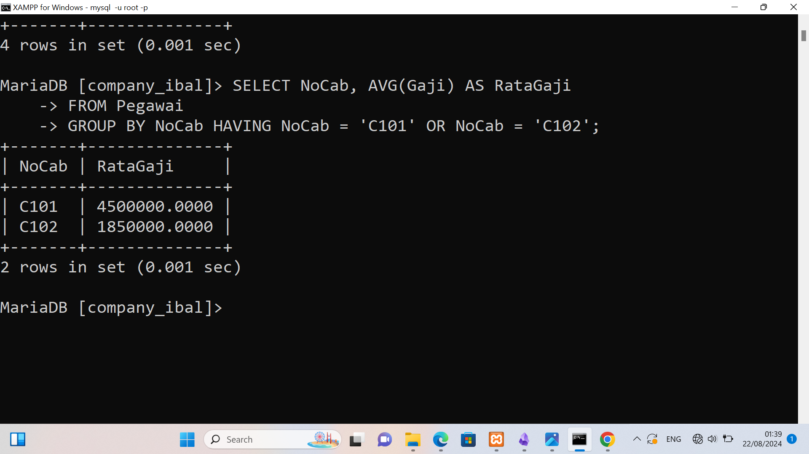

*STRIKTUR :*
~~~sql
SELECT MAX(Gaji) AS GajiTerbesar, MIN(Gaji) AS GajiTerkecil
    -> FROM pegawai;
~~~

*PENJELASAN :* 
- *SELECT MAX(Gaji) AS GajiTerbesar, MIN(Gaji) AS GajiTerkecil*:
    - *MAX(Gaji)*: Fungsi MAX digunakan untuk mencari nilai maksimum dari kolom Gaji. Fungsi ini akan menelusuri semua nilai dalam kolom Gaji dan mengembalikan nilai yang paling besar. Hasil dari fungsi ini akan diberi alias (nama lain) GajiTerbesar.
    - *MIN(Gaji)*: Fungsi MIN digunakan untuk mencari nilai minimum dari kolom Gaji. Fungsi ini akan menelusuri semua nilai dalam kolom Gaji dan mengembalikan nilai yang paling kecil. Hasil dari fungsi ini akan diberi alias (nama lain) GajiTerkecil.

- *FROM pegawai*:
    - *FROM pegawai*: Bagian ini menentukan dari tabel mana data akan diambil. Dalam hal ini, data diambil dari tabel pegawai.
## Latiahan-15
**GAMBAR :** 
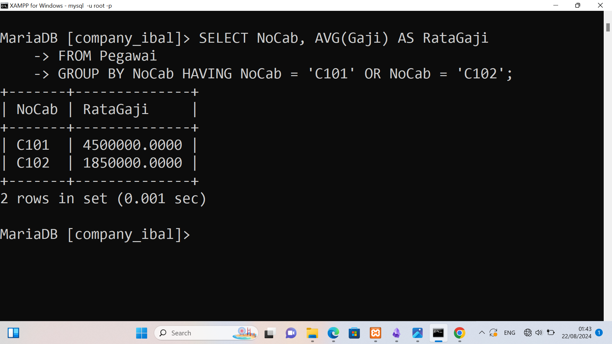

*STRIKTUR :*
~~~sql
SELECT NoCab, Max(Gaji) AS GajiTerbesar, MIN(Gaji) AS GajiTerkecil
    -> FROM pegawai
    -> GROUP BY NoCab;
~~~

*PENJELASAN :* 
- *SELECT NoCab, Max(Gaji) AS GajiTerbesar, MIN(Gaji) AS GajiTerkecil*:
    - *NoCab*: Kolom ini akan ditampilkan dalam hasil query untuk menunjukkan nomor cabang.
    - *MAX(Gaji) AS GajiTerbesar*: Fungsi MAX digunakan untuk mencari nilai maksimum dari kolom Gaji dalam setiap grup NoCab. Hasilnya diberi alias GajiTerbesar.
    - *MIN(Gaji) AS GajiTerkecil*: Fungsi MIN digunakan untuk mencari nilai minimum dari kolom Gaji dalam setiap grup NoCab. Hasilnya diberi alias GajiTerkecil.

- *FROM pegawai*:
    - Bagian ini menentukan dari tabel mana data akan diambil. Dalam hal ini, data diambil dari tabel pegawai.

- *GROUP BY NoCab*:
    - *GROUP BY NoCab*: Bagian ini mengelompokkan hasil berdasarkan kolom NoCab. Artinya, data akan dikelompokkan berdasarkan nomor cabang, dan untuk setiap cabang, fungsi MAX dan MIN akan diterapkan pada kolom Gaji.
## Latiahan-16
**GAMBAR :** 
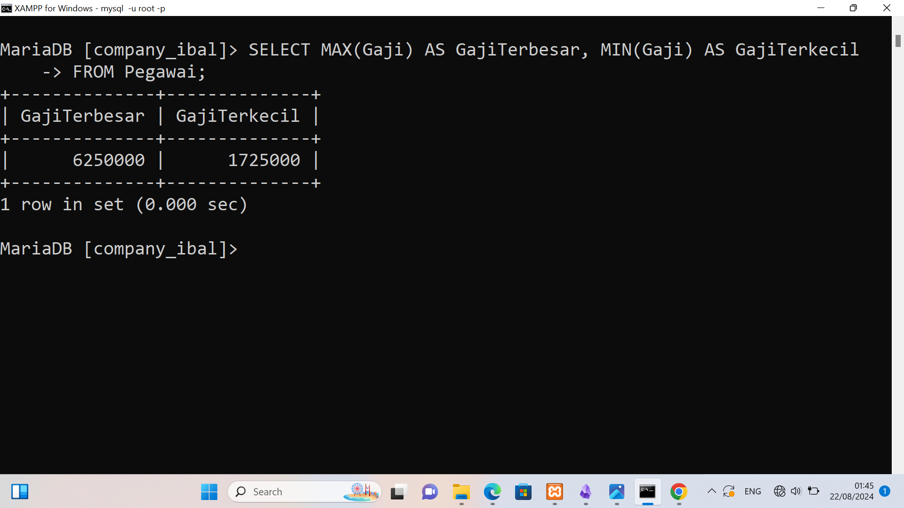

*STRIKTUR :*
~~~sql
SELECT NoCab, Max(Gaji) AS GajiTerbesar, MIN(Gaji) AS GajiTerkecil
    -> FROM pegawai
    -> GROUP BY NoCab HAVING COUNT(NIP) >= 3;
~~~

*PENJELASAN :* 
- *SELECT NoCab, Max(Gaji) AS GajiTerbesar, MIN(Gaji) AS GajiTerkecil*:
    - *NoCab*: Kolom ini menampilkan nomor cabang (NoCab) dalam hasil query.
    - *MAX(Gaji) AS GajiTerbesar*: Fungsi MAX digunakan untuk mencari nilai maksimum dari kolom Gaji dalam setiap grup NoCab. Hasilnya diberi alias GajiTerbesar.
    - *MIN(Gaji) AS GajiTerkecil*: Fungsi MIN digunakan untuk mencari nilai minimum dari kolom Gaji dalam setiap grup NoCab. Hasilnya diberi alias GajiTerkecil.

- *FROM pegawai*:
    - Bagian ini menentukan dari tabel mana data akan diambil. Dalam hal ini, data diambil dari tabel pegawai.

- *GROUP BY NoCab*:
    - *GROUP BY NoCab*: Bagian ini mengelompokkan hasil berdasarkan kolom NoCab. Artinya, data akan dikelompokkan berdasarkan nomor cabang, dan untuk setiap cabang, fungsi MAX dan MIN akan diterapkan pada kolom Gaji.

- *HAVING COUNT(NIP) >= 3*:
    - *HAVING COUNT(NIP) >= 3*: Kondisi ini menyaring hasil grup yang memenuhi kriteria tertentu. Dalam hal ini, hanya cabang yang memiliki jumlah pegawai (dihitung berdasarkan NIP, yang merupakan Nomor Induk Pegawai) sebanyak tiga atau lebih yang akan dimasukkan dalam hasil.
## Latiahan-17
**GAMBAR :** 
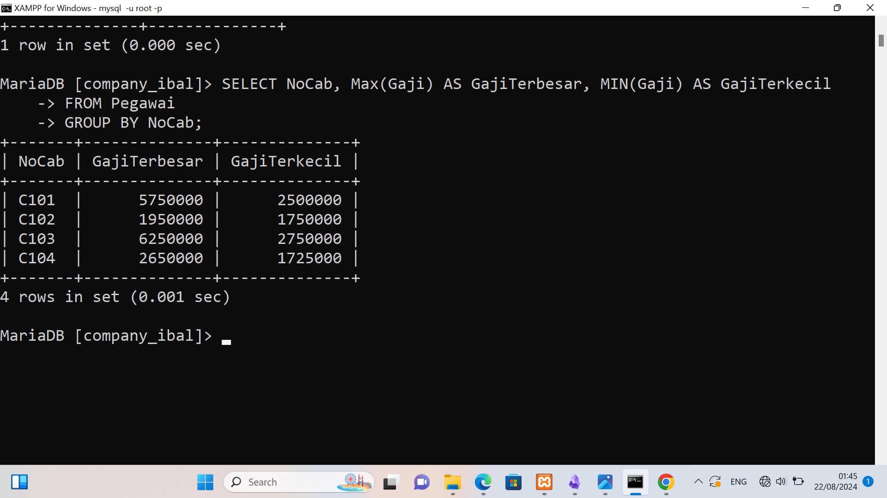

*STRIKTUR :*
~~~sql
SELECT COUNT(NIP) AS JumlahPegawai, SUM(Gaji) AS TotalGaji,
    -> AVG(Gaji) AS RataGaji, MAX(Gaji) AS GajiMaks, MIN(Gaji) AS GajiMin
    -> FROM pegawai;
~~~

*PENJELASAN :* 
- *SELECT COUNT(NIP) AS JumlahPegawai*:
    - Bagian ini menghitung jumlah pegawai dalam tabel pegawai dengan cara menghitung berapa banyak data NIP (Nomor Induk Pegawai) yang ada. Hasilnya akan ditampilkan dengan nama alias JumlahPegawai.

- *SUM(Gaji) AS TotalGaji*:
    - Bagian ini menjumlahkan seluruh nilai gaji dari semua pegawai yang ada di tabel pegawai. Hasil penjumlahan ini akan ditampilkan dengan nama alias TotalGaji.

- *AVG(Gaji) AS RataGaji*:
    - Bagian ini menghitung rata-rata gaji dari semua pegawai yang ada di tabel pegawai. Hasil perhitungan rata-rata gaji ini akan ditampilkan dengan nama alias RataGaji.

- *MAX(Gaji) AS GajiMaks*:
    - Bagian ini mencari dan menampilkan gaji tertinggi (maksimum) di antara semua pegawai yang ada di tabel pegawai. Hasilnya akan ditampilkan dengan nama alias GajiMaks.

- *MIN(Gaji) AS GajiMin*:
    - Bagian ini mencari dan menampilkan gaji terendah (minimum) di antara semua pegawai yang ada di tabel pegawai. Hasilnya akan ditampilkan dengan nama alias GajiMin.

- *FROM pegawai*:
    - Bagian ini menunjukkan tabel sumber data yang digunakan, yaitu tabel pegawai. Semua operasi perhitungan (COUNT, SUM, AVG, MAX, MIN) akan dilakukan berdasarkan data yang ada di tabel ini.
## Latiahan-18
**GAMBAR :** 
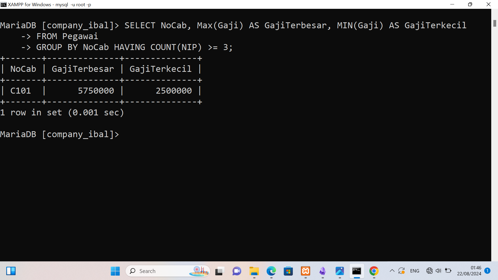

*STRIKTUR :*
~~~sql
SELECT COUNT(NIP) AS Jumlahpegawai, SUM(Gaji) AS TotalGaji,
    -> AVG(Gaji) AS RataGaji, Max(Gaji) AS GajiMks, MIN(Gaji) AS GajiMin
    -> FROM pegawai
    -> WHERE Jabatan = 'Staff' OR Jabatan = 'Sales'
    -> GROUP BY NoCab HAVING SUM(Gaji) <= 2600000;
~~~

*PENJELASAN :* 
- *SELECT COUNT(NIP) AS Jumlahpegawai*:
    - Bagian ini menghitung jumlah pegawai dengan menghitung jumlah NIP (Nomor Induk Pegawai) yang ada. Hasilnya akan ditampilkan dengan nama alias Jumlahpegawai.

- *SUM(Gaji) AS TotalGaji*:
    - Bagian ini menjumlahkan semua nilai gaji dari pegawai yang memenuhi kriteria. Hasil penjumlahan gaji ini akan ditampilkan dengan nama alias TotalGaji.

- *AVG(Gaji) AS RataGaji*:
    - Bagian ini menghitung rata-rata gaji dari pegawai yang memenuhi kriteria. Hasil perhitungan rata-rata ini akan ditampilkan dengan nama alias RataGaji.
- *MAX(Gaji) AS GajiMks*:
    - Bagian ini mencari dan menampilkan gaji tertinggi (maksimum) di antara pegawai yang memenuhi kriteria. Hasilnya akan ditampilkan dengan nama alias GajiMks.

- *MIN(Gaji) AS GajiMin*:
    - Bagian ini mencari dan menampilkan gaji terendah (minimum) di antara pegawai yang memenuhi kriteria. Hasilnya akan ditampilkan dengan nama alias GajiMin.

- *FROM pegawai*:
    - Bagian ini menunjukkan tabel yang menjadi sumber data, yaitu tabel pegawai.

- *WHERE Jabatan = 'Staff' OR Jabatan = 'Sales'*:
    - Bagian ini menetapkan kondisi untuk memilih hanya pegawai dengan Jabatan yang bernilai 'Staff' atau 'Sales'. Artinya, hanya data pegawai dengan jabatan ini yang akan diproses lebih lanjut dalam query ini.

- *GROUP BY NoCab*:
    - Bagian ini mengelompokkan data berdasarkan kolom NoCab (Nomor Cabang). Artinya, data akan dikelompokkan per cabang, dan hasil perhitungan (jumlah pegawai, total gaji, rata-rata gaji, gaji tertinggi, dan gaji terendah) akan ditampilkan untuk setiap cabang.

- *HAVING SUM(Gaji) <= 2600000*:
    - Bagian ini menetapkan kondisi setelah pengelompokan, yaitu hanya cabang-cabang yang memiliki total gaji kurang dari atau sama dengan 2.600.000 yang akan ditampilkan dalam hasil akhir query. Kondisi ini digunakan setelah pengelompokan karena HAVING digunakan untuk menyaring hasil setelah agregasi (seperti SUM).
