 # Buat Database baru

## **1. Membuat Database Baru**

Untuk membuat database baru, gunakan perintah `CREATE DATABASE` di SQL. Berikut adalah contoh sintaks untuk membuat database: 
```sql
CREATE DATABASE nama_database;
```

Contoh : 
```sql
CREATE DATABASE pegawai;
```

Hasil : 

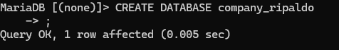

- **`CREATE DATABASE`**: Perintah SQL untuk membuat database baru.
- **`nama_database`**: Nama yang Anda pilih untuk database baru. Nama ini harus unik dalam server database dan tidak boleh mengandung spasi.
# Membuat Table
*STRUKTUR "*
```sql

CREATE TABLE pegawai (
-> NIP INT PRIMARY KEY,
-> NDep VARCHAR(255) NOT NULL,
-> NBlk VARCHAR(255),
-> JK ENUM('L', 'P') NOT NULL,
-> Alamat TEXT NOT NULL,
-> Telp VARCHAR(255) NOT NULL,
Jabatan ENUM('Manager', 'Supervisor', 'Staff'),
    Gaji BIGINT NOT NULL,
    NoCab VARCHAR(255) NOT NULL
);
```

*HASIL :*

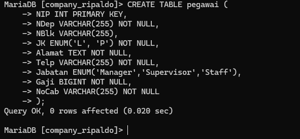

- `NIP` (tipe integer, berfungsi sebagai primary key)
- `NDep` (string yang tidak boleh kosong, mewakili nama depan)
- `NBlk` (string, mewakili nama belakang)
- `JK` (enum dengan nilai 'L' atau 'P', mewakili jenis kelamin, dan tidak boleh kosong)
- `Alamat` (teks yang tidak boleh kosong untuk alamat)
- `Telp` (string yang tidak boleh kosong untuk nomor telepon)
- `Jabatan` (enum dengan nilai 'Manager', 'Supervisor', atau 'Staff')
- `Gaji` (big integer yang tidak boleh kosong, mewakili gaji)
- `NoCab` (string yang tidak boleh kosong, kemungkinan mewakili nomor cabang atau kantor)

Untuk penjelasan lanjutnya kita lanjut di materi selanjutnya. Dengan mengecek Struktur Table....
# #PRAKTIKKUM 5
# Mengecek Struktur Table

Untuk mengecek struktur pada table, kita menggunakan perintah `Desc`

Struktur : 
```sql
DESC nama_table
```

Contoh : 
```sql
DESC pegawai
```


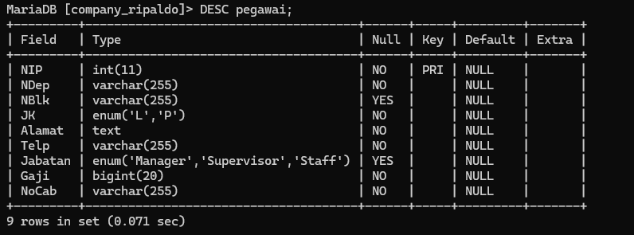


*PENJELASAN :*
> Deskripsi Tabel Pegawai

1. NIP (INT, PRIMARY KEY)

- NIP: Menyimpan Nomor Induk Pegawai. Tipe data ini adalah integer (INT).
- PRIMARY KEY: Menandakan bahwa NIP adalah kunci utama untuk tabel ini. Artinya, setiap Nomor Induk Pegawai harus unik dan tidak boleh kosong (NULL).

2. NDep (VARCHAR(255), NOT NULL)

- NDep: Menyimpan Nama Depan pegawai. Tipe data ini adalah string dengan panjang maksimum 255 karakter (VARCHAR(255)).
- NOT NULL: Kolom ini harus diisi; tidak boleh kosong (NULL).

3. NBlk (VARCHAR(255))

- NBlk: Menyimpan Nama Belakang pegawai. Tipe data ini adalah string dengan panjang maksimum 255 karakter (VARCHAR(255)).
- NULL YES: Kolom ini bisa kosong (NULL) jika tidak ada nilai.

4. JK (ENUM('L', 'P'), NOT NULL)

- JK: Menyimpan Jenis Kelamin pegawai. Tipe data ini adalah ENUM dengan dua pilihan: 'L' untuk Laki-laki dan 'P' untuk Perempuan.
- NOT NULL: Kolom ini harus diisi dengan salah satu dari nilai yang diperbolehkan; tidak boleh kosong (NULL).

5. Alamat (TEXT, NOT NULL)

- Alamat: Menyimpan alamat pegawai. Tipe data ini adalah TEXT, yang memungkinkan penyimpanan teks dalam jumlah besar.
- NOT NULL: Kolom ini harus diisi; tidak boleh kosong (NULL).

6. Telp (VARCHAR(255), NOT NULL)

- Telp: Menyimpan nomor telepon pegawai. Tipe data ini adalah string dengan panjang maksimum 255 karakter (VARCHAR(255)).
- NOT NULL: Kolom ini harus diisi; tidak boleh kosong (NULL).

7. Jabatan (ENUM('Manajer', 'Supervisor', 'Staf'))

- Jabatan: Menyimpan jabatan pegawai. Tipe data ini adalah ENUM dengan tiga pilihan: 'Manajer', 'Supervisor', atau 'Staf'.
- NULL YES: Kolom ini bisa kosong (NULL) jika tidak ada nilai.

8. Gaji (BIGINT, NOT NULL)

- Gaji: Menyimpan gaji pegawai. Tipe data ini adalah BIGINT, yang memungkinkan penyimpanan angka dalam jumlah sangat besar.
- NOT NULL: Kolom ini harus diisi; tidak boleh kosong (NULL).

9. NoCab (VARCHAR(255), NOT NULL)

- NoCab: Menyimpan nomor cabang pegawai. Tipe data ini adalah string dengan panjang maksimum 255 karakter (VARCHAR(255)).
- NOT NULL: Kolom ini harus diisi; tidak boleh kosong (NULL).
# Mengisi data pada table
*STRUKTUR "*
```sql
INSERT INTO pegawai (NIP, NDep, NBlk, JK, Alamat, Telp, Jabatan, Gaji, NoCab) VALUES 
-> (10107, 'Emya', 'Salsalina', 'P', 'JL. Suci 78 Bandung', '022-555768', 'Manager', 5250000, 'C101'), 
-> (10246, 'Dian', 'Anggraini', 'P', 'JL. Mawar 5 Semarang', '024-555102', 'Supervisor', 2750000, 'C103'), 
-> (10324, 'Martin', 'Susanto', 'L', 'JL. Bima 51 Jakarta', '021-555785', 'Staff', 1750000, 'C102'), 
-> (10252, 'Antoni', 'Irawan', 'L', 'JL. A. Yani 15 Jakarta', '021-555888', 'Manager', 5750000, 'C102'), 
-> (10176, 'Diah', 'Wahyuni', 'P', 'JL. Maluku 56 Bandung', '022-555934', 'Supervisor', 2500000, 'C101'), 
-> (10314, 'Ayu', 'Rahmadani', 'P', 'JL. Malaka 342 Jakarta', '021-555098', 'Supervisor', 1950000, 'C102'), 
-> (10307, 'Erik', 'Adrian', 'L', 'JL. Manggis 5 Semarang', '024-555236', 'Manager', 6250000, 'C103'), 
-> (10415, 'Susan', 'Sumantri', 'P', 'JL. Pahlawan 24 Surabaya', '031-555120', '', 2650000, 'C104'), 
-> (10407, 'Rio', 'Gunawan', 'L', 'JL. Melati 356 Surabaya', '031-555231', 'Staff', 1725000, 'C104');
```

*PENJELASAN :*
1.  **`INSERT INTO pegawai`**:
    
    - Ini adalah perintah SQL yang digunakan untuk menambahkan data baru ke tabel yang bernama **`pegawai`**.
- **Kolom yang Diisi**:
    
    - Dalam perintah ini, Anda menentukan kolom-kolom di tabel `pegawai` yang akan diisi dengan data. Kolom-kolom tersebut adalah:
        - **NIP**: Nomor Induk Pegawai
        - **NDep**: Nama Depan
        - **NBlk**: Nama Belakang
        - **JK**: Jenis Kelamin
        - **Alamat**: Alamat
        - **Telp**: Nomor Telepon
        - **Jabatan**: Jabatan
        - **Gaji**: Gaji
        - **NoCab**: Nomor Cabang
2. **`VALUES`**:
    
    - Setelah menentukan kolom-kolom yang akan diisi, Anda menyebutkan data yang akan dimasukkan. Data untuk setiap baris harus mengikuti urutan kolom yang telah disebutkan.
- **Contoh Data yang Dimasukkan**:
    
    - **Baris Pertama**:
        - **NIP**: 10107
        - **NDep**: 'Emya'
        - **NBlk**: 'Salsalina'
        - **JK**: 'P' (Perempuan)
        - **Alamat**: 'JL. Suci 78 Bandung'
        - **Telp**: '022-555768'
        - **Jabatan**: 'Manager'
        - **Gaji**: 5.250.000
        - **NoCab**: 'C101'
    - **Baris Berikutnya**:
        - Mengikuti format yang sama dengan data yang berbeda untuk setiap kolom.
- **Catatan Penting**:
    
    - **Kolom Jabatan**: Pada baris data dengan **NIP** 10415 untuk **Susan Sumantri**, kolom Jabatan tidak diisi (`''`). Jika kolom Jabatan adalah ENUM (jenis kelamin) dan tidak mengizinkan nilai kosong, ini dapat menyebabkan masalah. Pastikan kolom Jabatan diisi dengan nilai yang valid seperti 'Staff' jika kolom tersebut tidak mengizinkan nilai kosong.
    - **Pembaruan Data**: Jika kolom Jabatan mengizinkan nilai kosong, Anda mungkin perlu memperbarui baris ini dengan jabatan yang sesuai. Jika tidak, Anda mungkin perlu menyesuaikan skema tabel untuk mengizinkan nilai kosong.
**Hasil** :

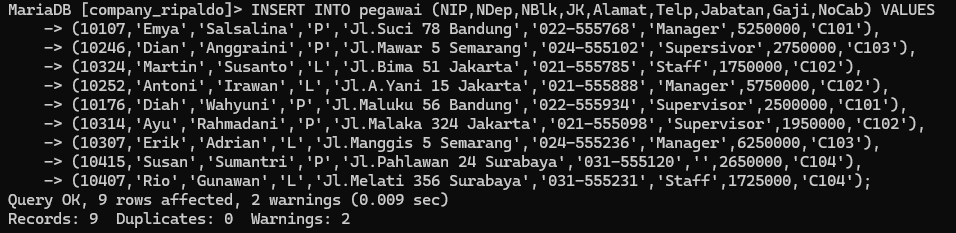


# Menghitung jumlah entri atau baris dalam kolom tertentu

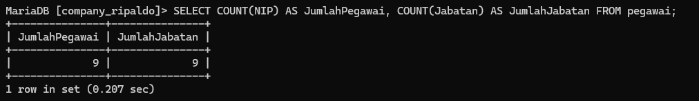


- SELECT = untuk memilih kolom apa saja yang ingin dipilih (untuk dihitung).

- COUNT (NIP) = untuk menghitung Jumlah barisan data yang mempunyai dari kolom Yang dipilih. NIP adalah nama kolom Yang dipilih untuk dihitung.

- AS = untuk mengubah nama dari suatu kolom untuk sementara. Jumlah Pegawai = merupakan nama ubahan dari Perintah AS yang digunakan. merupakan nama sementara dari Perintah COUNT (NIP).

- COUNT (Jabatan) untuk menghitung jumlah barisan data yang mempunyai isi data dan kolom yang dipilih. Jabatan adalah nama kolom Yang dipilih untuk dihitung

- AS = untuk mengubah nama dari suatu kolom untuk sementara. Jumlah Jabatan = merupakan nama sementara dari perintah COUNT (Jabatan).

- FROM Pegawai = merupakan dari tabel mana datanya yang digunakan Pegawai adalah nama tabel Yang datanya ingin digunakan.

	Hasilnya = karena ada 9 barisan data, Yang ingin dihitung adalah kolom NIP, Jumlah dari kolom NIP (isi datanya) ada 9, ditampilkan sebagai Jumlah pesawai. Kolom Jabatan Jusa dihitung, akan tetapi ada satu data yang berisi Null (kosong), oleh karena itu hanya ada 8 data ditampilkan sebagai Jumlah Jabatan.


# Menghitung jumlah pegawai yang terdaftar di cabang tertentu

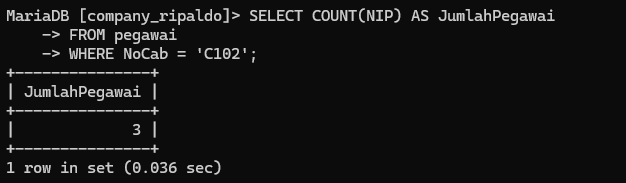

- SELECT = untuk memilih kolom mana saja yang ingin dipilih untuk dihitung.

- COUNT (NIP) = untuk menghitung Jumlah barisan data yang mempunyai data dari kolom Yang dipilih. NIP adalah nama kolom Yang dipilih untuk dihitung.

- As = untuk mengubah nama dari suatu kolom untuk sementara.

- Jumlah Pegawai = nama sementara Yang dipilih untuk kolom COUNT (NIP)

- FROM Pegawai = dari tabel mana datanya akan digunakan. Pesawai adalah nama tabel Yang dipilih untuk digunakan.

- WHERE = merupakan kondisi Yang harus dipenuhi agar datanya dapat dengan query COUNT (NIP).

- (Nocab = 'C102') = adalah kondisi dari WHERE Yang harus dipenuhi, Jadi hanya barisan data yang memiliki Clo2 di kolom "vocab Yang bisa dihitung.

	Hasilnya = Di 9 barisan data Yangaja Pada tabel Pegawai, kita ingin menghitung Jumlah barisan data yang memiliki nilai 'clo₂ Pada kolom "Nocab" nya dengan menggunakan COUNT. Jadi Yang muncul adalah 3 0 barisan data. kita Juga ingin mengubah nama dari kolom hasil Perintah COUNT secara sementara dengan Perintah AS, namanya adalah Jumlah Pegawai.

# Menghitung jumlah pegawai di setiap cabang yang berbeda

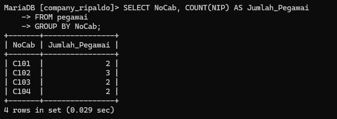


- SELECT untuk memilih kolom mana saja yang ingin dihitung atau ditampilkan.

- Nocab = merupakan nama kolom Yang ingin ditampilkan.

- COUNT (NIP) = untuk menghitung Jumlah barisan data Yang mempunyai isi data dari kolom Yang dipilih.

- NIP adalah nama kolom yang dipilih untuk dihitung. AS untuk mengubah nama dari suatu kolom untuk sementara.

- Jumlah Pegawai = merupakan nama sementara dari kolom hasil COUNT (NIP).

- FROM Pegawai dari tabel mana Yang data kolomnya ingin digunakan. Pegawai adalah nama tabel Yang dipilih untuk digunakan.

- GROUP BY untuk mengelompokkan data berdasarkan nilai data yang telah ditentukan Pada kolom Yang dipilih. Nocab hama kolom Yang dipilih untuk datanya dikelompokkan.

	Hasilnya = Berdasarkan. 9 barisan data, masing-masing. nilai, dalam kolom Nocab

# Menghitung jumlah pegawai di setiap cabang

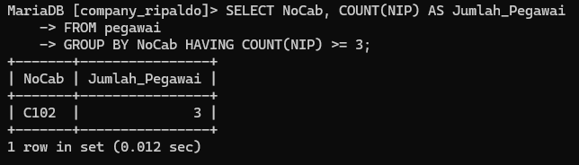


- SELECT = untuk memilih kolom mana sasa Yang ingin dihitung atau ditampilkan.

- Nocab = merupakan nama kolom yang ingin ditampilkan.

- COUNT (NIP) = untuk menghitung jumlah barisan data yang mempunyai isi data dari kolom Yang dipilih. NIP adalah nama kolom Yang dipilih untuk dihitung.

- AS = untuk mengubah nama dari suatu kolom untuk sementara.

- Jumlah-Pegawai = nama sementara dari kolom hasil COUNT (NIP).

- FROM Pegawai = untuk memilih dari tabel mana Yang data kolomnya ingin digunakan. Pegawai adalah nama tabel Yang dipilih untuk digunakan.

- GROUP BY = untuk mengelompokkan data berdasarkan nilai data Yang telah ditentukan Pada kolom Yan dipilih. Nocab-nama kolom Yang dipilih untuk dikelompokkan datanya.

- HAVING = untuk menentukan kondisi (Yang harus dipenuhi) oleh suatu kelompok data agar bisa ditampilkan.

- (COUNT (NIP) >= 3) = merupakan kondisi Yang harus dipenuhi oleh suatu kelompok data. Jadi hanya kelompok data Yang hasil hitungannya lebih atau Sama dengan 3.

	Hasilnya seperti sebelumnya, ada 9 barisan data dibadi sesuai Nocab nya masing- masing. Namun Yang ingin ditampilkan adalah hasil hitungan yang lebih dari atau sama dengan 3. Yaitu Nocab C102 Yang ada 3. Yand lain c1o1 ada 2, c103 ada 2, c104 ada 2.

# Menghitung total keseluruhan gaji dari semua pegawai

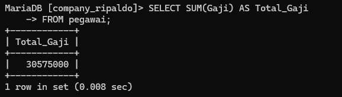


- SELECT = untuk memilih kolom mana saja yang dipilih untuk dijumlahkan.SUM (Gaji) untuk menghitung Jumlah data (khusus andka) Pada kolom Yang dipilih. Gaji merupakan nama kolom Yang dipilih untuk dihitung Jumlah isi datanya

- AS = untuk mengganti nama dari kolom hasil Sum (Gaji) untuk sementara.

- Total_Gaji = merupakan nama sementara dari perintah As.

- FROM Pegawai = untuk memilih dari tabel mana Yang kolom datanya akan digunakan. Pegawai adalah nama dari tabel Yang dipilih.

	Hasilnya = kolom gaji Yang isi datanya berupa angka-angka, semuanya dijumlahkan menjadi satu seperti ditotalkan (Sama seperti matematika Pada umumnya). hasilnya adalah 30 575 000. Adapun nama kolom dari hasil Jumlah tersebut diubah dari SUM(Gasi) menjadi Total-gaji

# Menghitung total gaji dari semua pegawai yang memiliki jabatan sebagai "Manager"

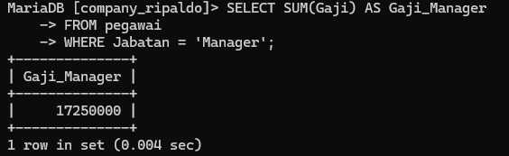

- SELECT = untuk memilih kolom mana saja yang dipilih untuk dijumlahkan.

- Sum (Gaji) = untuk menghitung Jumlah isi data (khusus angka) Pada kolom Yang dipilih. Gaji adalah nama kolom Yang dipilih untuk dijumlahkan isi datanya.

- AS = untuk mengganti nama dari kolom hasil SUM (Gaji) secara sementara.

- Gaji_Manager = merupakan nama Sementara dari Perintah AS.

- FROM Pegawai = untuk memilih dari tabel mana Yang kolom datanya akan digunakan. Pegawai adalah nama dari table yang dipilih.

- WHERE = kondisi Yang harus dipenuhi oleh suatu kolom agar datanya bisa dijumlah.

- (Jabatan = "manager") = merupakan kondisi dari WHERE. Hanya barisan data yang kolom Jabatannya bersi kolom Gajinya bisa diJumlahkan.

	Hasilnya = barison data Yang kolom Jabatannya berisi manajer akan dijumlah kolom Gajinya menjadi. 17250 000. Jadi hanya beberapa kolom. Saja yang dijumalah

# Menghitung total gaji yang dikeluarkan untuk setiap cabang

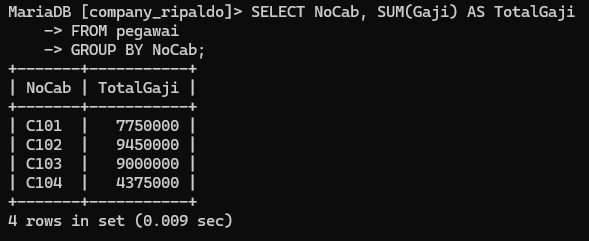


- SELECT = untuk memilih Kolom mana saja yang dipilih untuk ditampilkan/dijumlahkan.

- Nocab = adalah nama kolom yang ingin ditampilkan.

- SUM (Gaji) = untuk menghitung Jumlah data (khusus angka) Pada kolom Yang dipilih. Gaji adalah nama kolom Yang dipilih untuk dijumlahkan isi datanya.

- AS = untuk mengganti nama dari kolom hasil SUM(Gaji) untuk sementara.

- Totalgaji = merupakan nama sementara dari Perintah AS.

- FROM Pegawai =untuk memilih dari tabel mana Yang data kolomnya akan digunakan. Pegawai adalah nama tabel yang dipilih.

- GROUP BY = untuk mengelompokkan data berdasarkan nilai data yang telah ditentukan pada kolom yang dipilih.

- Nocab = nama kolom Yang datanya dipilih untuk dikelompokkan.

	Hasilnya = Jadi, berdasarkan kolom Nocab, barisan data yang kolom Nocab nya berisi clol maka kolom Gaji dari barisan data itu dijumlahkan bersama barisan data Yang memiliki Nocab clol dua. Maka kolom Gaji dijumlahkan sesuai dengan kolom Nocab nya

# Menghitung total gaji di setiap cabang dan hanya menampilkan cabang-cabang yang memiliki total gaji tertentu

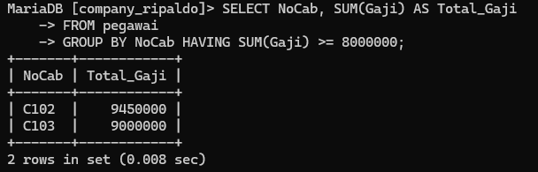

- SELECT = untuk memilih kolom mana saja yang dipilih untuk ditampilkan / dijumlahkan. Nocab nama kolom Yang dipilih untuk ditampilkan.

- SUM(Gaji) = untuk menghitung Jumlah data (khusus angka) Pada kolom Yang dipilih. Gaji, adalah nama kolom Yang dipilih untuk dijumlahkan isi datanya.

- AS = untuk menganti nama dari kolom hasil Sum (Gaji) untuk sementara.

- Total_Gaji = nama Sementara dari Perintah AS.

- FROM Pegawai = untuk memilih dari tabel mana Yang data kolomnya ingin digunakan. Pegawai adalah nama dari tabel yang dipilih.

- GROUP BY = untuk mengelompokkan data berdasarkan nilai data Yang telah ditentukan Pada kolom yang dipilih.

- Nocab = nama kolom Yang dipilih untuk datanya dikelompokkan. Having = kondisi Yang harus dipenuhi oleh suatu kelompok data agar bisa ditampilkan.

- (SUM (Gaji) >= 8000000) = Kondisi dari HAVING, Hasil dari Penjumlahan Gaji Yang hanya bisa ditampilkan adalah Hasil yang lebih dari atau sama dengan 8000000.

	Hasilnya = Sama seperti sebelumnya, tetapi No cab Yang memenuhi kondisi tersebut hanyala clo2 dan c103 karena hasil Jumlah kolom Gaji nya lebih dari atau sama dengan 8000000. Adapun hasil kolom SUMCGaji) diganti Jadi Total_Gaji.

# Menghitung rata-rata gaji dari semua pegawai yang terdaftar

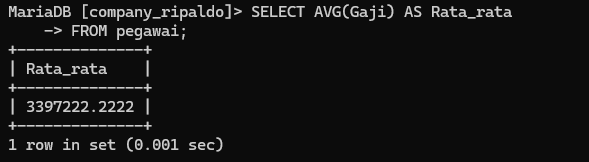

- SELECT = untuk memilih kolom mana Sara Yang dipilih untuk ditampilkan.

- AVG (Gaji) = untuk menghitung rata-rata dari data yang ada pada kolom Yang dipilih. Gaji adalah nama kolom Yang dipilih untuk dihitung rata-ratanya.

- AS = untuk menganti nama dari kolom hasil AVG (Gari) untuk sementara.

- Rata-rata = nama sementara dari Perintah AS.

- FROM Pegawai = untuk memilih dari tabel mana Yang data kolomnya ingin digunakan. Pegawai adalah nama dari tabel yang dipilih.

	Hasilnya = 3397222.2222 merupakan hasil rata-rata dari semua 9 barisan data Pada kolom Gaji. Adapun nama kolom hasil dari AVG (Gaji) Yaitu Rata-rata.

# Menghitung rata-rata gaji dari pegawai yang memiliki jabatan tertentu

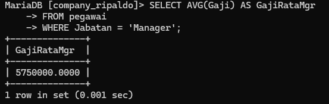

- SELECT untuk memilih kolom mana saja yang dipilih untuk ditampilkan.

- AVG (Gaji) = untuk menghitung rata-rata dari data yang ada pada kolom Yang dipilih Gaji adalah nama kolam Yang dipilih untuk dihitung rata-ratanya.

- AS = untuk mengganti nama dari kolom hasil AVG (Gaji) untuk sementara.

- GajiRataMgr = nama sementara dari Perintah AS.

- FROM Pegawai = untuk memilih dan tabel mana Yang data kolomnya ingin digunakan. Pegawai adalah nama dari tabel Yang dipilih.

- WHERE = Kondisi Yang harus dipenuhi oleh suatu kolom agar datanya bisa dihitung rata- ratanya (Jabatan = 'Manajer') kondisi dari wHERE. Barisan data yang kolom Jabatannya Manajer akan dihitung rata-rata kolom Gajinya.

	Hasilnya = 5750000.0000 merupakan hasil hitung rata-rata dari barisan data yang memiliki manager di kolom Jabatan nya, dari situ kolom Gaji nya di hitung
# Menghitung rata-rata gaji pegawai di setiap cabang

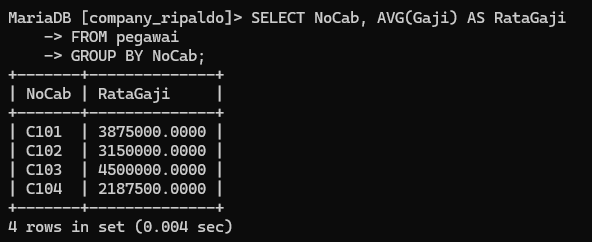

- SELECT = untuk memilih Kolom mana saja yang dipilih untuk ditampilkan, dihitung.

- Nocab = Kolom Yang dipilih untuk ditampilkan.

- AVG (Gaji) = untuk menghitung rata-rata dari data yang ada pada kolom Yang dipilih. Gaji adalah nama kolom Yang dipilih untuk dihitung rata-ratanya.

- As = untuk menganti nama dari kolom hasil AVG(Gajii) untuk sementara.

- Rata Gaji = adalah nama sementara dari Perintah As.

- FROM Pegawai = untuk memilih dan tabel mana yang data kolomnya ingin digunakan. Pegawai adalah nama dari tabel yang dipilih.

- GROUP BY = untuk mengelompokkan data berdasarkan nilai data yang telah ditentukan.Pada kolom Yong dipilih.

- Nocab = nama kolom Yang dipilih untuk datanya dikelompokkan.

	Hasilnya = Hampir sama seperti no.7, masing-masing kolom Nocab dihitung rata-ratanya

# Menghitung rata-rata gaji pegawai di cabang-cabang tertentu

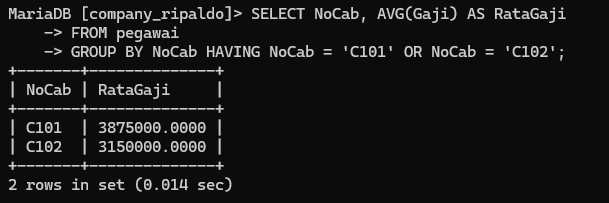

- SELECT = untuk memilih kolom mana saja yang dipilih untuk ditampilkan, dihitung.

- Nocab = Kolom Yong dipilih untuk ditampilkan.

- AVG (Gaji) = untuk menghitung rata-rata dari data yang ada pada kolom Yang dipilih. Gaji adalah nama kolom Yang dipilih untuk dihitung rata-ratanya.

- AS = untuk menganti nama dari kolom hasil AVG (Gaji) untuk sementara.

- rata Gaji = nama sementara dari Perintah As.

- FROM Pegawai untuk memilih dari tabel mana Yang datanya Kolomnya ingin dignakan Pegawai adalah nama dari tabel Yang dipilih.

- GROUP BY = untuk mengelompokkan data berdasarkan nilai data Yang telah ditentukan Pada kolom Yang dipilih.

- Nocab = nama Kolom Yand dipilih untuk datanya dikelompokkan.

- HAVING = kondisi Yang harus dipenuhi oleh suatu kelompok data.

- (Nocabc101' OR Nocab = 'c102') = merupakan kondisi dari Having. Jadi kolom Nocab Yang memiliki c101 atav C102 Yang hanya akan ditampilkan. OR adalah kondisi Yang hanya salah satu datanya yang harus dipenuhi

# Menemukan nilai gaji terbesar dan terkecil dari semua pegawai

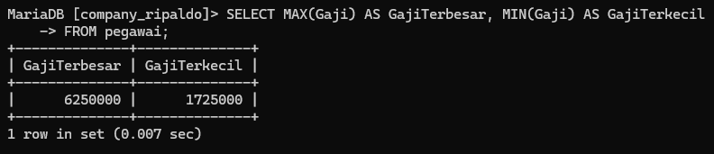

- SELECT = untuk memilih kolom mana saja yang dipilih untuk ditampilkan.

- MAX(gaji) = untuk menampilkan nilai maksimum atau terbesar / tertinggi dari suatu data dalam kolom Yang dipilih. Gaji adalah nama kolom Yang dipilih.

- As Gajiterbesar = untuk mengganti nama dari kolom hasil Min(Gaji), menjadi nama Sementaranya Yaitu Gaji Terbesar.MIN (Gaji) = untuk menampilkan nilai minimum atau terkecil/terendah dari suatu data dalam kolom yg dipilih. Gaji adalah nama kolam Yang dipilih.

- As Gaji Terkecil = untuk mengganti nama dari kolom hasil MIN (Gaji) menjadi Gaji Terkecil untuk sementara.

- FROM Pegawai = untuk memilih dari tabel mana yang dat kolomnya ingin ditampilkan.

	Hasilnya = Jadi dari 9 nilai yang ada di kolam Gaji, Gaji maksimumnya adalah 6250000 dan namanya diubah menjadi Gajiterbesar. Gajii minimumnya adalah 1725000 dan namanya diubah menadi Gajiterkecil.

# Menemukan nilai gaji terbesar dan terkecil dari pegawai yang memiliki jabatan "Manager"

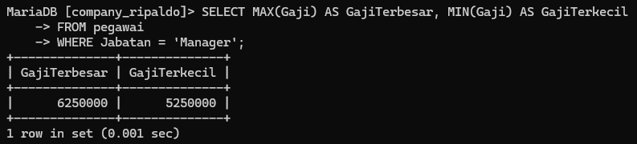

- SELECT = untuk memilih kolom mana saja yang dipilih untuk ditampilkan.

- MAX (Gaji) = untuk menampilkan nilai terbesar dari suatu data dalam kolom Yang dipilih Gajii adalah nama kolom yang dipilih.

- AS GajiTerbesar = untuk mengganti nama dari kolom hasil max (Gaji) menjadi Gajiterbesar untuk sementara.

- MIN (Gaji) = untuk menampilkan nilai terkecil dari Suatu data dalam kolam Gaji adalah nama kolom Yang dipilih.

- AS Gajiterkecil = untuk menganti nama dari kolom hasil MIN (Gaji) menjadi Gaji terkecil untuk sementara.

- FROM Pegawai = untuk memilih dari tabel mana Yand data kolomnya ingin ditampilkan.

- WHERE kondisi = Yang harus dipenuhi oleh suatu kolom data agar bisa ditampilkan. (jabatan Manajer) = kondisi dari WHERE Yang harus dipenuhi. Barisan data yang kolom jabatannya berisi manajer akan ditampilkan kolom Gajinya.

	Hasilnya Jabatan Manajer Yang memiliki nilai maksimum adalah 6250000 Kolom hasil MAX nya diubah Jadi Gaji terbesar. sedangkan nilai minimumnya adalah $250000 Kolamhasil MIN nya diubah Tadi Gaji Terkecil

# Menemukan gaji terbesar dan terkecil untuk setiap cabang yang memiliki tiga pegawai atau lebih

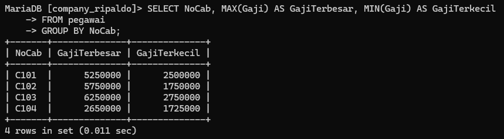

- SELECT = untuk memilih kolom mana saja yang dipilih untuk ditampilkan.

- Nocab= nama kolom Youd ingin ditampilkan.

- MAX (Gaji) = untuk menampilkan nilai terbesar dari suatu data dalam kolom Yang dipilih Gaji nama kolom Yang dipilih.

- AS GajiTerbesar = untuk mengganti nama kolom hasil MAX (Gaji) menjadi Gaji terbesar untuk sementara.

- MIN (Gaji) = untuk menampilkan nilai terkecil dari suatu data dalam kolom Yang dipilih Gaji nama kolom Yang dipilih.

- As Gajiterkecil = untuk mengganti nama kolom hasil MIN (Gaji) menjadi Gaji Terkecil untuk sementara.

- FROM Pegawai = untuk memilih dari tabel mana Yang data kolomnya ingin ditampilkan. Pegawai adalah nama tabel Yang dipilih untuk ditampilkan.

- GROUP BY = untuk mengelompokkan data berdasarkan nilai data yang telah ditentukan Pada kolom Yan dipilih.

- Nocab = nama Kolom yang ingin dikelompokkan.

	Hasilnya = masing-masing Nocab dicari nilai maksimum dan minimumnya. mulai dari clol, c102, c103, c104. dan nama hasil kolannya diubah Jadi Gajiterbesar dan GajiTerkecil.
# Mendapatkan berbagai statistik terkait gaji dari seluruh pegawai

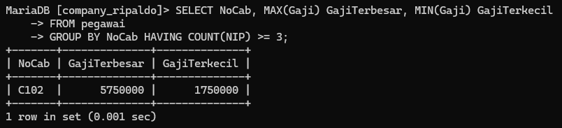

- SELECT untuk memilih kolom mana sara Yang dipilih untuk ditampilkan.

- Nocab = nama kolom Yang ingin ditampilkan.

- MAX (Gaji) = untuk menampilkan nilai terbesar dan suatu data dalam kolom Yang dipilih Gat adalah nama kolom Yang dipilih.

- AS Gajiterbesar = untur menssanti nama kolom hasil MAX (Gaji) menjadi GariTerbesar Untuk Sementara.

- MIN (Gaji) = untuk menampilkan nilai terkecil dari suatu data dalam kolom yg dipilih. Gaji adalah nama Kolam Yang dipilih.

- AS Gaji = Terkecil untuk mengganti nama kolom hasil MIN (Gaji) menjadi Gajiterkecil untuk sementara.

- FROM Pegawai = adalah untuk memilih dari tabel mana Yang data kolomnya ingin ditampilkan,Pegawai adalah nama tabel Yang dipilih.

- GROUP BY = untuk mengelompokkan data Pada kolom Yang dipilih.

- Nocab = nama kolom Yand dipilih untuk dikelompokkan. Having = Kondisi Yang harus dipenuhi oleh suatu kelompok data.

- (COUNT(NIP) >= 3)= kondisi dri HAVING. Hanya hasil hitung kolom NIP Yang lebih dari atau sama dengan 3 Yang muncul.

	Hasilnya seperti no. 4, Yang mempunyai hasil hitung lebih dari atau Sama dengan 3 Nocab C102 Jadi hanya itu Yandg dicari Nilai maksimum dan adalah minimumnya Pada kolom Gaji

# Memperoleh ringkasan statistik terkait data pegawai

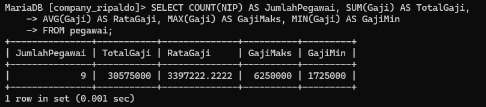

- SELECT = untuk memilih kolam mana saja yang dipilih untuk ditampilkan.

- COUNT (NIP) = untuk menghitung jumlah barisan data yang ada pada kolam Yang dipilih.

- AS Jumlah Pesawai = untuk menssanti nama kolam hasil COUNT (NIP) menjadi Jumlah Pegawai.

- SUM (Gaji) = untuk menjumlah data Yang ada pada kolom Yang dipilih. Gaji adalah kolom Yang dipilih. AS Total Gaji untuk mengganti nama kolom hasil SUM (Gaji) menjadi Total Gaji.

- AVG (Gaji) = untuk menghitung rata-ratanya suatu data dalam kolom yang dipilih. Gaji adalah nama kolom Yang dipilih untuk dihitung. AS RataGaji = untuk mengganti nama kolom hasil AVG (Gari) menjadi RataGaji.

- MAX (Gaji) = untuk menampilkan nilai terbesar dari suatu data dalam kolam Yang dipilih Gaji adalah nama kolom yang dipilih.

- AS Gajimaks = untuk mengganti nama dari kolom hasil MAX(Gari) menjadi Garimaks. untuk Sementara. MIN (Gaji) untuk menampilkan nilai terkecil dari suatu kalam Yang dipilih. Gaji nama kolom Yang dipilih.

- AS GajiMIN = untuk menganti nama dari kolom hasil MIN (Gaji) menjadi Gajimin. Untuk sementara.

- FROM Pegawai = untuk memilih tabel mana yang dipilih untuk ditampilkan. Pegawai adalah nama tabel Yang dipilih.

	Hasilnya = Dihitung berapa NIP, Di Jumlahkan semua data Pada kolom Gaji, Dihitung Rata-tata datri kolom Gaji, Ditampilkan nilai terbesar Pada kolom Gaji, dan Nilai terkecil dalam Kolom Gaji.

# Menghitung dan menganalisis statistik gaji pegawai

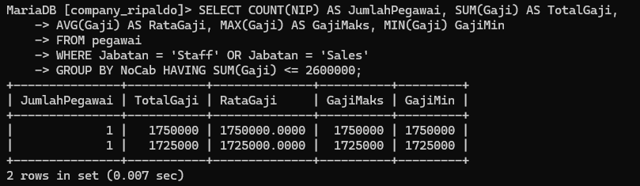


- SELECT = untuk memilih kolam mana saja yang ingin digunakan.

- COUNT (NIP) = untuk menghitung barisan data yang ada Pada kolom Yang dipilih. AS Jumlah

- pegawai = untuk mengganti nama dari kolom hasil COUNT (NIP) menjadi Jumlah Pegawai untuk sementara.

- SUM (Gaji) = untuk menjumlah data Yang ada Pada kolom Yang dipilih. Gaji adalah nama kolom Yang dipilih.

- As Total Gaji = untuk mengganti nama dari kolom hasil SUM(Gaji) menjadi Total Gaji Untuk Sementara. AVG (Gaji) untuk menghitung rata-rata dari kolom Yand dipilih. Gaji adalah nama kolom Yang dipilih.

- As Rata Gaji = untuk mengganti nama dari kolom hasil AVG (Gaji) menjadi Rata Gaji Untuk sementara. MAX (Gaji) untuk menampilkan nilai 2 terbesar dan suatu data dalam kolom Yang dipilih Gaji adalah nama kolom. Yang dipilih.


