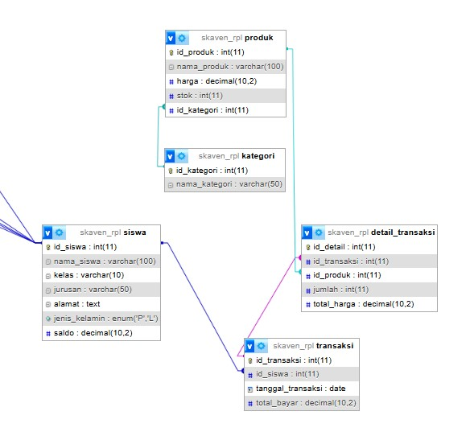

# 📋 **Laporan Aplikasi Kantin Sekolah**

## 1. 🧩 **Deskripsi Fitur**
### 🔐 Login & Autentikasi
Pengguna dapat login sebagai **admin** atau **siswa**. Role ini menentukan fitur yang bisa diakses:
- **Admin**: Kelola siswa, produk, transaksi, dan laporan.
- **Siswa**: Melakukan pembelian
### 🧑‍🎓 Manajemen Siswa
Admin dapat:
- Menambah, mengedit, atau menghapus data siswa.
- Mengatur saldo siswa untuk transaksi.

### 🍔 Manajemen Produk
Admin mengelola produk kantin:
- Tambah produk (nama, harga, stok, kategori).
- Edit atau hapus produk.
- Produk dikelompokkan berdasarkan kategori.
### 💸 Transaksi Pembelian
Siswa melakukan pembelian produk:
- Sistem mencatat transaksi dan item yang dibeli.
- Mengurangi saldo siswa dan stok produk secara otomatis.
- Menyimpan total harga dan rincian transaksi.
### 📊 Laporan Transaksi
Admin dapat melihat:
- Riwayat pembelian per siswa atau seluruh transaksi.
- Total pengeluaran dan item yang dibeli per siswa atau produk.
- Bisa difilter berdasarkan tanggal/siswa.
---
## 2. 🗄️ **Struktur Database**

| Tabel              | Penjelasan                                                        |
| ------------------ | ----------------------------------------------------------------- |
| `siswa`            | Menyimpan data siswa: nama, kelas, dan saldo.                     |
| `produk`           | Menyimpan daftar produk kantin: nama, harga, stok, dan kategori.  |
| `kategori`         | Menyimpan jenis kategori produk (makanan, minuman, snack, dll).   |
| `transaksi`        | Mencatat transaksi pembelian siswa, termasuk tanggal & id_siswa.  |
| `detail_transaksi` | Rincian produk yang dibeli dalam transaksi, jumlah & total_harga. |
| `users`            | Akun login dengan role admin/siswa (digunakan saat autentikasi).  |

==tabel==


---
## 3. 🔗 **Relasi Tabel**

|Relasi|Penjelasan|
|---|---|
|`transaksi.id_siswa → siswa.id_siswa`|Menyimpan siapa yang melakukan transaksi.|
|`produk.id_kategori → kategori.id_kategori`|Mengelompokkan produk berdasarkan jenis.|
|`detail_transaksi.id_transaksi → transaksi.id_transaksi`|Menyimpan setiap item pembelian dari transaksi.|
|`detail_transaksi.id_produk → produk.id_produk`|Menyimpan detail produk yang dibeli.|

### 📌 _Analisis Kerja Fitur terhadap Relasi_
Saat siswa melakukan pembelian:
1. Transaksi dicatat ke `transaksi`, relasi ke `siswa`.
2. Setiap produk masuk ke `detail_transaksi`, relasi ke `produk`.
3. Total harga dihitung dan saldo siswa dikurangi.
4. Stok produk otomatis dikurangi.
---
## 4. 📊 **Agregasi (GROUP BY & HAVING)**
### 💡 Contoh Query:
```sql
SELECT 
  s.nama_siswa,
  SUM(dt.total_harga) AS total_pengeluaran
FROM transaksi t
JOIN siswa s ON t.id_siswa = s.id_siswa
JOIN detail_transaksi dt ON t.id_transaksi = dt.id_transaksi
GROUP BY s.nama_siswa
HAVING total_pengeluaran > 10000;
```
### 📌 _Penjelasan:_
- **Tujuan**: Menampilkan siswa yang pengeluarannya lebih dari Rp10.000.
- **GROUP BY**: Kelompokkan berdasarkan siswa.
- **SUM(total_harga)**: Hitung total belanja siswa.
- **HAVING**: Filter siswa dengan pengeluaran di atas batas tertentu.
### ✅ _Fitur Terkait_:
Digunakan dalam halaman **laporan admin** untuk:
- Menilai siapa siswa paling aktif belanja.
- Melihat tren produk terlaris.
### 📌 _Tujuan_:
- Mencegah siswa mengakses halaman manajemen produk/siswa.
- Menjaga integritas data agar hanya admin yang bisa mengubah informasi penting.
### 🚫 Fitur yang Diproteksi:

| Halaman                | Akses Role                      |
| ---------------------- | ------------------------------- |
| `manajemen_siswa.php`  | admin                           |
| `manajemen_produk.php` | admin                           |
| `transaksi.php`        | siswa/admin (dengan batasan UI) |
|                        |                                 |


# 📌 **MACAM -MACAM Fitur: KANTIN_SEKOLAH**
## 🎯 Tujuan
Memungkinkan admin mengelola produk kantin (makanan dan minuman) melalui fitur tambah, edit, dan hapus. Produk ini digunakan saat transaksi pembelian oleh siswa.

## 📁 File: `manajemen_siswa.php`
### 📊 **Relasi Tabel dalam Sistem Manajemen Siswa **

#### **1. Tabel: `siswa`**
Menyimpan informasi utama siswa seperti:
- `id_siswa` (Primary Key)
- `nama_siswa`
- `kelas`
- `jurusan`
- `jenis_kelamin`
- `saldo`

#### **2. Tabel: `transaksi`**
Menyimpan riwayat transaksi pembelian oleh siswa:
- `id_transaksi` (Primary Key)
- `id_siswa` (Foreign Key) → **relasi ke `siswa.id_siswa`**
- `tanggal_transaksi`
- `total_bayar`
- (Kemungkinan ada `id_produk` di tabel lain yang belum dicantumkan di sini)
---
#### 🔗 **Relasi Antartabel**

| Tabel Utama | Kolom Relasi | Tabel Relasi | Keterangan Relasi                     |
| ----------- | ------------ | ------------ | ------------------------------------- |
| `siswa`     | `id_siswa`   | `transaksi`  | `siswa.id_siswa = transaksi.id_siswa` |
|             |              |              |                                       |

> Jenis Relasi: **One-to-Many**  
> Artinya: **1 siswa bisa memiliki banyak transaksi.**

---
#### 🔍 **Contoh Relasi dalam Query**
Pada bagian berikut:
```sql
`SELECT siswa.*,         COUNT(transaksi.id_transaksi) AS jumlah_transaksi,        COALESCE(SUM(transaksi.total_bayar), 0) AS total_transaksi FROM siswa LEFT JOIN transaksi ON siswa.id_siswa = transaksi.id_siswa GROUP BY siswa.id_siswa`
```
Penjelasan:
- Menggabungkan data siswa dengan transaksi (menggunakan `LEFT JOIN`).
- Menghitung jumlah transaksi per siswa.
- Menjumlahkan total uang yang dibelanjakan (`SUM(total_bayar)`).

---

### 🔄 Proses Tambah / Edit Data Siswa

```php 
if ($_SERVER['REQUEST_METHOD'] === 'POST') {
    $id_siswa = $_POST['id_siswa'] ?? null;
    $nama     = $_POST['nama_siswa'];
    $kelas    = $_POST['kelas'];
    $jurusan  = $_POST['jurusan'];
    $jk       = $_POST['jenis_kelamin'];
    $saldo    = $_POST['saldo'];

    if ($id_siswa) {
        // Edit siswa
        $query = $koneksi->prepare("UPDATE siswa SET nama_siswa=?, kelas=?, jurusan=?, jenis_kelamin=?, saldo=? WHERE id_siswa=?");
        $query->bind_param("ssssii", $nama, $kelas, $jurusan, $jk, $saldo, $id_siswa);
    } else {
        // Tambah siswa
        $query = $koneksi->prepare("INSERT INTO siswa (nama_siswa, kelas, jurusan, jenis_kelamin, saldo) VALUES (?, ?, ?, ?, ?)");
        $query->bind_param("ssssi", $nama, $kelas, $jurusan, $jk, $saldo);
    }
    $query->execute();
    header("Location: manajemen_siswa.php");
    exit;
}

```


---

### ❌ Proses Hapus Data
```php
if (isset($_GET['hapus'])) {
    $id_hapus = $_GET['hapus'];
    $koneksi->query("DELETE FROM siswa WHERE id_siswa = $id_hapus");
    header("Location: manajemen_siswa.php");
    exit;
}

```

---

### ✏️ Ambil Data untuk Form Edit

```php
$edit_data = null;
if (isset($_GET['edit'])) {
    $id_edit = $_GET['edit'];
    $result = $koneksi->query("SELECT * FROM siswa WHERE id_siswa = $id_edit");
    $edit_data = $result->fetch_assoc();
}

```
---
### 🧾 Form Tambah/Edit Siswa

- Menggunakan method POST
- Kolom: Nama, Kelas, Jurusan, Jenis Kelamin, Saldo
- Jika `edit_data` tidak kosong, tampilkan form edit

---
### 📄 Tabel Daftar Siswa

```php
SELECT siswa.*, 
    COUNT(transaksi.id_transaksi) AS jumlah_transaksi,
    COALESCE(SUM(transaksi.total_bayar), 0) AS total_transaksi
FROM siswa
LEFT JOIN transaksi ON siswa.id_siswa = transaksi.id_siswa
GROUP BY siswa.id_siswa

```
Menampilkan:
- Nama
- Kelas
- Jurusan
- Jenis Kelamin
- Saldo (dalam badge)
- Total Transaksi
- Aksi (Edit dan Hapus)

---
### 🎨 Teknologi & Library Front-End
- **Bootstrap 5** → styling dan layout
- **Font Awesome** → ikon
- **AOS (Animate on Scroll)** → animasi elemen masuk saat scroll
- **Custom CSS**:
    - Hover card
    - Badge saldo dan transaksi
    - Responsive form dan tabel

---
### ✅ Fitur Utama
- Tambah, Edit, dan Hapus data siswa
- Hitung total transaksi tiap siswa
- Tampilan UI yang responsif dan menarik
- Integrasi dengan tabel `transaksi`

## 📁 File: `manajemen_produk.php`

### 🧾 **Relasi Tabel Manajemen Produk**
#### 1. **Tabel `kategori`**
Tabel ini berisi daftar kategori produk.

|Kolom|Tipe Data|Keterangan|
|---|---|---|
|`id_kategori`|INT (PK)|Primary key (auto_increment)|
|`nama_kategori`|VARCHAR|Nama kategori produk|

---

#### 2. **Tabel `produk`**
Tabel ini menyimpan data produk beserta relasi ke kategori.

|Kolom|Tipe Data|Keterangan|
|---|---|---|
|`id_produk`|INT (PK)|Primary key (auto_increment)|
|`nama_produk`|VARCHAR|Nama produk|
|`harga`|INT|Harga produk|
|`stok`|INT|Jumlah stok|
|`id_kategori`|INT (FK)|Foreign key yang merujuk ke `kategori.id_kategori`|

---

#### 3. **Relasi Antar Tabel**
- Tabel `produk` memiliki **foreign key** `id_kategori` yang menghubungkan setiap produk ke satu kategori pada tabel `kategori`.
- Jenis relasinya adalah **Many-to-One**:
    - **Banyak produk** dapat memiliki **satu kategori** yang sama.
---
#### 🔄 **Query Join yang Digunakan**

```sql
`SELECT p.*, k.nama_kategori  FROM produk p LEFT JOIN kategori k ON p.id_kategori = k.id_kategori;`
```
> _Query ini digunakan untuk menampilkan daftar produk beserta nama kategori-nya._


### 🔄 Proses Tambah / Edit Data Produk

```php
// Proses Tambah if (isset($_POST['tambah'])) {     ...     $conn->query("INSERT INTO produk (...) VALUES (...)");     header("Location: manajemen_produk.php");     exit; }  // Proses Edit if (isset($_POST['edit'])) {     ...     $conn->query("UPDATE produk SET ... WHERE id_produk = $id");     header("Location: manajemen_produk.php");     exit; }`
```
- Form tambah/edit produk menggunakan `method="POST"`.
- Kolom: Nama Produk, Harga, Stok, Kategori.
- Tambah → tombol `tambah`, Edit → tombol `edit`.

---

### ❌ Proses Hapus Data

```php
`if (isset($_GET['hapus'])) {     $id = (int)$_GET['hapus'];     $conn->query("DELETE FROM produk WHERE id_produk = $id");     header("Location: manajemen_produk.php");     exit; }`
```
- Menghapus produk berdasarkan `id_produk`.
- Redirect kembali ke halaman produk setelah hapus.

---

### 📄 Menampilkan Tabel Daftar Produk

```php
`SELECT p.*, k.nama_kategori  FROM produk p LEFT JOIN kategori k ON p.id_kategori = k.id_kategori`
```
Menampilkan:

- Nama Produk
- Harga
- Stok (dalam badge)
- Nama Kategori
- Aksi (Edit dan Hapus)

---

### 🧾 Form Tambah Produk

- Berada dalam card dengan class Bootstrap.
- Field:
    - Nama Produk (text)
    - Harga (number)
    - Stok (number)
    - Kategori (select dari tabel `kategori`)
- Dilengkapi validasi `required`.

---

### 🎨 Teknologi & Library Front-End

- **Bootstrap 5** → layout dan komponen UI
- **Font Awesome** → ikon tombol dan judul
- **AOS (Animate on Scroll)** → efek animasi elemen saat scroll
- **Custom CSS**:
    - Hover pada card (`card-custom`)
    - Efek hover baris tabel (`table-hover`)
    - Tampilan badge stok
    - Responsive layout

---

### ✅ Fitur Utama

- Tambah, Edit, dan Hapus produk
- Tampil kategori dari relasi dengan tabel `kategori`
- UI interaktif dan ringan dengan animasi
- Validasi form pada sisi server dan client
- Navigasi kembali ke dashboard admin

## 📁 File: `transaksi.php`
### **RELASI TABEL TRANSAKSI.PHP**
#### 💡 **1. Tabel `siswa`**
- **Primary Key:** `id_siswa`
- Digunakan untuk mencatat data siswa yang melakukan transaksi.
- **Relasi:**
    - Terhubung ke tabel `transaksi` melalui `id_siswa`.
---
#### 💡 **2. Tabel `produk`**
- **Primary Key:** `id_produk`
- Menyimpan daftar barang yang tersedia di kantin (nama, harga, stok).
- **Relasi:**
    - Terhubung ke tabel `detail_transaksi` melalui `id_produk`.

---
#### 💡 **3. Tabel `transaksi`**
- **Primary Key:** `id_transaksi`
- Menyimpan data transaksi utama: siswa, tanggal, dan total pembayaran.
- **Foreign Key:** `id_siswa` → `siswa.id_siswa`
- **Relasi:**
    - Satu transaksi bisa punya banyak `detail_transaksi` (1 to Many).
    - Satu transaksi dilakukan oleh satu `siswa`.

---

#### 💡 **4. Tabel `detail_transaksi`**
- **Primary Key:** `id_detail`
- **Foreign Key:**
    - `id_transaksi` → `transaksi.id_transaksi`
    - `id_produk` → `produk.id_produk`
- Menyimpan daftar item yang dibeli dalam satu transaksi (jumlah, total per item).
- **Relasi:**
    - Banyak detail untuk satu transaksi (Many to 1).
    - Banyak detail bisa merujuk ke satu produk.
    - 
### 📤 Query Data Transaksi

```php
`$query = " SELECT      t.id_transaksi,     t.tanggal_transaksi,     t.total_bayar,     s.nama_siswa,     p.nama_produk,     d.jumlah,     d.total_harga FROM transaksi t JOIN siswa s ON t.id_siswa = s.id_siswa JOIN detail_transaksi d ON t.id_transaksi = d.id_transaksi JOIN produk p ON d.id_produk = p.id_produk ORDER BY t.tanggal_transaksi DESC ";`
```
- Mengambil data dari tabel:
    - `transaksi`
    - `siswa`
    - `detail_transaksi`
    - `produk`
- Ditampilkan dalam satu baris transaksi per produk.

---

### 📊 Tampilan Tabel Transaksi

```php
`<table class="table table-bordered table-hover align-middle">   <thead class="table-dark text-center">     <tr>       <th>#</th>       <th>Nama Siswa</th>       <th>Produk</th>       <th>Jumlah</th>       <th>Total Harga</th>       <th>Total Bayar</th>       <th>Tanggal</th>     </tr>   </thead>   ... </table>`
```
Menampilkan kolom:

- Nomor urut
- Nama Siswa
- Nama Produk
- Jumlah (dalam badge)
- Total Harga (produk × jumlah)
- Total Bayar (per transaksi)
- Tanggal Transaksi

---

### 🎨 Tampilan & Library Front-End

- **Bootstrap 5** – layout responsif
- **Font Awesome** – ikon
- **AOS (Animate on Scroll)** – efek animasi scroll
- **Custom CSS**:
    - Hover baris tabel
    - Badge jumlah
    - Responsif dan estetis

---

### 🔙 Navigasi

```php
`<a href="admin_dashboard.php" class="btn btn-secondary">   <i class="fas fa-arrow-left"></i> Kembali ke Dashboard </a>`
```
- Tombol kembali ke dashboard admin.
- Menjaga navigasi antar halaman tetap lancar.

---

### ✅ Fitur Ringkasan

- [x]  Menampilkan seluruh transaksi produk
- [x]  Relasi antar tabel siswa, transaksi, produk
- [x]  Tampilan rapi dan animatif
- [x]  Navigasi kembali ke dashboard admin
- [x]  Validasi saat gagal koneksi

## 📁 File: `produk_terlaris.php`
### **RELASI TABEL**
#### 📁 **Tabel yang Terlibat:**
1. `transaksi`
2. `detail_transaksi`
3. `produk`

#### 📌 **Penjelasan Relasi:**
- **transaksi → detail_transaksi**
    - Satu transaksi bisa memiliki banyak baris detail.
    - Relasi: **One-to-Many** berdasarkan `id_transaksi`.
- **produk → detail_transaksi**
    - Satu produk bisa muncul di beberapa transaksi.
    - Relasi: **One-to-Many** berdasarkan `id_produk`.
### 📥 **Query Utama pada `transaksi.php`:**

```sql
`SELECT      p.nama_produk,      p.harga,      SUM(dt.jumlah) AS total_terjual FROM      detail_transaksi dt JOIN      produk p ON dt.id_produk = p.id_produk GROUP BY      dt.id_produk ORDER BY      total_terjual DESC LIMIT 5;`
```
---
### 📝 **Catatan:**
- Halaman ini digunakan untuk menampilkan **produk terlaris** dalam **bulan berjalan**.
- Jika tidak ada transaksi dalam bulan ini, akan muncul peringatan bahwa data belum tersedia.
#### 1. **Cek Transaksi Bulan Ini**

```sql
`SELECT * FROM transaksi  WHERE MONTH(tanggal_transaksi) = MONTH(CURRENT_DATE())    AND YEAR(tanggal_transaksi) = YEAR(CURRENT_DATE())`
```
- Mengecek apakah ada transaksi yang terjadi bulan ini.
- Jika tidak ada: tampilkan peringatan.

#### 2. **Ambil Produk Terlaris**

```sql
`SELECT    p.nama_produk,    p.harga,    SUM(dt.jumlah) AS total_terjual FROM detail_transaksi dt JOIN produk p ON dt.id_produk = p.id_produk GROUP BY dt.id_produk ORDER BY total_terjual DESC LIMIT 5`
```
- Menggabungkan `detail_transaksi` dan `produk`.
- Mengelompokkan berdasarkan `id_produk` dan menghitung jumlah terjual.
- Mengurutkan secara menurun (`DESC`) dan menampilkan 5 teratas.

---
### 🖥️ Tampilan & UX

- **Bootstrap 5**: layout responsif.
- **Font Awesome**: ikon grafik dan tombol.
- **AOS.js**: animasi saat scroll.
- **Custom CSS**:
    - `card-custom`: efek hover elegan.
    - `info`: notifikasi saat data kosong.
    - `table-hover`: interaktif saat mouse hover.

---
### 📊 Tabel Produk Terlaris

| Nama Produk | Harga     | Total Terjual |     |
| ----------- | --------- | ------------- | --- |
| Produk A    | Rp 50.000 | 12            |     |
| ...         | ...       | ...           |     |
|             |           |               |     |
|             |           |               |     |
|             |           |               |     |

- Menampilkan produk, harga (format Indonesia), dan jumlah terjual.
- Jika tidak ada hasil: tampilkan peringatan "⚠️ Tidak ada produk terjual bulan ini."

---

### 🖨️ Fitur Cetak

```php
`<button onclick="window.print()">Cetak Laporan</button>`

- Mencetak tampilan laporan langsung dari browser.
```

---

### 🔙 Navigasi

```php
`<a href="admin_dashboard.php" class="btn btn-primary">Kembali</a>`
```
- Tombol kembali ke dashboard admin.

---

### ✅ Checklist Fitur

- [x]  Cek apakah ada transaksi bulan ini
- [x]  Menampilkan produk terlaris berdasarkan jumlah
- [x]  Tabel interaktif dan estetis
- [x]  Fitur cetak laporan
- [x]  Tampilan animasi scroll
## 📚 Catatan Sistem Transaksi Kantin Sekolah (Versi Ringkas)

### 🧠 **1. Konsep Umum Sistem Transaksi**
- Transaksi melibatkan:
    - **Siswa** sebagai pembeli.
    - **Produk** yang dijual di kantin.
    - **Transaksi** untuk mencatat pembelian.
    - **Detail Transaksi** mencatat produk per transaksi.
- Saat transaksi dilakukan:
    - Total harga dihitung.
    - Saldo siswa berkurang.
    - Stok produk berkurang.
    - Semua dicatat otomatis ke database.

---

### 🧩 **2. Struktur Tabel Penting**
- `siswa(id_siswa, nama_siswa, saldo)`
- `produk(id_produk, nama_produk, harga, stok)`
- `transaksi(id_transaksi, id_siswa, tanggal_transaksi, total_bayar)`
- `detail_transaksi(id_detail, id_transaksi, id_produk, jumlah, subtotal)`
> 💡 _Relasi utama:_
> - `transaksi` ↔ `siswa`
> - `detail_transaksi` ↔ `transaksi` + `produk`

---

### 💳 **3. Proses Transaksi - Alur Singkat**
1. User pilih siswa.
2. Pilih produk yang ingin dibeli.
3. Sistem:
    - Hitung total bayar.
    - Bandingkan saldo.
    - Jika cukup → transaksi jalan.
    - Simpan data ke `transaksi` dan `detail_transaksi`.
    - Update saldo & stok.

### 🔍 **4. Validasi yang Harus Ada**

- ❗ Produk tidak boleh kosong.
- ❗ Saldo siswa harus cukup.
- ❗ Jumlah stok harus mencukupi.
- ✔ Gunakan `mysqli_real_escape_string` untuk keamanan input.

---

### 📊 **5. Manfaat Detail Transaksi**

- Bisa tahu produk apa saja yang dibeli per transaksi.
- Cocok untuk laporan harian, mingguan, bahkan bulanan.
- Bisa jadi bahan evaluasi produk mana yang paling laris.

---

### 🔒 **6. Keamanan dan Konsistensi**

- Gunakan `transaction` (MySQL `BEGIN`, `COMMIT`, `ROLLBACK`) jika perlu untuk menghindari data rusak.
- Jangan biarkan data disimpan jika proses belum lengkap (misalnya saldo belum dikurangi tapi transaksi sudah masuk).